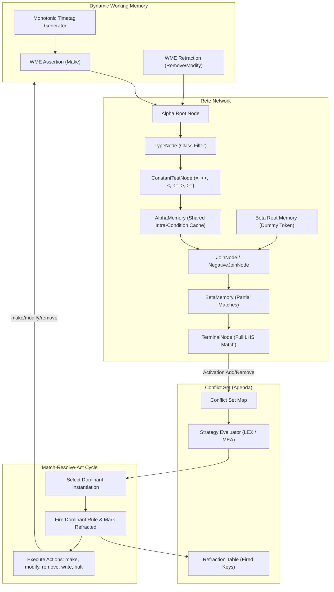
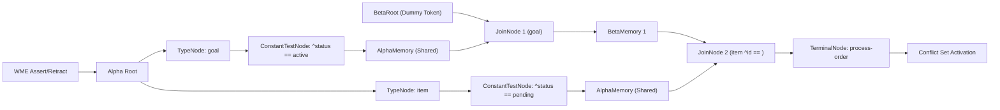
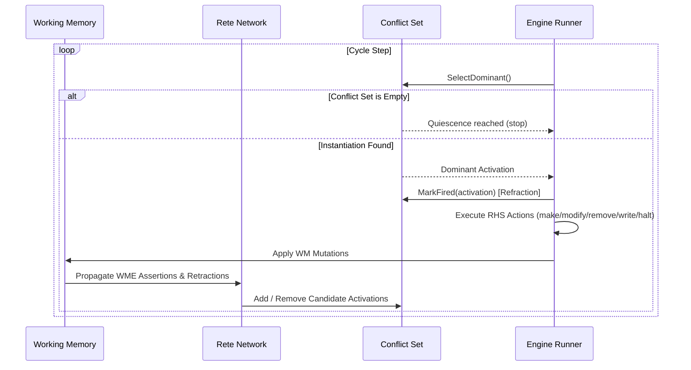

# OPS5 Go Runtime & Engine Specification

A minimal, robust, and high-performance Go implementation of Charles Forgy's classic **OPS5** production rule system using the **Rete** pattern matching algorithm.

This engine provides a complete, modern execution environment for rule-based systems, featuring dynamic working memory, Rete alpha/beta network compilation with structural node sharing, negative condition elements, LEX and MEA conflict resolution strategies with strict refraction, retroactive rule compilation, an interactive CLI REPL, cycle tracing, and an automated JSON test harness.

---

## Table of Contents

1. [Architectural Overview](#architectural-overview)
2. [Language & Syntax Specification](#language--syntax-specification)
   - [Keywords & Syntax Quick Reference](docs/keywords.md)
   - [File I/O, Stream Redirection & Input](docs/file_io.md)
   - [Unique Atom Generation (`genatom`)](docs/genatom.md)
   - [Attribute Index Resolution (`litval`)](docs/litval.md)
   - [Lexical Elements & Data Types](#lexical-elements--data-types)
   - [Schema & Vector Declarations (`literalize`, `vector-attribute`)](#schema--vector-declarations-literalize-vector-attribute)
   - [Working Memory Elements (WMEs)](#working-memory-elements-wmes)
   - [Production Rules (`(p ... )`)](#production-rules-p--)
   - [Left-Hand Side (LHS) Condition Elements](#left-hand-side-lhs-condition-elements)
   - [Right-Hand Side (RHS) Actions](#right-hand-side-rhs-actions)
3. [Rete Pattern Matching Engine](#rete-pattern-matching-engine)
   - [Alpha Network Mechanics](#alpha-network-mechanics)
   - [Beta Network & Join Mechanics](#beta-network--join-mechanics)
   - [Negative Condition Elements](#negative-condition-elements)
   - [Dynamic & Retroactive Compilation](#dynamic--retroactive-compilation)
4. [Conflict Resolution & Execution Lifecycle](#conflict-resolution--execution-lifecycle)
   - [Match-Resolve-Act Cycle](#match-resolve-act-cycle)
   - [Refraction Semantics](#refraction-semantics)
   - [LEX Strategy (Lexicographic)](#lex-strategy-lexicographic)
   - [MEA Strategy (Means-Ends Analysis)](#mea-strategy-means-ends-analysis)
   - [Rule Specificity Calculation](#rule-specificity-calculation)
5. [CLI & Interactive REPL Guide](#cli--interactive-repl-guide)
   - [Installation & Build](#installation--build)
   - [CLI Commands & Flags](#cli-commands--flags)
   - [Interactive REPL Reference](#interactive-repl-reference)
   - [Execution Tracing](#execution-tracing)
6. [Test Harness & JSON Test Suite Specification](#test-harness--json-test-suite-specification)
   - [Test Case Schema](#test-case-schema)
   - [Fixture Example](#fixture-example)
   - [Running Test Suites](#running-test-suites)
7. [Programmatic Go API Reference](#programmatic-go-api-reference)
   - [Quick Start Example](#quick-start-example)
   - [Package Breakdown](#package-breakdown)
   - [Extensibility & Custom Actions](#extensibility--custom-actions)

---

## Architectural Overview



The runtime strictly decouples the pattern-matching network from the working memory store and agenda manager via event-driven interfaces:
- **`wm.WorkingMemory`**: Maintains active WMEs indexed by immutable 64-bit integer timetags. Dispatches `OnAssert` and `OnRetract` events.
- **`rete.Network`**: Maintains shared alpha chains and beta trees. Transforms WME additions/removals into token streams.
- **`conflict.Set`**: Maintains active instantiations, sorts them according to salience policies, and prevents duplicate firings via refraction.
- **`engine.Engine`**: Drives the execution loop, evaluates variable substitutions, and invokes RHS actions.

---

## Language & Syntax Specification

> [!TIP]
> For an exhaustive, quick-reference table of all top-level directives, RHS actions, LHS operators, REPL commands, and roadmap items, see the [OPS5 Syntax & Keyword Reference](docs/keywords.md).

### Lexical Elements & Data Types

The tokenizer supports standard OPS5 S-expression syntax. Whitespace and newlines serve as token delimiters. Semicolons denote line comments:
```ops5
; This is an OPS5 comment line
```

The engine supports first-class data types:

| Data Type | Syntax Pattern | Go Representation | Examples |
| :--- | :--- | :--- | :--- |
| **Symbol** | Unquoted alphanumeric sequence | `model.TypeSymbol` (`string`) | `active`, `pending`, `goal`, `item-10` |
| **Integer** | Optional sign with digits | `model.TypeInteger` (`int64`) | `0`, `42`, `-101`, `1000000` |
| **Float** | Floating-point decimal | `model.TypeFloat` (`float64`) | `3.14`, `0.001`, `-12.5` |
| **String** | Double-quoted text | `model.TypeString` (`string`) | `"Hello World"`, `"Batch complete"` |
| **Boolean** | Case-insensitive boolean literals | `model.TypeBoolean` (`bool`) | `true`, `false` |
| **Vector** | Space-separated sequence of values | `model.TypeVector` (`[]model.Value`) | `42.36 -71.05`, `"Beantown" "The Hub"` |
| **Variable** | Delimited by angle brackets `<...>` | `model.TypeVariable` (`string`) | `<x>`, `<id>`, `<goal-ptr>`, `<val>` |

### Schema & Vector Declarations (`literalize`, `vector-attribute`)

#### Class Schema Declarations (`(literalize ...)`)

OPS5 programs can declare class schemas using the top-level `(literalize ...)` directive:

```ops5
(literalize <class-name> <attr-1> <attr-2> ... <attr-n>)
```

Attribute names can be declared as bare symbols or prefixed with a caret `^`:
```ops5
(literalize vector x y z)
(literalize point ^x ^y)
```

##### Positional Attribute Mapping
Declaring a schema activates classic OPS5 positional attribute mapping. In classic OPS5, WMEs were represented internally as fixed-width vectors based on their `literalize` declaration. With a registered schema:
- **Positional `make` actions**: Values provided without an explicit attribute name are mapped sequentially to the declared attribute slots:
  ```ops5
  (make point 10 20)
  ; Automatically maps to: (make point ^x 10 ^y 20)
  ```
- **Positional LHS condition elements**: Condition patterns without explicit `^` attributes test positional values against the corresponding schema attributes:
  ```ops5
  (p match-origin
     (point 0 0)
     -->
     (write "Found origin point")
  )
  ```
- **Mixed named & positional attributes**: Explicit named attributes (`^attr val`) can be combined with positional attributes; positional values populate unassigned schema positions in declared order:
  ```ops5
  (make vector 1.0 ^z 3.0 2.0)
  ; Positional 1.0 -> ^x, ^z -> 3.0, positional 2.0 -> ^y
  ```
- If no schema is declared for a class, attributes default to purely dynamic key-value pairs (`^<attr> <val>`).

#### Multi-Valued Attributes (`(vector-attribute ...)`)

In standard OPS5, attributes are single-valued by default. The `(vector-attribute ...)` directive designates one or more attributes as multi-valued vector attributes capable of holding sequences of values:

```ops5
(vector-attribute <attr-1> <attr-2> ... <attr-n>)
```

##### Example
```ops5
(literalize City name location state country population)
(vector-attribute location)

(make City ^name Boston ^location 42.36 -71.05 ^state MA ^country USA ^population 675000)
```

##### Vector Pattern Matching & Variable Binding
- **Positional segment extraction**: When multiple constraints or variables follow a vector attribute, they bind sequentially to the elements of the vector:
  ```ops5
  (p locate-city
     (City ^name <name> ^location <lat> <long> ^state MA)
     -->
     (write <name> "latitude:" <lat> "longitude:" <long>)
  )
  ; Binds <lat> to 42.36 and <long> to -71.05
  ```
- **Membership testing**: When a single scalar or constraint follows a vector attribute, it matches if ANY element in the vector satisfies the condition:
  ```ops5
  (p find-by-coord
     (City ^name <name> ^location 42.36)
     -->
     (write "Matched city by coordinate:" <name>)
  )
  ```
- **Whole-vector capture**: Binding a single variable to a vector attribute captures the entire sequence:
  ```ops5
  (p copy-location
     (City ^name <name> ^location <loc>)
     -->
     (write <name> "full location:" <loc>)
  )
  ; <loc> contains 42.36 -71.05
  ```
- **Vector modifications**: RHS `modify` and REPL `modify` update vector attributes with new value sequences:
  ```ops5
  (modify <c> ^location 42.0 -71.0)
  ```

### Working Memory Elements (WMEs)

A Working Memory Element (WME) represents a structured record in the system:
- **Timetag**: An immutable positive 64-bit integer assigned monotonically upon assertion.
- **Class**: The categorical identifier of the element (e.g., `goal`, `item`, `process`).
- **Attributes**: Key-value pairs prefixed with `^`. Unset attributes evaluate as undefined.

Textual representation:
```ops5
(12: item ^id 101 ^status pending ^priority 5)
```

### Production Rules (`(p ... )`)

A production rule has a name, a Left-Hand Side (LHS) condition elements list, an arrow separator `-->`, and a Right-Hand Side (RHS) actions list:

```ops5
(p <rule-name>
   <condition-element-1>
   <condition-element-2>
   ...
   -->
   <action-1>
   <action-2>
   ...
)
```

### Left-Hand Side (LHS) Condition Elements

#### 1. Positive Condition Elements
Matches a WME of a specified class whose attributes satisfy all stated constraints:
```ops5
(goal ^type batch ^status start)
```

#### 2. Element Variables
Prefixing a condition element with a variable binds that variable to the **timetag** of the matching WME. This bound variable can be referenced later in RHS `modify` and `remove` actions:
```ops5
<g> (goal ^type batch ^status in-progress)
```

#### 3. Negated Condition Elements
Matches when **no** WME exists in working memory that satisfies the condition:
```ops5
-(item ^status pending)
```
Negated conditions can also test variables bound in earlier positive condition elements (cross-condition negative joins):
```ops5
<it> (item ^id <id> ^status pending)
-(hold ^item-id <id>)
```

#### 4. Relational Operators & Multi-Constraint Tests
Attributes can be matched against literal values or variables using relational operators. When no operator is specified, `=` is assumed:

| Operator | Syntax | Description |
| :--- | :--- | :--- |
| **Equal** | `=`, (or omitted) | Values must be identical in type and content |
| **Not Equal** | `<>`, `!=` | Values must not match |
| **Less Than** | `<` | Numeric or lexicographical order strictly less |
| **Less or Equal** | `<=` | Numeric or lexicographical order less than or equal |
| **Greater Than** | `>` | Numeric or lexicographical order strictly greater |
| **Greater or Equal** | `>=` | Numeric or lexicographical order greater than or equal |

Multiple constraints can be specified for a single attribute:
```ops5
(sensor ^temperature > 32 <= 212 ^status active)
```

#### 5. Cross-Condition Variable Binding
Variables bound in earlier condition elements enforce equality (or relational joins) when repeated in subsequent condition elements:
```ops5
(order ^order-id <oid> ^customer-id <cid>)
(customer ^id <cid> ^tier vip)
(item ^order-id <oid> ^status pending)
```

### Right-Hand Side (RHS) Actions

Actions execute sequentially when the rule fires:

#### `(make <class> [^<attr> <val> ...])`
Asserts a new WME into working memory with a fresh timetag. Variable references are substituted with their bound values:
```ops5
(make item ^id <new-id> ^status pending ^attempts 0)
```

#### `(modify <target> [^<attr> <val> ...])`
> [!NOTE]
> For an in-depth architectural breakdown of the two-phase retraction/assertion lifecycle and targeting semantics, see the [OPS5 `modify` Reference](docs/modify.md).

Implements standard OPS5 semantic modification:
1. Retracts the target WME.
2. Asserts a replacement WME with a new timetag, merging new attribute values while **preserving all unmodified attributes**.

The `<target>` can be specified by:
- **Element variable**: `(modify <g> ^status done)`
- **1-based CE index**: `(modify 1 ^status done)`

#### `(remove <target>)`
Retracts the targeted WME from working memory. The `<target>` can be an element variable (e.g., `(remove <it>)`) or a 1-based CE index (e.g., `(remove 2)`).

#### `(write <arg1> <arg2> ...)`
> [!NOTE]
> For report generation and table/grid formatting instructions, see the [OPS5 `write`, `(crlf)`, and `(tabto N)` Reference](docs/write.md).

Emits symbols, numbers, strings, and resolved variables to the engine's configured output writer.
- Supports **`(crlf)`** to output newlines and reset the horizontal column position.
- Supports **`(tabto <column>)`** to move the cursor forward to a 1-based column position by padding spaces, enabling aligned tabular grids and reports:
  ```ops5
  (write (crlf) (tabto 5) "ID" (tabto 20) "STATUS" (tabto 35) "VALUE" (crlf))
  (write (tabto 5) <id> (tabto 20) <status> (tabto 35) <val> (crlf))
  ```
- If no `(crlf)` is present in the `write` action, a trailing newline is appended automatically.

#### `(bind <var> <val-or-compute>)`
> [!NOTE]
> For complete details on arithmetic operators, evaluation order, and nested sub-expressions, see the [OPS5 `bind` and `compute` Reference](docs/bind.md).

Assigns the evaluated value or the result of a `compute` expression to a local variable `<var>` during the rule firing cycle:
```ops5
(bind <item-total> (compute <price> * <qty>))
(modify <it> ^total <item-total>)
```
Variables bound by `bind` are immediately accessible to all subsequent actions in the same rule firing.

#### `(cbind <element-variable>)`
Binds the working memory element most recently added by `make`, `modify`, or `call` to `<element-variable>`. Subsequent actions in the same rule firing can use that element variable to modify, remove, or reference that element:
```ops5
(make person ^name "Alice" ^age 30)
(cbind <p>)
(modify <p> ^age 31)
```

#### `(compute <op1> <operator> <op2> ...)`
Evaluates arithmetic expressions using standard OPS5 left-to-right evaluation:
- Operators: `+`, `-` (including unary minus), `*`, `/` (or `//`, `\`), and `%` (or `\\`).
- Usable inside `bind`, or directly as values in `make`, `modify`, and `write`:
```ops5
(write "Grand Total:" (compute <subtotal> + (compute <subtotal> * <rate>)) (crlf))
```

#### `(halt)`
Halts the engine execution immediately. The current cycle completes, but no further rules fire.

#### `(openfile <logical-name> <filespec> <mode>)`
> [!NOTE]
> For complete documentation on stream management, file modes, and examples, see the [File I/O, Stream Redirection & Input Reference](docs/file_io.md).

Opens a file and registers it under a logical name. Modes include `in` (read), `out` (create/truncate write), and `append`. Supports vertical bar symbol escaping for filenames with punctuation or spaces (e.g. `|RuleTrace.ops|`).

#### `(closefile <logical-name>)`
Closes an open file stream. If the closed file was the default stream for `accept`, `write`, or `trace`, that subsystem automatically reverts to standard terminal I/O.

#### `(default <logical-name> <subsystem>)`
Directs the default I/O stream for `accept`, `write`, or `trace` to `<logical-name>`. Passing `nil` or `terminal` restores the default standard terminal stream.

#### `(accept [<logical-name>])` and `(acceptline [<logical-name>])`
Reads user input from standard input or a redirected logical file stream:
- `(accept)`: Reads the next whitespace-delimited atom (symbol, integer, float).
- `(acceptline)`: Reads an entire line of input into a scalar or vector.

#### `(genatom)`
> [!NOTE]
> For complete documentation and examples, see the [OPS5 `genatom` Reference](docs/genatom.md).

Generates a unique sequential symbolic atom (`atom1`, `atom2`, `atom3`, ...):
```ops5
(bind <id> (genatom))
(make task ^id <id> ^status ready)
```
Can also be used directly as an attribute value in `make` and `modify`, in `write` output, and in top-level `make` declarations.

#### `(litval [<class>] <attr>)`
> [!NOTE]
> For complete documentation and examples, see the [OPS5 `litval` Reference](docs/litval.md).

Returns the 1-based numeric index assigned to an attribute within its element class or WME vector layout (where position 1 is the class name, position 2 is the 1st attribute, etc.):
```ops5
(make City ^name Albuquerque ^state NM)
(bind <name-idx> (litval name))   ; evaluates to 2
(bind <state-idx> (litval state)) ; evaluates to 3
```
Can also be evaluated inside `make`, `modify`, `write`, `compute`, and in the REPL.

---

## Rete Pattern Matching Engine

The engine compiles production rules into a directed acyclic dataflow graph based on Charles Forgy's Rete algorithm.



### Alpha Network Mechanics
1. **Root Dispatch**: `AlphaRootNode` categorizes incoming WMEs by class using `TypeNode` instances. A wildcard type node `*` captures cross-class patterns.
2. **Constant Test Sharing**: Linear chains of `ConstantTestNode` instances test attribute existence and literal predicates.
3. **Alpha Memory Sharing**: Identical condition patterns share the exact same `AlphaMemory` node across different rules. A canonical key (e.g. `item|^status=pending`) ensures structural sharing.

### Beta Network & Join Mechanics
1. **Tokens**: Tokens represent partial rule instantiations. A token is a linked list of WMEs and an environment map of bound variables.
2. **Beta Root Memory**: Initialized with a dummy empty token so the first condition element can be processed by a standard two-input `JoinNode`.
3. **Variable Join Constraints**: `JoinNode` tests incoming candidate WMEs against variable bindings established in parent tokens.
4. **Activation Propagation**:
   - Left activations (new tokens from parent beta memory) join with right WMEs stored in alpha memory.
   - Right activations (new WMEs from alpha memory) join with left tokens stored in beta memory.

### Negative Condition Elements
Negated conditions are implemented via `NegativeJoinNode`:
- For each left token, the node maintains a count of matching right WMEs.
- If the match count is **0**, the token is propagated forward to the child beta node (condition satisfied).
- If an assertion in alpha memory matches a token with count 0, the node emits a retraction (`TagRemove`) downstream (condition blocked).
- If the blocking WME is retracted, the count drops back to 0 and the node re-emits an assertion (`TagAdd`) downstream (condition unblocked).

### Dynamic & Retroactive Compilation
In many classic Rete implementations, all rules had to be declared before asserting facts. This engine supports **dynamic and retroactive rule compilation**:
- When `engine.AddRule()` is invoked at runtime (such as in an interactive REPL session), any newly compiled alpha and beta nodes perform a catch-up pass against existing working memory elements.
- Terminal nodes are immediately populated with instantiations for pre-existing facts, and activations enter the conflict set without requiring working memory to be re-asserted.

---

## Conflict Resolution & Execution Lifecycle



### Match-Resolve-Act Cycle
Each cycle of the engine proceeds in three strict phases:
1. **Match**: Working memory changes propagate through Rete. The Conflict Set updates with newly enabled or disabled activations.
2. **Resolve**: The Conflict Set sorts all active candidate instantiations and selects the single dominant activation according to the active strategy (**LEX** or **MEA**).
3. **Act**: The dominant activation is marked as refracted and its RHS actions are evaluated.

### Refraction Semantics
To prevent infinite loops where a single rule continuously matches the same static facts:
- An instantiation is uniquely identified by the tuple `(RulePointer, [Timetag_1, Timetag_2, ...])`.
- Once an instantiation fires, its unique key is stored in the refraction table.
- An identical instantiation cannot fire again unless at least one of its participating WMEs is modified or re-asserted (yielding a new timetag).

### LEX Strategy (Lexicographic)

The default OPS5 conflict resolution strategy prioritizes the most recently asserted or modified facts across the entire LHS:

1. **Recency Vector Comparison**:
   - Collect all participating WME timetags in the instantiation.
   - Sort them descending: `[T_max, T_second, ..., T_min]`.
   - Compare vectors lexicographically against other candidate activations. The activation with the highest timetag wins. If highest timetags are equal, compare second-highest, and so on.
2. **Specificity**:
   - If recency vectors are identical, choose the rule with higher specificity (more condition tests).
3. **Rule Index Tie-Breaker**:
   - If specificity is identical, choose the rule declared earliest in the engine (lowest declaration index).
4. **Alphabetical Tie-Breaker**:
   - Final deterministic tie-breaker by rule name string comparison.

### MEA Strategy (Means-Ends Analysis)

The MEA strategy is designed for goal-directed architectures:

1. **Recency of Condition Element 1**:
   - Compare the timetag of the WME matching the **very first condition element** (the goal CE). The instantiation with the newest goal WME dominates.
2. **Recency Vector of Remaining Condition Elements**:
   - If CE 1 timetags are equal, sort the remaining timetags (`CE_2` through `CE_N`) descending and compare them lexicographically (identical to LEX).
3. **Specificity**:
   - If remaining recencies are equal, choose the rule with higher specificity.
4. **Rule Index & Name Tie-Breakers**:
   - Definition index followed by alphabetical tie-breaker.

#### Strategy Comparison Example

Consider two rules and four asserted facts:
- Fact 1: `(1: goal ^id 1)`
- Fact 2: `(2: fact ^tag x)`
- Fact 3: `(3: goal ^id 2)`
- Fact 4: `(4: fact ^tag y)`

Rule `fire-goal-1` matches Goal 1 (timetag 1) and Fact y (timetag 4). Participating timetags: `[1, 4]`.  
Rule `fire-goal-2` matches Goal 2 (timetag 3) and Fact x (timetag 2). Participating timetags: `[3, 2]`.

- **Under LEX**:
  - `fire-goal-1` vector: `[4, 1]`
  - `fire-goal-2` vector: `[3, 2]`
  - Compare first elements: `4 > 3`. **`fire-goal-1` fires first.**
- **Under MEA**:
  - Compare CE 1 timetags: Goal for rule 1 has timetag `1`; Goal for rule 2 has timetag `3`.
  - Compare CE 1: `3 > 1`. **`fire-goal-2` fires first.**

### Rule Specificity Calculation

Rule specificity measures how constrained a rule is:
$$\text{Specificity} = \sum_{ce \in \text{Conditions}} (1 + \text{Constraints}(ce))$$
- Every condition element contributes `+1` for its class name test.
- Every attribute constraint test (`=`, `<>`, `<`, `<=`, `>`, `>=`) contributes `+1`.
- Element variable definitions and variable bindings do not inflate specificity unless associated with a concrete test.

---

## CLI & Interactive REPL Guide

### Installation & Build

Compile the self-contained binary using the Go toolchain (requires Go 1.21+):

```bash
go build -o ops5 ./cmd/ops5
```

### CLI Commands & Flags

```bash
# Launch the interactive REPL
./ops5

# Execute an OPS5 rule file in batch mode
./ops5 path/to/rules.ops

# Pre-load rules and immediately drop into the REPL
./ops5 -i path/to/rules.ops

# Run with cycle tracing enabled
./ops5 -trace path/to/rules.ops

# Execute with MEA strategy and cycle limit
./ops5 -strategy mea -max-cycles 500 path/to/rules.ops

# Run external JSON test suites
./ops5 test tests/fixtures/simple_workflow.json tests/fixtures/mea_lex.json
```

| Flag | Type | Default | Description |
| :--- | :--- | :--- | :--- |
| `-i` | boolean | `false` | Drop into interactive REPL after loading input file |
| `-trace` | boolean | `false` | Enable cycle-by-cycle execution tracing to stdout |
| `-strategy` | string | `"lex"` | Conflict resolution strategy: `lex` or `mea` |
| `-max-cycles`| integer | `1000` | Maximum number of cycles before terminating batch run |

### Interactive REPL Reference

When running `./ops5` interactively, balanced parenthesis tracking allows rules to be entered across multiple lines:

```ops5
ops5> (p classify-alert
...      (sensor ^id <id> ^temp > 100)
...      -->
...      (make alert ^sensor-id <id> ^level critical)
...      (write "Critical alert triggered for sensor" <id>)
...   )
Defined rule 'classify-alert' (conditions=1, specificity=3)
```

#### REPL Command Summary

| Command | Arguments | Description | Example |
| :--- | :--- | :--- | :--- |
| `(literalize ...)` / `literalize` | `<class> <attrs...>` | Declare attribute schema for positional mapping | `literalize point x y` |
| `(vector-attribute ...)` / `vector-attribute` | `<attrs...>` | Declare multi-valued vector attributes | `vector-attribute location` |
| `vector-attributes` | *none* | Display declared vector attributes | `vector-attributes` |
| `schemas` | `[class]` | Display registered schemas (all or specific class) | `schemas point` |
| `(p ...)` | `<rule-definition>` | Compile a production rule into the active Rete network | `(p r1 (goal ^status active) --> (halt))` |
| `make` | `<class> [^<attr> <val> ...]` | Assert a new WME | `make goal ^type batch ^status start` |
| `modify` | `<timetag> [^<attr> <val> ...]` | Modify an existing WME by timetag | `modify 1 ^status in-progress` |
| `remove` | `<timetag>` | Retract a WME by its timetag | `remove 1` |
| `openfile` | `<log-name> <filespec> <mode>` | Open file stream (`in`, `out`, `append`) | `(openfile ruletrace \|RuleTrace.ops\| out)` |
| `closefile` | `<log-name>` | Close an open file stream | `(closefile ruletrace)` |
| `default` | `[<log-name> <subsystem>]` | View or set default stream for `accept`, `write`, `trace` | `(default ruletrace accept)` |
| `genatom` / `(genatom)` | *none* | Generate and display a unique symbolic atom | `(genatom)` |
| `litval` / `(litval ...)` | `[<class>] <attr>` | Display numeric index assigned to an attribute | `(litval name)` |
| `wm` | `[class]` | Display active WMEs (optionally filtered by class) | `wm item` |
| `cs` | *none* | Display conflict set in current salience order (`*` indicates dominant) | `cs` |
| `step` | *none* | Execute exactly one Match-Resolve-Act cycle | `step` |
| `run` | `[max_cycles]` | Execute until quiescence, halt, or max cycles | `run 10` |
| `strategy` | `[lex \| mea]` | View or switch conflict resolution strategy | `strategy mea` |
| `trace` | `on \| off` | Toggle cycle execution tracing | `trace on` |
| `load` | `<file.ops>` | Load and compile rules and makes from an external file | `load rules.ops` |
| `test` | `<file.json>` | Execute an external JSON test suite case | `test fixture.json` |
| `reset` | *none* | Clear working memory and conflict set | `reset` |
| `help` | *none* | Display interactive help menu | `help` |
| `exit` / `quit` | *none* | Terminate the REPL session | `exit` |

### Execution Tracing

Enabling trace (`-trace` flag or `trace on` in REPL) outputs each rule firing with its cycle number and matching WME timetags:
```
[Cycle 1] Fired rule 'initialize-processing' with WMEs [1]
[Cycle 2] Fired rule 'process-item' with WMEs [2 4]
Processed item 102
[Cycle 3] Fired rule 'process-item' with WMEs [2 3]
Processed item 101
[Cycle 4] Fired rule 'complete-batch' with WMEs [2]
Batch completed successfully
Execution halted by rule action after 4 cycles.
```

---

## Test Harness & JSON Test Suite Specification

The engine includes an automated test harness designed to validate rule execution against external test suites.

### Test Case Schema

Test scenarios can be specified in JSON format:

```json
{
  "$schema": "http://json-schema.org/draft-07/schema#",
  "title": "OPS5TestCase",
  "type": "object",
  "required": ["name"],
  "properties": {
    "name": { "type": "string", "description": "Unique identifier for the test case" },
    "description": { "type": "string" },
    "strategy": { "type": "string", "enum": ["LEX", "MEA"], "default": "LEX" },
    "source": { "type": "string", "description": "Inline OPS5 rule definitions" },
    "source_file": { "type": "string", "description": "Relative or absolute path to .ops rule file" },
    "initial_wm": {
      "type": "array",
      "items": {
        "type": "object",
        "required": ["class"],
        "properties": {
          "class": { "type": "string" },
          "attributes": { "type": "object", "additionalProperties": { "type": "string" } }
        }
      }
    },
    "max_cycles": { "type": "integer", "default": 1000 },
    "expected_cycles": { "type": "integer", "description": "Exact number of expected rule firings" },
    "expected_wm": {
      "type": "array",
      "description": "WMEs that MUST exist in working memory upon completion",
      "items": {
        "type": "object",
        "required": ["class"],
        "properties": {
          "class": { "type": "string" },
          "attributes": { "type": "object", "additionalProperties": { "type": "string" } }
        }
      }
    },
    "forbidden_wm": {
      "type": "array",
      "description": "WME patterns that MUST NOT exist in working memory upon completion",
      "items": {
        "type": "object",
        "required": ["class"],
        "properties": {
          "class": { "type": "string" },
          "attributes": { "type": "object", "additionalProperties": { "type": "string" } }
        }
      }
    },
    "expected_outputs": {
      "type": "array",
      "items": { "type": "string" },
      "description": "Substrings expected in write action stdout"
    }
  }
}
```

### Fixture Example

`tests/fixtures/simple_workflow.json`:
```json
{
  "name": "simple_workflow_test",
  "description": "Validates full workflow using external .ops source file",
  "strategy": "LEX",
  "source_file": "fixtures/simple_workflow.ops",
  "initial_wm": [
    {
      "class": "goal",
      "attributes": { "type": "batch", "status": "start" }
    }
  ],
  "max_cycles": 10,
  "expected_cycles": 4,
  "expected_wm": [
    {
      "class": "goal",
      "attributes": { "type": "batch", "status": "all-done" }
    },
    {
      "class": "item",
      "attributes": { "id": "101", "status": "done" }
    },
    {
      "class": "item",
      "attributes": { "id": "102", "status": "done" }
    }
  ],
  "forbidden_wm": [
    {
      "class": "item",
      "attributes": { "status": "pending" }
    }
  ],
  "expected_outputs": [
    "Processed item 101",
    "Processed item 102",
    "Batch completed successfully"
  ]
}
```

### Running Test Suites

Run via the CLI binary:
```bash
./ops5 test tests/fixtures/*.json
```

Run via Go's native test tool:
```bash
go test -v ./tests
```

---

## Programmatic Go API Reference

### Quick Start Example

```go
package main

import (
	"fmt"
	"ops5/pkg/conflict"
	"ops5/pkg/engine"
	"ops5/pkg/model"
	"ops5/pkg/parser"
)

func main() {
	// 1. Initialize engine
	eng := engine.New()
	eng.SetStrategy(conflict.StrategyLEX)

	// 2. Parse and register rules
	rules, err := parser.ParseRules(`
		(p process-order
		   <o> (order ^id <oid> ^status pending)
		   -->
		   (modify <o> ^status completed)
		   (write "Order completed:" <oid>)
		   (halt)
		)
	`)
	if err != nil {
		panic(err)
	}
	for _, rule := range rules {
		eng.AddRule(rule)
	}

	// 3. Assert initial working memory
	eng.Make("order", map[string]model.Value{
		"id":     model.NewInt(9001),
		"status": model.NewSymbol("pending"),
	})

	// 4. Run execution loop
	cycles, err := eng.Run(100)
	if err != nil {
		panic(err)
	}

	fmt.Printf("Engine completed in %d cycles. Halted: %v\n", cycles, eng.IsHalted())
}
```

### Package Breakdown

```
pkg/
├── model/        # Domain types: WME, ClassSchema, Value (Symbol, Int, Float, String, Variable), Rule, Action
├── wm/           # Thread-safe WorkingMemory, timetag generation, listener notifications
├── rete/         # Alpha & Beta nodes, Tokens, Alpha/Beta memories, joins, negations, terminal nodes
├── conflict/     # Conflict Set agenda, Instantiations, Refraction, LEX & MEA comparator functions
├── engine/       # Match-Resolve-Act lifecycle coordinator, action dispatch, step/run loop
├── parser/       # OPS5 S-expression lexer and parser
├── cli/          # Interactive REPL and command dispatcher
└── harness/      # JSON test suite loader, assertion checker, and runner
```

### Extensibility & Custom Actions

In addition to standard OPS5 actions (`make`, `modify`, `remove`, `write`, `halt`), Go applications can register `CustomAction` handlers directly on rules:

```go
rule := model.NewRule("notify-external-service")
rule.AddCondition(model.NewPositiveCE("event").AddEqualTest("type", model.NewSymbol("alert")))
rule.AddAction(model.CustomAction{
    Name: "webhook-dispatch",
    Execute: func(ctx any) error {
        // Custom Go execution logic (HTTP call, database transaction, etc.)
        return nil
    },
})
eng.AddRule(rule)
```

---

## Verification & Concurrency Model

- **Thread-Safety**: `WorkingMemory`, `Network`, `BetaMemory`, `AlphaMemory`, `ConflictSet`, and `Engine` protect shared mutable state with fine-grained read/write mutexes (`sync.RWMutex`), supporting thread-safe inspection and concurrent listener dispatch.
- **Unit & Integration Tests**: Comprehensive tests in [`tests/suite_test.go`](tests/suite_test.go), [`pkg/rete/network_test.go`](pkg/rete/network_test.go), [`pkg/conflict/conflict_test.go`](pkg/conflict/conflict_test.go), and [`pkg/cli/repl_test.go`](pkg/cli/repl_test.go).
- Run the full test suite with test coverage:
  ```bash
  go test -race -cover ./...
  ```
