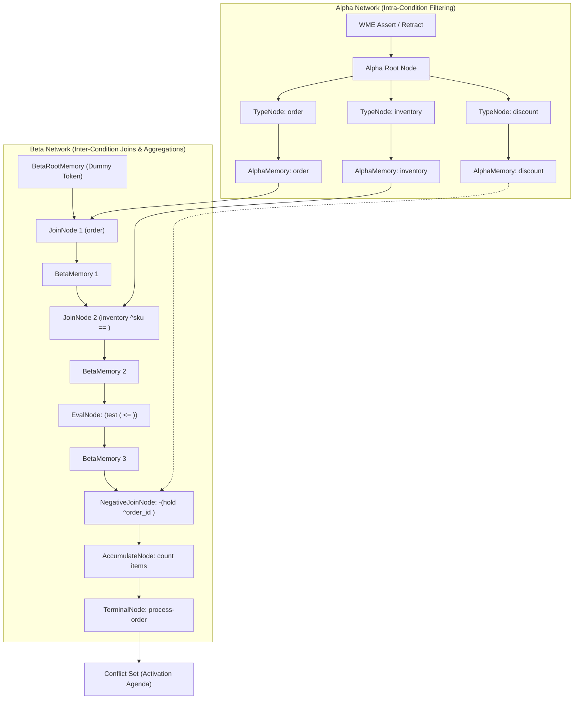
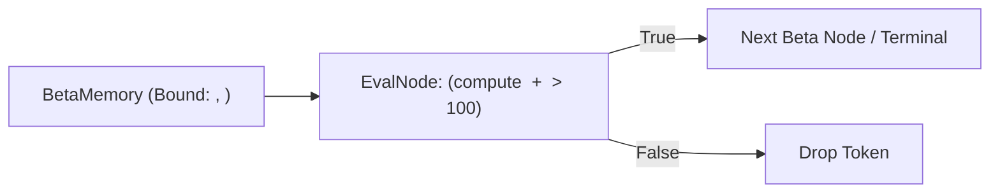
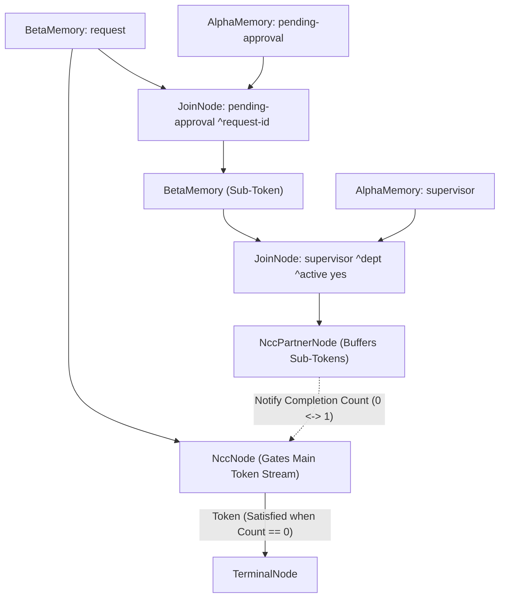

# Rete Beta Network Architecture & Beta Node Catalog

In Charles Forgy's Rete algorithm, the **Beta Network** is the dataflow pipeline responsible for inter-condition tests, variable bindings across multiple condition elements (CEs), and managing partial rule instantiations.

While the **Alpha Network** processes isolated Working Memory Elements (WMEs) against single-attribute constant conditions, the **Beta Network** combines streams of tokens across different conditions, evaluates equality and relational joins, enforces negated conditions, computes aggregations, and ultimately drives activations into the **Conflict Set**.

---

## 1. Beta Node Overview & Implementation Matrix

All nodes in the Beta network process **tokens** via the [`LeftActivatable`](../pkg/rete/beta.go) interface, propagating activations tagged with `TagAdd` (assertion) or `TagRemove` (retraction). Two-input nodes also receive right activations of WMEs from parent [`AlphaMemory`](../pkg/rete/alpha.go) nodes.

The table below catalogs the full spectrum of Beta node types in Rete engines, their structural inputs, memory state, and their current implementation status within this OPS5 engine:

| Node Type | Arity (Inputs) | Primary Purpose / Role | Left Input | Right Input | Retained State / Memory | Engine Status | Language / Rule Construct |
| :--- | :--- | :--- | :--- | :--- | :--- | :--- | :--- |
| **`BetaRootMemory`** | 0 inputs (Seeded) | Root anchor of the beta network; initiates condition matching chains | Initialized with `DummyRootToken()` | None | Single dummy root token | **Implemented** | Engine initialization |
| **`BetaMemory`** | 1 input (Left) | Caches tokens representing partial matches; enables successor sharing and fast joins | Left token stream from parent node | None | Token map (`map[string]*Token`), [`BetaIndex`](../pkg/rete/index.go) equality buckets | **Implemented** | Intermediate condition boundary |
| **`JoinNode`** | 2 inputs (Left + Right) | Performs standard positive relational join between left tokens and right WMEs | Tokens from `BetaMemory` | WMEs from `AlphaMemory` | None (stateless; delegates to memories) | **Implemented** | `(class ^attr <var>)` (Positive CE) |
| **`NegativeJoinNode`** | 2 inputs (Left + Right) | Enforces absence of matching WMEs; passes token when match count is 0 | Tokens from `BetaMemory` | WMEs from `AlphaMemory` | Token map, [`BetaIndex`](../pkg/rete/index.go), match-count map (`matches[tokenSig] -> set[timetag]`) | **Implemented** | `-(class ^attr <var>)` (Negated CE) |
| **`TerminalNode`** | 1 input (Left) | Signifies complete LHS match; notifies conflict set of additions/removals | Fully matched tokens from final join | None | Associated `*model.Rule`, `ConflictSetListener` reference | **Implemented** | Rule completion (`-->`) |
| **`EvalNode`** | 1 input (Left) | Single-input filter testing mathematical or boolean expressions across bound variables | Tokens from upstream beta node | None | None (stateless filter) | **Implemented** | `(test (compute <x> + <y> > 100))` |
| **`ExistentialJoinNode`** | 2 inputs (Left + Right) | Semi-join (`exists`): verifies that at least one matching WME exists *without* multiplying tokens | Tokens from `BetaMemory` | WMEs from `AlphaMemory` | Token map, match-count map (`matches[tokenSig] -> set[timetag]`), hash index | **Implemented** | `(exists (class ^attr <var>))` |
| **`AccumulateNode`** | 2 inputs (Left + Right) | Aggregates matching WMEs (`count`, `sum`, `min`, `max`, `average`, `collect`) and binds result to token | Tokens from `BetaMemory` | WMEs from `AlphaMemory` | Token map, matched WME map, active child token map, [`BetaIndex`](../pkg/rete/index.go) | **Implemented** | `(accumulate ... :sum <v>)` |
| **`NccNode` / `NccPartnerNode`**| 2 inputs (Left + Sub-network) | Negated Conjunctive Condition: matches absence of a *conjunction* of multiple conditions | Tokens from parent `BetaMemory` | Tokens from sub-network `NccPartnerNode` | Completion maps (`completions[parentSig][subSig]`), match-count tracking | **Implemented** | `-( (cond-1) (cond-2) ... )` |

---

## 2. Token Dataflow Architecture

The following diagram illustrates how working memory assertions and retractions flow through the Alpha and Beta networks to produce Conflict Set activations across different beta node types:



---

## 3. Detailed Specification of Implemented Beta Nodes

### 3.1 `BetaRootMemory`
- **Source**: `pkg/rete/network.go` (`net.rootBetaMem`)
- **Role**: In Rete, the first condition element of a production rule cannot join against prior conditions. Rather than introducing a special single-input join node for the first condition, Rete seeds a root `BetaMemory` with a `DummyRootToken()`.
- **Semantics**:
  - The dummy token has `Parent == nil`, `WME == nil`, and empty variable bindings.
  - When the first positive condition element is compiled into a `JoinNode`, the dummy token joins with each matching right WME in `AlphaMemory` to produce the initial 1-WME tokens.

### 3.2 `BetaMemory`
- **Source**: `pkg/rete/beta.go` (`BetaMemory`)
- **Role**: Intermediate storage point between two joins. It caches tokens produced by an upstream join node and dispatches them to one or more downstream beta nodes.
- **State & Indexing**:
  - `tokens map[string]*Token`: Tokens keyed by composite timetag signature.
  - `indexes []*BetaIndex`: Hash index buckets built on subsets of bound variables. Child join nodes request indices (e.g. on `<customer_id>`) using `GetOrCreateIndex()` to achieve $O(1)$ lookup times when right WMEs arrive.
- **Propagation**:
  - `TagAdd`: Inserts token into internal storage and hash buckets, then calls `LeftActivation(token, TagAdd)` on all successors.
  - `TagRemove`: Removes token from internal storage and hash buckets, then propagates `TagRemove` downstream.
  - **Retroactive Catch-up**: When a new successor node is attached (e.g. via `AddSuccessor` during dynamic rule addition), all pre-existing tokens are immediately forwarded to the new child.

### 3.3 `JoinNode`
- **Source**: `pkg/rete/beta.go` (`JoinNode`)
- **Role**: Two-input relational join node that combines left tokens with right WMEs.
- **Join Constraints (`JoinTest`)**:
  - Compares attribute values on right WMEs against variables previously bound in the token.
  - Supports equality (`=`), inequalities (`<>`, `<`, `<=`, `>`, `>=`), and vector membership/positional indices.
- **Two-Way Propagation**:
  1. **Left Activation (`token, tag`)**:
     - Uses `BetaIndex.KeyForToken(token)` to probe `AlphaIndex` on the right side.
     - Iterates over candidates, evaluates residual non-equality tests via `matchesJoinTests()`, extracts new variable bindings introduced by this condition, and forwards new child `Token` downstream.
  2. **Right Activation (`wme, tag`)**:
     - Uses `AlphaIndex.KeysForWME(wme)` to probe `BetaIndex` on the left side.
     - Matches candidate tokens, extracts new bindings, constructs child tokens, and propagates downstream.

### 3.4 `NegativeJoinNode`
- **Source**: `pkg/rete/beta.go` (`NegativeJoinNode`)
- **Role**: Evaluates negated condition elements `-(class ^attr <var>)`.
- **Match-Count Mechanism**:
  - Rather than creating concatenated child tokens, a negative node acts as an **inverting gate** for the incoming token.
  - Maintains `matches map[string]map[int64]bool`: for each incoming token signature, tracks the exact set of right WME timetags that satisfy the join tests.
- **Gate Transitions**:
  - **Left Activation (`TagAdd`)**: Probes `AlphaIndex` for matching WMEs. If `len(matchedWmes) == 0`, the negative condition is satisfied and the token is forwarded downstream with `TagAdd`. If matches exist, the token is stored in memory but blocked.
  - **Right Activation (`TagAdd`)**: If an arriving WME matches a previously satisfied token (transitioning match count from $0 \to 1$), the node emits a downstream retraction (`TagRemove`) to invalidate activations.
  - **Right Activation (`TagRemove`)**: If a blocking WME is retracted (transitioning match count from $1 \to 0$), the node emits a downstream assertion (`TagAdd`) to unblock the token.

### 3.5 `TerminalNode`
- **Source**: `pkg/rete/beta.go` (`TerminalNode`)
- **Role**: Sits at the terminus of a production rule's beta pipeline.
- **Semantics**:
  - When a token arrives at `TerminalNode` with `TagAdd`, the rule is completely satisfied; the node invokes `listener.OnActivationAdd(rule, token)` on the `ConflictSet`.
  - When a token arrives with `TagRemove`, the activation is retracted via `listener.OnActivationRemove(rule, token)`.
  - Supports dynamic deactivation (`Deactivate()`) when rules are removed via `(excise <rule>)`.

### 3.6 `EvalNode`
- **Source**: `pkg/rete/eval.go` (`EvalNode`)
- **Role**: Single-input Beta filter evaluating mathematical, boolean, and relational expressions across bound variables.
- **Target OPS5 / Rule Construct**: `(test (compute <x> + <y> > 100))` or `(test (<val> <> 0))`
- **Architecture & Execution**:
  - Implements `LeftActivatable`. Placed downstream of a `BetaMemory` or `JoinNode` where all required variables are already bound in `token.Bindings`.
  - On `LeftActivation(token, tag)`:
    - Evaluates compiled `model.EvalTest` or custom Go predicate against `token.Bindings`.
    - If the predicate returns `true`, forwards the token downstream with the matching `tag` (`TagAdd` or `TagRemove`).
    - If the predicate returns `false`, drops the token.
  - Supports programmatic custom predicate functions via `NewEvalPredicateNode()`.
- **Advantage**: Bypasses the need to assert temporary working memory facts just to evaluate cross-variable mathematical inequalities or complex constraints.



### 3.7 `ExistentialJoinNode` (`exists` Semi-Join)
- **Source**: `pkg/rete/existential.go` (`ExistentialJoinNode`)
- **Role**: Two-input Beta semi-join verifying that at least one matching WME exists *without* multiplying tokens.
- **Target OPS5 / Rule Construct**: `(exists (item ^order_id <id> ^status pending))`
- **Architecture & Execution**:
  - Connects to a left `BetaMemory` and a right `AlphaMemory` with dual-sided hash indexing (`BetaIndex` & `AlphaIndex`).
  - Solves the **combinatorial explosion** problem in rules that only care *whether* a matching fact exists, without needing to duplicate tokens or bind individual attributes.
  - **Match-Count Tracking**:
    - Maintains `matches map[string]map[int64]bool` per token signature.
    - Transition $0 \to 1$: Emits `TagAdd` downstream (condition satisfied).
    - Transitions $1 \to 2, 3, \dots$: No downstream emission (no duplicate tokens).
    - Transition $1 \to 0$: Emits `TagRemove` downstream (condition no longer satisfied).
  - **Token Payload**: Propagates the incoming parent token unchanged.

### 3.3 `AccumulateNode` (Aggregation & Collection)
- **Source Code**: [`pkg/rete/accumulate.go`](../pkg/rete/accumulate.go)
- **Target OPS5 Syntax**:
  ```ops5
  (accumulate (order-line ^order-id <id> ^price <p>) :sum <p> <total>)
  (accumulate (task ^status pending) :count <cnt>)
  (accumulate (student ^grade <g>) :avg <g> <gpa>)
  (accumulate (score ^val <v>) :max <v> <high>)
  (accumulate (item ^id <id>) :collect <id> <list>)
  ```
- **Supported Operations**:
  - `:count` (optional target; emits 0 on empty match)
  - `:sum` (supports int and float arithmetic; emits 0 on empty match)
  - `:average` / `:avg` (emits float; requires count > 0)
  - `:min` / `:max` (relational comparison; requires count > 0)
  - `:collect` (vector accumulation; emits empty vector on empty match)
- **Dual-Sided Hash Indexing**:
  - `BetaIndex` on incoming parent tokens.
  - `AlphaIndex` on right-memory WMEs.
- **Dynamic Invalidation & Updates**:
  - Maintains `matchedWmes map[string]map[int64]*model.WME` and `activeTokens map[string]*Token` per parent token signature.
  - When matching WMEs are added or retracted:
    1. Re-evaluates aggregate value.
    2. If an active token was previously propagated downstream, retracts old token (`TagRemove`).
    3. Emits new token with updated aggregate binding and WME timetags (`TagAdd`).
- **Token Timetags**:
  - Combines parent token timetags with the timetags of the aggregated WMEs, preserving LEX/MEA conflict resolution recency and refraction integrity.

| Feature | Standard `JoinNode` | `NegativeJoinNode` | `ExistentialJoinNode` | `AccumulateNode` | `NccNode` / `NccPartner` |
| :--- | :--- | :--- | :--- | :--- | :--- |
| **Downstream Token Multiplicity** | $N$ tokens for $N$ matching WMEs | At most 1 token per parent token | Exactly 1 token per parent token | Exactly 1 token per parent token | At most 1 token per parent token |
| **Condition Satisfied When** | Each matching WME arrives | Match Count $== 0$ | Match Count $> 0$ | Valid aggregate computed (count $\ge 0$ or $> 0$) | Subnetwork Match Count $== 0$ |
| **Token Payload** | Appends matched WME & binds new variables | Retains parent WMEs unchanged | Retains parent WMEs unchanged | Binds `<result-var>` to computed aggregate | Retains parent WMEs unchanged |

### 3.4 `NccNode` & `NccPartnerNode` (Negated Conjunctions)
- **Source Code**: [`pkg/rete/ncc.go`](../pkg/rete/ncc.go)
- **Target OPS5 Syntax**:
  ```ops5
  -( (pending-approval ^request-id <rid>)
     (supervisor ^dept <d> ^active yes) )
  ```
- **Architecture**:
  - Handles the absence of a **group** of conditions where individual facts might exist in working memory, but their joint conjunction does not.
  - Consists of two coordinated nodes:
    - **`NccSubnetwork`**: A sub-chain of standard beta joins compiled from the inner condition elements. The sub-pipeline originates at the parent beta memory, joining against bound variables in parent tokens as well as intra-conjunction variables.
    - **`NccPartnerNode`**: Terminal node of the sub-pipeline. Buffers completed sub-tokens in `completions[parentSig][subSig]` and notifies its partner `NccNode`.
    - **`NccNode`**: Gates the primary token stream. When `CompletionCount == 0`, the negated conjunction is satisfied and the parent token is propagated downstream (`TagAdd`).
- **Dynamic Transition Tracking**:
  - **Transition $0 \to 1$**: Subnetwork finds first joint completion matching parent token; `NccNode` emits `TagRemove` downstream (condition blocked).
  - **Transitions $1 \to 2, 3, \dots$**: Additional completions recorded; downstream remains blocked (no redundant invalidations).
  - **Transition $1 \to 0$**: Last joint completion retracted from subnetwork; `NccNode` emits `TagAdd` downstream (condition unblocked).
  - **Parent Token Retraction**: Cleanly retracts downstream activations and purges completion buffers in `NccPartnerNode`.
- **Token Payload**: Propagates the parent token unchanged without appending any sub-WMEs or leaking inner bindings downstream.



---

## 4. Complete Rete Beta Node Catalog

All 9 canonical Rete Beta node types are now fully implemented and active in the engine:

1. **`BetaRootMemory`**: Network root anchor seeded with `DummyRootToken()`.
2. **`BetaMemory`**: Caches partial matches with dual-sided `BetaIndex` hash tables.
3. **`JoinNode`**: Two-input relational join with dual-sided `AlphaIndex` hash tables.
4. **`NegativeJoinNode`**: Single negated condition with match-count gating and hash indexing.
5. **`TerminalNode`**: Completion terminus with dynamic activation/deactivation.
6. **`EvalNode`**: Single-input predicate and arithmetic expression filter (`(test ...)`).
7. **`ExistentialJoinNode`**: Semi-join ($\exists$) with match-count gating and token explosion suppression.
8. **`AccumulateNode`**: Incremental aggregation (`:count`, `:sum`, `:avg`, `:min`, `:max`, `:collect`).
9. **`NccNode` & `NccPartnerNode`**: Subnetwork-based negated conjunctive condition blocks.

---

## 5. Summary

The OPS5 engine features a comprehensive, state-of-the-art Rete implementation supporting:
- Dual-sided $O(1)$ hash indexing across both alpha and beta dimensions.
- Full first-order logic quantification ($\land$, $\lor$, $\neg$, $\exists$, $\forall$, and $\neg(\dots \land \dots)$).
- Aggregation, arithmetic predicate evaluation, dynamic rule excision, and retroactive rule compilation.
