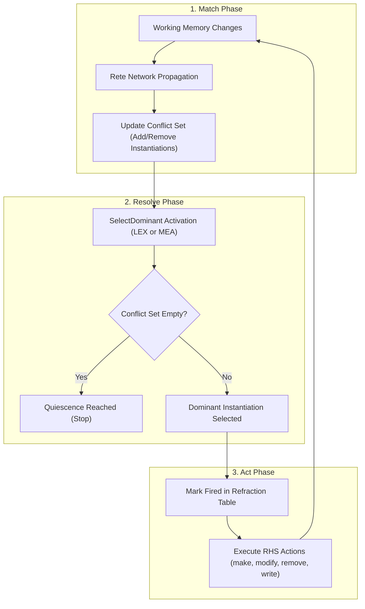
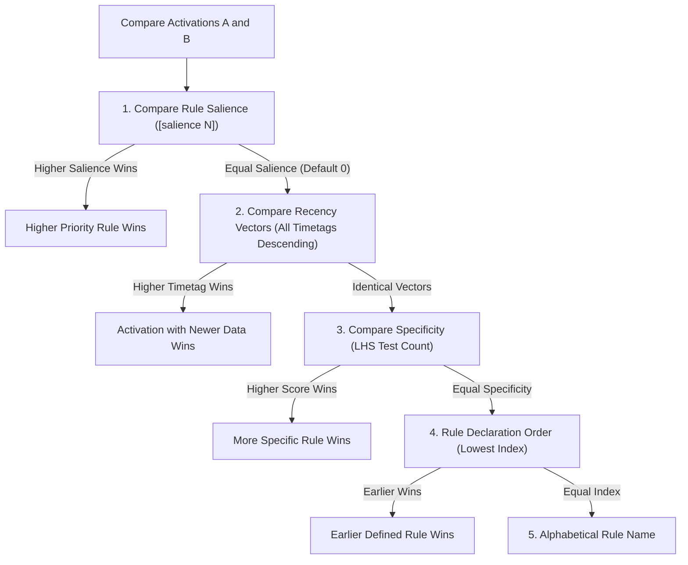
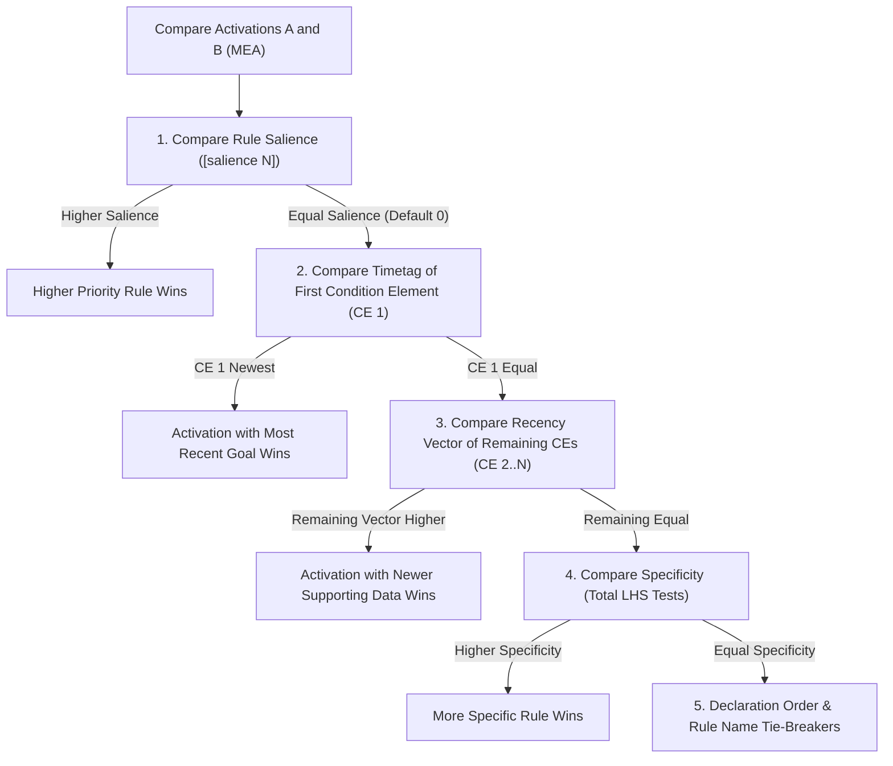
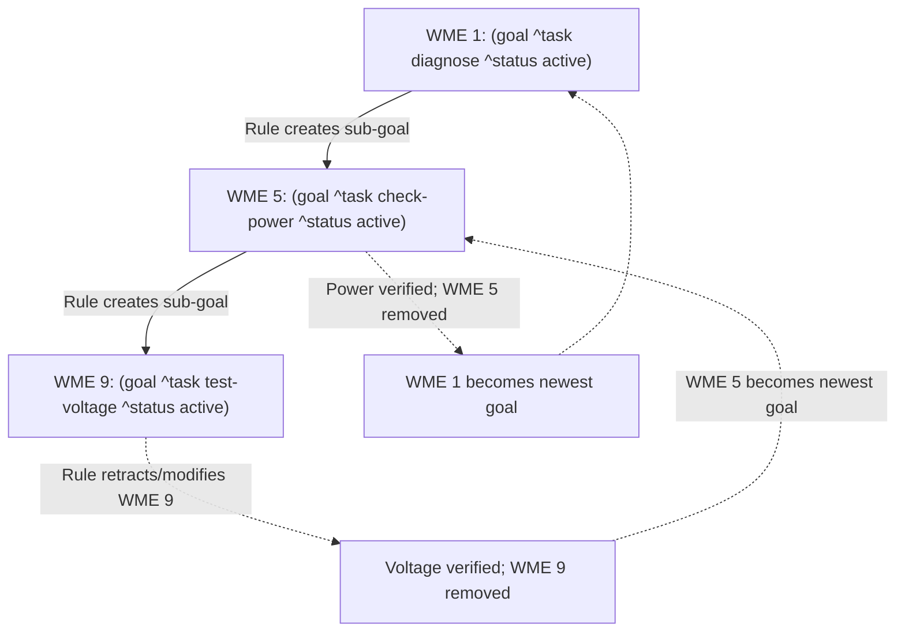

# OPS5 Conflict Resolution & Selection Strategies: LEX and MEA

In OPS5 and production rule systems based on the Rete algorithm, multiple rules can have their conditions satisfied simultaneously during any given inference cycle. The collection of all satisfied rule instantiations at a given moment is called the **Conflict Set** (or **Agenda**).

**Conflict Resolution** is the deterministic decision procedure used by the inference engine to select exactly one winning rule instantiation to fire on each cycle.

OPS5 provides two standard conflict resolution strategies:
- **`LEX`** (**Lexicographic**): Focuses attention on the most recently modified data across the entire Left-Hand Side (LHS).
- **`MEA`** (**Means-Ends Analysis**): Emphasizes goal-directed execution by prioritizing the recency of the **first condition element** (the goal or task descriptor), enabling structured sub-goaling and hierarchical control.

---

## 1. The Match-Resolve-Act Cycle

The engine runs a continuous recognition loop until no rules match (quiescence), an explicit `(halt)` action is executed, or a maximum cycle limit is reached.



### The Three Phases
1. **Match**: Working Memory Elements (WMEs) added, modified, or removed propagate through the Rete network's alpha and beta memories. Satisfied rule conditions produce new candidate activations; retracted WMEs invalidate and remove obsolete activations.
2. **Resolve**: The engine evaluates all candidate activations in the Conflict Set according to the active strategy (`LEX` or `MEA`) and determines the single dominant activation.
3. **Act**: The dominant activation is marked as refracted and its Right-Hand Side (RHS) actions execute in sequence, modifying working memory and triggering the next cycle.

---

## 2. Refraction Semantics

To prevent an inference engine from looping indefinitely on the same static set of facts, OPS5 enforces **refraction**:

- An instantiation is uniquely identified by the rule together with the exact timetags of the matching WMEs:
  $$\text{Key} = \langle \text{RuleName}, [T_1, T_2, \dots, T_k] \rangle$$
- Once an instantiation fires, its unique key is stored in the engine's refraction table.
- A refracted instantiation is never placed back in the Conflict Set or allowed to fire again for that identical set of timetags.
- If any participating WME is modified (retracted and re-asserted with a newer timetag) or re-created, a new timetag is generated, producing a distinct instantiation key that can fire.

---

## 3. The LEX Strategy (Lexicographic)

**`LEX`** is the default OPS5 strategy. It models a flexible, data-driven recency heuristic where the production system always processes the newest information available.

### LEX Selection Algorithm

When comparing candidate activations $A$ and $B$, `LEX` evaluates five criteria in strict priority:



#### Step 1: Explicit Rule Salience
If the rules define explicit salience weights (default is `0`), the activation with the higher salience strictly dominates, regardless of WME recency or specificity.

#### Step 2: Full Recency Vector Comparison
1. For each candidate activation, collect the timetags of all WMEs matching positive condition elements.
2. Sort the timetags in **strictly descending order**:
   $$V = [T_{\max}, T_2, T_3, \dots, T_{\min}]$$
3. Compare the vectors lexicographically element-by-element:
   - Compare $V_A[0]$ with $V_B[0]$. The activation with the larger timetag dominates.
   - If $V_A[0] = V_B[0]$, compare $V_A[1]$ with $V_B[1]$, and so on.
   - If one vector is a prefix of the other (e.g. $[10, 5, 2]$ vs $[10, 5]$), the longer vector dominates because it incorporates additional confirming evidence.

#### Step 3: Specificity Comparison
If the recency vectors are identical, the system chooses the more specialized rule. Specificity is the total number of tests in the rule's Left-Hand Side (see [Rule Specificity](#5-rule-specificity-calculation)).

#### Step 4: Rule Declaration Order
If specificity is identical, the rule defined earliest in the source program (lowest declaration index) dominates.

#### Step 5: Deterministic Name Tie-Breaker
If declaration indices are identical (e.g. dynamically generated rules), rule names are compared alphabetically.

---

## 4. The MEA Strategy (Means-Ends Analysis)

**`MEA`** was designed specifically for goal-directed architectures and expert systems (such as CMU's R1/XCON system). In such systems, production rules are structured so that the **first condition element** represents the active goal or sub-goal context.

### MEA Selection Algorithm

`MEA` evaluates criteria in the following strict priority:



#### Step 1: Explicit Rule Salience
If the rules define explicit salience weights, the higher salience activation strictly dominates.

#### Step 2: First Condition Element (Goal Recency)
- Compare the timetag of the WME matching **Condition Element 1** ($CE_1$):
  - If $T_{A, 1} > T_{B, 1}$, Activation $A$ dominates.
  - If $T_{B, 1} > T_{A, 1}$, Activation $B$ dominates.
- Because a newly asserted or modified sub-goal will have a higher timetag than its parent goal, the engine immediately suspends parent-level processing and focuses exclusively on rules serving the new sub-goal.

#### Step 3: Remaining Recency Vector (Supporting Data Recency)
If both activations match the exact same goal WME ($T_{A, 1} = T_{B, 1}$):
- Collect the timetags of the remaining condition elements ($CE_2, \dots, CE_k$).
- Sort remaining timetags in descending order.
- Compare the resulting vectors lexicographically, exactly as in `LEX`.

#### Step 4: Specificity Comparison
If remaining recency vectors are identical, choose the activation with higher specificity.

#### Step 5: Declaration Order and Name Tie-Breakers
Identical to `LEX`.

---

## 5. Rule Specificity Calculation

When recencies are tied, OPS5 chooses the more specific rule. Specificity measures the number of distinct structural and attribute constraints a rule imposes on working memory.

$$\text{Specificity} = \sum_{ce \in \text{Conditions}} \text{Score}(ce)$$

Where for each condition element:
- **`+1`** for the class name match (e.g. `(City ...)` or `(goal ...)`).
- **`+1`** for each attribute constraint test (e.g. `^status active`, `^count > 5`, `^type <> nil`).

### Specificity Example

Consider two rules matching task elements:

```ops5
; Specificity = 1 (class task) + 1 (^status) = 2
(p default-task
    (task ^status pending)
  -->
    (write "Processing general task" (crlf))
)

; Specificity = 1 (class task) + 1 (^status) + 1 (^priority) + 1 (^type) = 4
(p urgent-batch-task
    (task ^status pending ^priority high ^type batch)
  -->
    (write "Processing urgent batch task" (crlf))
)
```

If a WME satisfies both rules with identical recency, `urgent-batch-task` (specificity 4) will always dominate `default-task` (specificity 2).

---

## 6. Detailed Comparison: LEX vs. MEA

### Strategy Feature Matrix

| Dimension | LEX (Lexicographic) | MEA (Means-Ends Analysis) |
| :--- | :--- | :--- |
| **Primary Driver** | Global data recency across all CEs | Local recency of Condition Element 1 (Goal) |
| **Architectural Style** | Data-driven, opportunistic, event-driven | Goal-directed, hierarchical task breakdown |
| **Sub-goaling Support** | Manual (requires explicit stage tags or flags) | Native (assertion of sub-goal immediately preempts parent) |
| **Goal Resumption** | Requires explicit reactivation | Automatic when sub-goals are retracted |
| **Vector Scope** | All positive condition elements $[CE_1, \dots, CE_N]$ | CE 1 examined standalone; $[CE_2, \dots, CE_N]$ vector evaluated second |
| **Specificity Role** | Evaluated after full recency comparison | Evaluated after CE 1 and remaining CE comparisons |
| **OPS5 Default** | Yes | No (selectable via `(strategy mea)`) |

---

## 7. Concrete Walkthrough: LEX vs. MEA in Action

Consider an expert diagnostic system with two rules and four asserted facts:

### Rules Definition

```ops5
; Rule 1: Diagnostic analysis under Goal 1
(p rule-diag-1
    (goal ^id 1)
    (measurement ^sensor temp ^val <v>)
  -->
    (write "Executing Diagnostic 1" (crlf))
)

; Rule 2: Diagnostic analysis under Goal 2
(p rule-diag-2
    (goal ^id 2)
    (measurement ^sensor press ^val <v>)
  -->
    (write "Executing Diagnostic 2" (crlf))
)
```

### Working Memory State

Assume facts are asserted in this order:
1. `(1: goal ^id 1)` *(Initial goal created)*
2. `(2: measurement ^sensor press ^val 100)` *(Pressure sensor read)*
3. `(3: goal ^id 2)` *(Sub-goal created later)*
4. `(4: measurement ^sensor temp ^val 98.6)` *(Temperature sensor read last)*

### Conflict Set Evaluation

Both rules are satisfied:
- **Activation A (`rule-diag-1`)**: Matches `goal ^id 1` (timetag 1) and `measurement temp` (timetag 4).
  - Condition element order: `[1, 4]`
- **Activation B (`rule-diag-2`)**: Matches `goal ^id 2` (timetag 3) and `measurement press` (timetag 2).
  - Condition element order: `[3, 2]`

### Firing Order Under LEX
1. Compute sorted descending recency vectors:
   - Activation A: `[4, 1]`
   - Activation B: `[3, 2]`
2. Compare index 0:
   - $4 > 3 \implies$ **Activation A (`rule-diag-1`) wins.**
3. **Behavior**: The engine follows the freshest data (`temp` reading at timetag 4), regardless of the goal hierarchy.

### Firing Order Under MEA
1. Compare the timetag of Condition Element 1 ($CE_1$):
   - Activation A $CE_1$: Timetag **1** (`goal ^id 1`)
   - Activation B $CE_1$: Timetag **3** (`goal ^id 2`)
2. Compare $CE_1$ timetags:
   - $3 > 1 \implies$ **Activation B (`rule-diag-2`) wins.**
3. **Behavior**: The engine maintains focus on the newest sub-goal (`goal ^id 2`), deferring work on Goal 1 until Sub-goal 2 completes or is removed.

---

## 8. Goal Stack & Sub-Goaling Architecture with MEA

MEA enables clean hierarchical problem solving using working memory elements as a **goal stack**:



### Pattern Implementation
1. **Always place the goal element first**:
   ```ops5
   (p solve-subproblem
       (goal ^type calculate-tax ^order-id <oid>)
       (order ^id <oid> ^subtotal <sub>)
     -->
       ...
   )
   ```
2. **Spawning a sub-goal**:
   When a rule asserts a new `(make goal ^type calculate-discount)`, the new WME receives a higher timetag than the parent goal. MEA automatically switches the engine's focus to rules matching the new sub-goal.
3. **Completing a sub-goal**:
   When the sub-goal is retracted via `(remove <g>)`, the previous goal element once again becomes the most recent goal in working memory, automatically resuming parent execution.

---

## 9. Controlling Conflict Resolution in the Engine

### In the Interactive REPL

Display the active strategy:
```
ops5> strategy
Current conflict resolution strategy: LEX
```

Switch strategy dynamically:
```
ops5> strategy mea
Strategy set to MEA (Means-Ends Analysis)

ops5> strategy lex
Strategy set to LEX (Lexicographic)
```

Inspect the Conflict Set in current dominance order:
```
ops5> cs
Conflict Set (2 activations, strategy: MEA):
  * rule-diag-2 [3 2] (spec=3)
    rule-diag-1 [1 4] (spec=3)
```
*(The asterisk `*` designates the dominant activation scheduled to fire next).*

### In JSON Test Suites

Set the strategy explicitly within automated test suite definitions:
```json
{
  "name": "diagnostic_mea_test",
  "strategy": "MEA",
  "source_file": "fixtures/diagnostics.ops",
  "initial_wm": [ ... ],
  "expected_cycles": 6
}
```

### Programmatic Go API

Configure or inspect the strategy on the Go [`Engine`](../pkg/engine/engine.go) instance:

```go
package main

import (
    "ops5/pkg/conflict"
    "ops5/pkg/engine"
)

func main() {
    eng := engine.New()

    // Switch to MEA strategy
    eng.SetStrategy(conflict.StrategyMEA)

    // Query active strategy
    currentStrat := eng.ConflictSet().Strategy() // conflict.StrategyMEA
}
```
