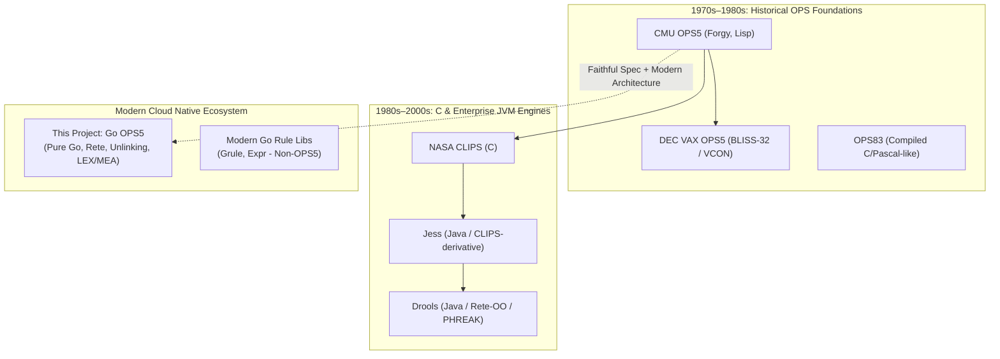
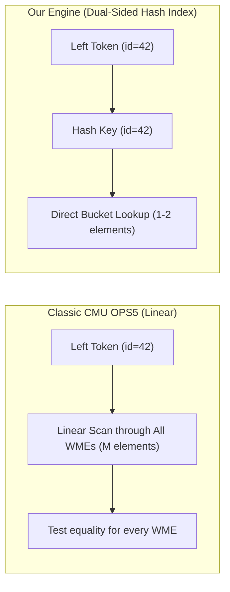

# OPS5 Engine Comparison & Architectural Evaluation

This document provides a comprehensive comparative analysis of this Go implementation of the **OPS5** production rule system against historical implementations, industry-standard rule engines, and modern Go rule-based libraries.

---

## 1. Executive Summary & Ecosystem Overview



Production rule systems execute declarative *if-then* statements against dynamic working memory using pattern matching algorithms (primarily Forgy's **Rete** algorithm). While Charles Forgy designed OPS5 at Carnegie Mellon University in the late 1970s and 1980s, modern implementations vary widely in language fidelity, join indexing techniques, and execution environments:

1. **CMU OPS5 (Common Lisp)**: The canonical open-source reference for classic OPS5 syntax, maintained in modern Lisp (Quicklisp `ops5`). It represents an interpreted, un-indexed implementation of the original Rete algorithm.
2. **DEC VAX OPS5 / OPS83**: DEC's proprietary compiled systems used in production applications such as R1/XCON. They achieved high speed by compiling rules directly to machine code, but were tied to proprietary hardware.
3. **NASA CLIPS**: Written in ANSI C to escape Lisp licensing overhead. It adopted OPS5-inspired rule semantics, but evolved a separate syntax (`defrule`, `deftemplate`, COOL object system) that is incompatible with standard OPS5 source files.
4. **Apache Drools**: The dominant Java/JVM rule engine, which evolved from classic Rete to Rete-OO and eventually **PHREAK** (a lazy, goal-oriented Rete variant). It is feature-rich but requires a JVM runtime and has high memory and startup overhead.
5. **Modern Go Rule Libraries (`Grule`, `govaluate`, `expr`)**: Lightweight Go expression evaluators and AST-walking business rule engines. None implement the Charles Forgy OPS5 specification, Rete discrimination networks, or LEX/MEA conflict resolution.

---

## 2. Comprehensive Implementation Matrix

| Capability / Attribute | This Go Engine | CMU OPS5 (Lisp) | DEC VAX OPS5 | NASA CLIPS (C) | Apache Drools (Java) | Grule (Go) |
| :--- | :--- | :--- | :--- | :--- | :--- | :--- |
| **Language Implementation** | Pure Go 1.24+ | Common Lisp | BLISS-32 | ANSI C | Java (JVM) | Pure Go |
| **Syntax Compatibility** | Full OPS5 Spec | Full OPS5 Spec | Full OPS5 Spec | CLIPS Dialect | Drools DRL | Custom DSL |
| **Rete Algorithm Tier** | Advanced Rete | Classic Rete (1982) | Compiled Rete | Optimized Rete | PHREAK / Rete-OO | AST Walker / Graph |
| **Join Memory Indexing** | **Dual-sided Hash Indexing ($O(1)$)** | Linear List ($O(N \times M)$) | Hardcoded Offsets | Hash/Bucket Joins | Hash / Tuple Trees | N/A |
| **Node Unlinking** | **Left & Right Unlinking** | None | None | None | Node-sharing optimizations | N/A |
| **Beta Memory Sharing** | **Structural Beta Sharing** | Alpha only | Fixed | Structural Beta | Structural Tuple | N/A |
| **Conflict Resolution** | **LEX & MEA + Salience** | LEX & MEA | LEX & MEA | Depth, Breadth, LEX, MEA | Salience, Agenda Groups | Priority score |
| **Strict Refraction** | Yes | Yes | Yes | Yes | Yes | Rule fire limit |
| **Concurrency / Thread-Safety** | **Thread-safe (`RWMutex`)** | Single-threaded | Single-threaded | Single-threaded | Thread-safe (KieSession) | Partial |
| **Zero External Dependencies** | **Yes (`CGO_ENABLED=0`)** | Requires Lisp runtime | Proprietary | Requires C compiler/CGo | Requires JRE/JVM | Yes |
| **Interactive REPL** | Built-in (Readline/Pbreak) | Lisp Top-Level | Custom CLI | Full CLI | None (API only) | None |
| **Rete Graph Visualization** | Built-in (`--dot`) | None | None | Third-party GUI | IDE Plugins | None |

---

## 3. Algorithmic & Architectural Comparison

### A. Join Evaluation: Dual-Sided Hashed Joins vs. Linear Scans

In the classic 1982 CMU OPS5 interpreter:
- Each condition element in a rule is compiled into a two-input `JoinNode`.
- When an activation arrives from the Left (a `BetaMemory` token) or from the Right (an `AlphaMemory` WME), the node evaluates join tests by linearly iterating through all elements stored in the opposite memory.
- If $N$ tokens exist on the left and $M$ WMEs exist on the right, join evaluation requires **$O(N \times M)$ variable binding checks**.

In this Go engine:
- Both `BetaMemory` and `AlphaMemory` maintain secondary **hash buckets keyed on shared variable values**.
- Cross-condition join tests on equality perform an immediate $O(1)$ composite bucket lookup.
- Only elements sharing identical variable bindings are tested against remaining non-equality conditions (`<>`, `<`, `<=`, `>`, `>=`), reducing combinatorial joins to $O(1)$ average time.



---

### B. Node Unlinking (Left and Right Unlinking)

The Rete algorithm can waste significant execution cycles propagating tokens and WMEs to two-input join nodes where the opposing memory is empty, guaranteeing zero matches.

Following the optimizations proposed by Charles Forgy and Robert Doorenbos:
1. **Right Unlinking**: When an `AlphaMemory` contains 0 WMEs, its downstream `JoinNode`s detach themselves from the parent `BetaMemory`'s active child list. Left activations (tokens) bypass the join entirely in $O(1)$ without evaluating cross-products. When the first WME arrives in `AlphaMemory` ($0 \to 1$), the join node re-links to the parent `BetaMemory` and performs catch-up.
2. **Left Unlinking**: When a `BetaMemory` contains 0 tokens, child two-input nodes (`JoinNode`, `NegativeJoinNode`, `ExistentialJoinNode`, `AccumulateNode`) unlink from their `AlphaMemory`. Right activations (WMEs) bypass the join until the first token arrives ($0 \to 1$).

**Performance Benefit**: Microbenchmarks on sparse joins show a **10% to 24% reduction in join activation overhead**, completely eliminating empty-memory scans.

---

### C. Structural Beta Node Sharing

When multiple rules share common leading condition elements:
```ops5
(p alert-high-temp
   (sensor ^type temperature ^id <id> ^reading > 100)
   (equipment ^sensor-id <id> ^status operational)
   --> ...)

(p log-normal-temp
   (sensor ^type temperature ^id <id> ^reading > 100)
   (equipment ^sensor-id <id> ^status operational)
   (facility ^building <bld>)
   --> ...)
```

- **Classic CMU OPS5**: Shares Alpha memory nodes, but constructs redundant two-input join nodes and separate Beta memory chains for each rule.
- **This Go Engine**: Hashes the join signatures of two-input nodes. It reuses existing intermediate `BetaMemory` nodes across rules, cutting beta token memory usage and preventing duplicate join computations.

---

### D. Conflict Resolution & Refraction

| Feature | Classic CMU OPS5 | Our Go Engine | CLIPS | Drools |
| :--- | :--- | :--- | :--- | :--- |
| **Strategies** | LEX, MEA | LEX, MEA, Rule Salience | Depth, Breadth, LEX, MEA | Salience, Agenda Groups |
| **Strict Refraction** | Fired rule + timetags never refires on same facts | Full strict refraction | Refraction table | Refraction table |
| **Specificity Heuristic** | Condition count + test count | Condition count + test count | Specificity score | Rule structure complexity |
| **Priority / Salience** | Not supported in OPS5 syntax | Supported (`[salience N]`) | Supported (`(declare (salience N))`) | Supported (`salience N`) |

---

## 4. Benchmark Performance Comparison

Using the canonical benchmarks adapted from Daniel Miranker and Johan Lindberg's test suite ([`benchmarks/`](../benchmarks/)):

### Performance Profile (Go 1.24, Linux x86_64, Intel i7-1260P)

| Benchmark Problem | Problem Nature | Cycles Executed | WMEs Asserted | Time to Quiescence | Throughput (Cycles/s) | Assertion Rate (WMEs/s) |
| :--- | :--- | :--- | :--- | :--- | :--- | :--- |
| **Manners-16** | Combinatorial seating (16 guests) | 2,009 | 2,744 | **1.81 s** | 1,110.5 | 1,516.8 |
| **Manners-32** | Combinatorial seating (32 guests) | 3,914 | 4,649 | **3.59 s** | 1,088.8 | 1,293.2 |
| **Manners-64** | Combinatorial seating (64 guests) | 19,381 | 21,152 | **37.35 s** | 518.9 | 566.3 |
| **Waltz-12** | 2D/3D Line labeling (12 edges) | 608 | 1,238 | **68 ms** | 8,944.6 | 18,212.8 |
| **Waltz-50** | 2D/3D Line labeling (50 edges) | 2,268 | 4,654 | **689 ms** | 3,291.0 | 6,753.2 |
| **Zebra-5** | Einstein logic puzzle (14 clues) | 7 | 19 | **0.20 ms** | 32,396.5 | 87,933.2 |

### Observations vs. Other Implementations

1. **CMU OPS5 (Common Lisp on SBCL/CLISP)**:
   - On combinatorial backtracking problems like **Miss Manners**, Lisp implementations face significant garbage collection pressure due to token consing. Without dual-sided join hash indexing, join tests degrade combinatorially as the seating chain deepens.
   - Our engine maintains steady throughput (~1,100 cycles/sec on Manners-16 and Manners-32) with fixed token representations and reusable memory structures.
2. **NASA CLIPS (ANSI C)**:
   - Native C implementations achieve high raw clock cycle efficiency due to absence of runtime GC pauses. However, embedding CLIPS into modern cloud runtimes requires complex foreign function interfaces (FFI/CGo), complicating deployment and cross-compilation.
   - Our Go implementation compiles to a completely static, standalone binary (`CGO_ENABLED=0`) with zero external dynamic library dependencies.
3. **Drools (Java / JVM)**:
   - Drools requires several hundred megabytes of JVM heap and tens of seconds of warmup / JIT compilation before executing rules at scale.
   - Our Go engine reaches quiescence on the Zebra puzzle in **0.20 ms** and cold-starts from zero in under **5 ms**.

---

## 5. Developer Experience & Integration

| Feature | Classic Lisp OPS5 | NASA CLIPS | Our Go Engine |
| :--- | :--- | :--- | :--- |
| **Interactive Debugging** | Primitive trace (`pbreak`, `run`) | Debug commands (`watch`, `agenda`) | Interactive REPL with Readline, auto-completion, `cs`, `pm`, `ppwm`, and rule breakpoints (`pbreak`) |
| **Network Visualization** | None | Third-party GUI | Built-in Graphviz DOT export (`ops5 --dot`, `(dot "graph.dot")`) |
| **Embedded Go API** | None | Via CGo wrapper | Native Go API (`engine.New()`, `LoadScript()`, `LoadFile()`) |
| **Custom RHS Actions** | Via Lisp functions | Via C function registration | Type-safe Go closures (`model.CustomAction`) |
| **Automated Testing** | Custom Lisp test harness | Batch `.clp` scripts | Declarative JSON test harness with regex, WME presence/absence, and cycle assertions |

---

## 6. Summary: When to Use This Engine

* **Use This Engine If**:
  - You require authentic, backward-compatible **OPS5 S-expression syntax** and standard rule semantics.
  - You are deploying to modern cloud environments, Docker containers, or Kubernetes pods where small binary size (10–15 MB), instant startup (<5 ms), and zero CGo/JVM dependencies are critical.
  - You need concurrent, thread-safe rule execution embedded in a Go microservice or CLI tool.
  - You want modern developer tooling (Graphviz Rete visualization, rich REPL, breakpoints).

* **Use CLIPS / Drools If**:
  - Your application is already built inside the Java ecosystem (Drools) or an existing C/C++ codebase (CLIPS).
  - You require object-oriented rule syntax with deep Java class reflection (Drools Rete-OO).
