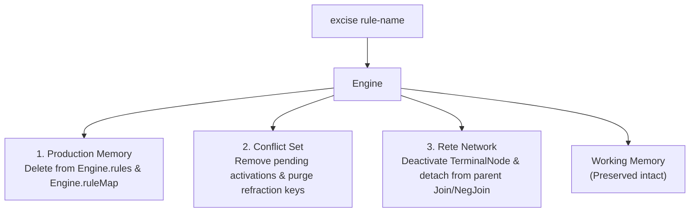

# OPS5 `excise` Directive & Command Reference

The `excise` construct removes production rules from production memory by name. It is the production memory counterpart to `remove` (which retracts working memory elements). When a rule is excised, it is completely detached from the inference engine: its terminal node is unlinked from the Rete network, any un-fired activations are purged from the conflict set, and its refraction history is cleared. Existing working memory elements (WMEs) are preserved without modification.

---

## 1. Syntax

### 1.1 Source File Directive (`.ops` / `.ops5`)

In rule files, `excise` is declared as an S-expression at the top level:

```ops5
(excise <rule-name-1> [<rule-name-2> ...])
```

#### Example
```ops5
; Define temporary staging rules
(p stage:validate-input
   (Input ^status unverified)
   -->
   (make ValidationRequest)
)

(p stage:debug-logger
   (Input ^val <v>)
   -->
   (write (crlf) "Debug input: " <v>)
)

; Evict debug-logger before running production pipeline
(excise stage:debug-logger)
```

---

### 1.2 Interactive CLI REPL

The interactive REPL supports both bare-word and S-expression forms:

```text
ops5> excise <rule-name-1> [<rule-name-2> ...]
ops5> (excise <rule-name-1> [<rule-name-2> ...])
```

#### Example Session
```text
ops5> (p demo-rule (item ^val <x>) --> (write "Item: " <x>))
Defined rule 'demo-rule' (conditions=1, specificity=2)
ops5> make item ^val 42
Asserted: (1: item ^val 42)
ops5> cs
Conflict Set (1 activations, strategy: LEX):
  * [1] demo-rule: (1)
ops5> excise demo-rule
Excised rule 'demo-rule'
ops5> cs
Conflict Set (0 activations, strategy: LEX):
  (empty)
ops5> run
Reached quiescence after 0 cycles.
ops5> wm
Working Memory (1 elements):
  (1: item ^val 42)
```

---

### 1.3 Programmatic Go API

The engine exposes methods for inspecting and excising rules directly:

```go
// Excise a single rule by name. Returns true if found and evicted, false otherwise.
func (e *Engine) ExciseRule(ruleName string) bool

// Excise multiple rules by name. Returns the slice of rule names successfully evicted.
func (e *Engine) ExciseRules(names ...string) []string

// Look up a compiled rule by name (returns nil if not present or excised)
func (e *Engine) Rule(name string) *model.Rule

// Retrieve all currently registered rules
func (e *Engine) Rules() []*model.Rule
```

#### Example
```go
eng := engine.New()
// ... add rules and WMEs ...

if eng.ExciseRule("stage:debug-logger") {
    fmt.Println("Rule excised successfully")
}
```

---

## 2. Internal Mechanics & Lifecycle

Excising a rule performs an atomic cleanup across three subsystems:



### 2.1 Rete Beta Network Detachment
1. The rule's `TerminalNode` is flagged as inactive via `Deactivate()`. Any in-flight or buffered token propagations reaching this node will not invoke `ConflictSetListener.OnActivationAdd`.
2. The `TerminalNode` is detached from its parent beta node (either a `JoinNode` or a `NegativeJoinNode`) using `parent.RemoveSuccessor(terminal)`.
3. The entry is removed from the network's internal terminal registry (`terminals map[string]terminalInfo`).

### 2.2 Conflict Set Purge
1. All pending activations for the rule are removed from the active agenda.
2. The rule's refraction history is deleted. Refraction keys formatted as `<rule-name>:<timetags...>` are purged from the conflict set's refraction table. This ensures that if a rule with the same name is compiled later, it does not inherit stale refraction blocks.

### 2.3 Production Memory Eviction
1. The rule is removed from `Engine.rules` slice and `Engine.ruleMap`.
2. Subsequent calls to `eng.Rule(name)` return `nil`.

### 2.4 Rule Redefinition
When `Engine.AddRule(rule)` or a top-level `(p <rule-name> ...)` statement is evaluated with a rule name that is already defined, OPS5 automatically performs an implicit excision of the previous definition before compiling the new rule. This prevents duplicate activations and orphaned terminal nodes.

---

## 3. Comparison: `excise` vs `remove` vs `reset` vs `halt`

| Operation | Target Layer | Modifies Rules? | Modifies WMEs? | Modifies Conflict Set? |
| :--- | :--- | :---: | :---: | :---: |
| **`excise`** | Production Memory | **Yes** (evicts rules) | No | **Yes** (purges activations for rule) |
| **`remove`** | Working Memory | No | **Yes** (retracts WMEs) | **Yes** (removes matching activations) |
| **`reset`** | System State | No | **Yes** (clears all WMEs) | **Yes** (clears all activations) |
| **`halt`** | Execution Control | No | No | No (stops cycle loop) |

---

## 4. Related References

- [OPS5 Syntax & Keyword Reference](keywords.md)
- [LHS Pattern Matching & Rete Network](lhs_patterns.md)
- [Conflict Resolution Strategies (LEX & MEA)](conflict_resolution.md)
- [Program Termination & Quiescence](program_termination.md)
