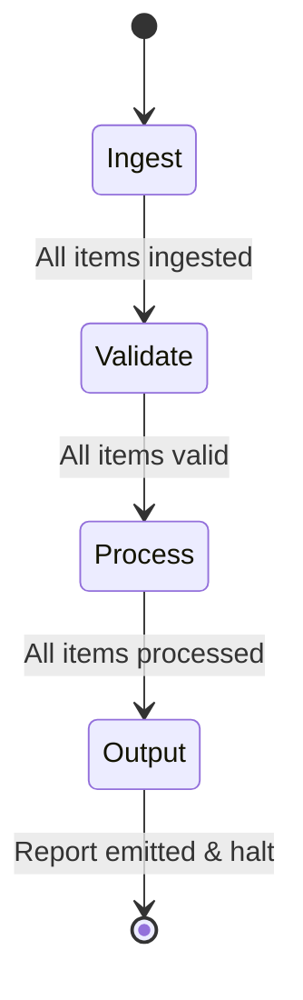
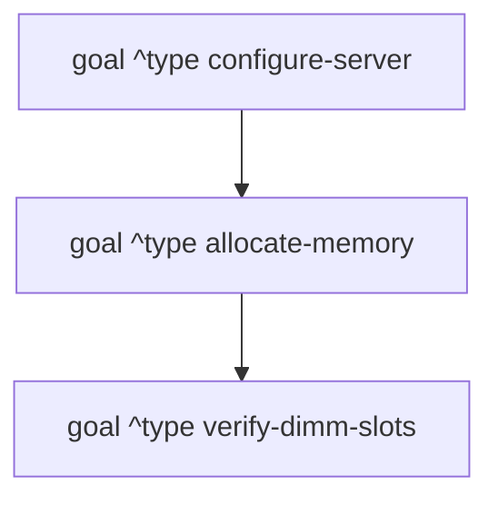

# OPS5 Design Patterns & Programming Idioms

Unlike imperative languages (which rely on sequential statements, loops, and function calls) or object-oriented languages (which organize logic around classes and methods), **production rule systems** operate asynchronously through forward-chaining pattern matching.

This document presents the classic architectural patterns and programming idioms used in OPS5 production systems.

---

## 1. Stage-Based Control (Finite State Machines)

Because production systems have no global sequential "program counter", complex workflows are divided into distinct execution phases using **Stage** (or **Context**) WMEs.



### Pattern Definition
1. Declare a control WME class representing the active phase:
   ```ops5
   (literalize stage name)
   ```
2. Each rule requires the active stage as its first condition element:
   ```ops5
   (p validate-item
       (stage ^name validate)
       <it> (item ^status raw ^price > 0)
     -->
       (modify <it> ^status valid)
   )
   ```
3. A **stage transition rule** advances the state machine once all work in the current stage is finished:
   ```ops5
   (p transition-validate-to-process
       <st> (stage ^name validate)
       -(item ^status raw) ; No more unvalidated items
     -->
       (modify <st> ^name process)
       (write "All items validated. Transitioning to processing." (crlf))
   )
   ```

---

## 2. Collection Iteration & Batch Processing

OPS5 rules match sets of matching facts simultaneously. To iterate across collections without infinite loops, use one of the two standard iteration idioms:

### Pattern A: The Consumption Pattern (Retraction)
Best when raw inputs only need to be processed once and discarded:

```ops5
(p consume-queue-item
    (stage ^name ingest)
    <q> (queue-entry ^payload <data>)
  -->
    (make task ^data <data> ^status ready)
    (remove <q>) ; Consume item to advance iteration
)
```
- Each cycle removes one `queue-entry`.
- When the queue is empty, the rule stops matching naturally.

### Pattern B: The Marking Pattern (Status Mutation)
Best when facts must be preserved in working memory for subsequent stages or reporting:

```ops5
(p process-pending-order
    (stage ^name process)
    <ord> (order ^status pending ^amount <amt>)
  -->
    (modify <ord> ^status processed)
    (write "Processed order with amount:" <amt> (crlf))
)
```
- By modifying `^status pending` to `^status processed`, the WME no longer satisfies the condition, preventing repeated execution.

---

## 3. Aggregations & Reductions

Calculating sums, counts, averages, and extrema across collections of WMEs is a common requirement.

### Summation Accumulator Pattern

```ops5
(literalize accumulator category total count)

; 1. Accumulate each item into running total
(p accumulate-expense
    (stage ^name calculate)
    <acc> (accumulator ^category expense ^total <cur-tot> ^count <cnt>)
    <exp> (expense ^status pending ^amount <amt>)
  -->
    (bind <new-tot> (compute <cur-tot> + <amt>))
    (bind <new-cnt> (compute <cnt> + 1))
    (modify <acc> ^total <new-tot> ^count <new-cnt>)
    (modify <exp> ^status counted)
)

; 2. Complete aggregation and advance stage
(p finish-expense-calculation
    <st> (stage ^name calculate)
    <acc> (accumulator ^category expense ^total <total> ^count <count>)
    -(expense ^status pending)
  -->
    (write "Total Expenses:" <total> "over" <count> "items." (crlf))
    (modify <st> ^name report)
)
```

### Finding Extrema (Maximum / Minimum)

In OPS5, finding the maximum or minimum element across a set does **not** require looping or sorting. Instead, use a **negated comparison**:

> *"An element is the maximum if there does NOT exist any element with a greater value."*

```ops5
(p select-highest-bid
    (stage ^name auction-close)
    <bid> (bid ^id <bid-id> ^amount <max-val>)
    -(bid ^amount > <max-val>) ; No higher bid exists
  -->
    (write "Winning bid is" <bid-id> "with amount" <max-val> (crlf))
    (make winner ^bid-id <bid-id> ^amount <max-val>)
    (halt)
)
```
- The negated condition `-(bid ^amount > <max-val>)` filters out all non-maximal candidates.
- Exactly one winning bid is matched in a single inference step.

---

## 4. Specificity & Exception Overrides

When designing rule systems, a general default rule can be overridden by a more specific rule without writing complex boolean logic:

```ops5
; General Default Rule (Specificity = 2)
(p process-shipment-standard
    <pkg> (package ^status pending)
  -->
    (modify <pkg> ^status scheduled ^carrier ground)
)

; Specific Exception Rule (Specificity = 4)
(p process-shipment-hazardous-priority
    <pkg> (package ^status pending ^hazardous true ^urgent true)
  -->
    (modify <pkg> ^status scheduled ^carrier special-courier)
)
```

### Why This Works
1. Both `LEX` and `MEA` strategies evaluate **Specificity** when recencies are equal.
2. The specific rule has 4 tests (class + 3 attributes) versus 2 tests for the default rule.
3. If a package is both `hazardous` and `urgent`, the specific rule dominates and fires first.
4. Its action modifies `^status` to `scheduled`, automatically retracting the pending activation for the default rule.

---

## 5. Goal Stacks & Sub-Goaling (with MEA)

In large systems (such as configuration, diagnosis, or planning), tasks are broken down hierarchically using **Means-Ends Analysis (MEA)**.



### Pattern Implementation
1. **Rule with MEA puts Goal WME as Condition Element 1**:
   ```ops5
   (p check-slot-availability
       (goal ^type verify-dimm-slots ^server-id <sid>)
       (chassis ^server-id <sid> ^slots-free <free>)
     -->
       (write "Free slots:" <free> (crlf))
   )
   ```
2. **Calling a Sub-goal**:
   When a parent rule requires a sub-task, it asserts a new goal:
   ```ops5
   (p start-dimm-check
       (goal ^type allocate-memory ^server-id <sid>)
     -->
       (make goal ^type verify-dimm-slots ^server-id <sid>)
   )
   ```
3. **Automatic Preemption & Return**:
   - Because the new goal has a higher timetag, MEA immediately shifts all focus to the sub-goal.
   - When the sub-goal finishes, the sub-routine rule removes `(remove <sub-goal>)`.
   - The parent goal immediately resumes control on the very next cycle.

---

## 6. Semaphore & Serialization Tokens

When multiple rules are eligible to fire but only one should proceed at a time (e.g. reserving a shared resource or printing a header):

```ops5
(literalize mutex-lock resource-name)

(p acquire-printer-lock
    (job ^id <jid> ^needs-printer true)
    -(mutex-lock ^resource-name printer)
  -->
    (make mutex-lock ^resource-name printer)
    (write "Printer locked by job" <jid> (crlf))
)

(p release-printer-lock
    <lock> (mutex-lock ^resource-name printer)
    (job ^id <jid> ^printer-done true)
  -->
    (remove <lock>)
    (write "Printer released." (crlf))
)
```

---

## 7. Summary Checklist for Robust Rules

1. **Avoid Infinite Loops**: Ensure every rule that modifies or asserts facts either:
   - Modifies an attribute that was part of the matching condition (e.g. changing `pending` to `done`).
   - Retracts one of the matching WMEs (`remove <var>`).
   - Advances a stage control WME (`modify <stage> ^name next`).
2. **Use Negation for Stage Transitions**: Always check for the absence of unfinished work before advancing stages (`-(item ^status pending)`).
3. **Prefer MEA for Complex Hierarchies**: Use MEA when building systems with sub-goals, parent-child tasks, or nested workflows.
4. **Leverage Specificity for Exceptions**: Let OPS5 conflict resolution handle special-case priority instead of adding complex negative conditions to general rules.
