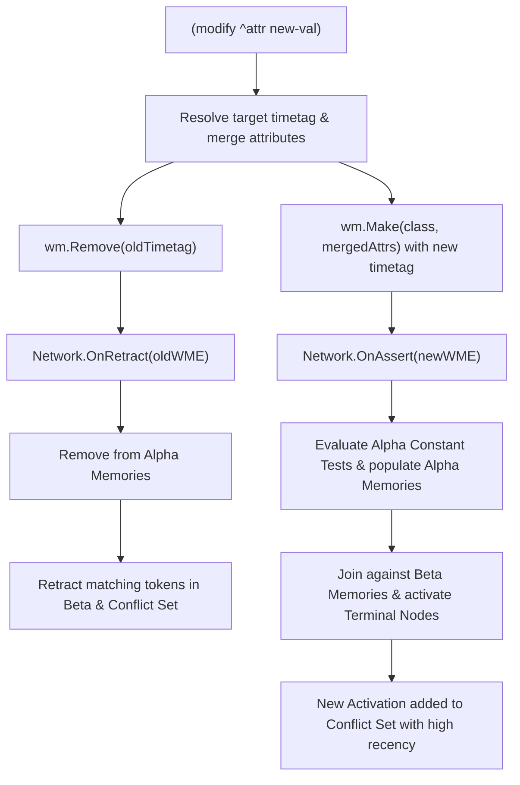

# OPS5 `modify` Action & Semantics Reference

In OPS5, the `modify` construct is used to alter an existing Working Memory Element (WME). It is supported both as a **Right-Hand Side (RHS) action** in production rules and as an **interactive command** in the CLI REPL.

---

## 1. Core OPS5 Semantics

In classical rule-based systems and Forgy's OPS5 specification, a `modify` operation is **not an in-place mutation**. Working memory elements are immutable once asserted.

A `modify` executes as a two-phase transaction:
1. **Retraction**: The existing WME is retracted from working memory. This triggers retraction events in the Rete network, removing any partial matches or conflict set activations dependent on that specific WME timetag.
2. **Assertion with Attribute Preservation**: A replacement WME is asserted with a **new, monotonic timetag**. All attributes explicitly specified in the `modify` action receive their new values, while **all unspecified attributes are preserved untouched** from the original WME.
3. **Agenda & Refraction**: Because the replacement WME has a fresh timetag, it enters the conflict set with higher recency, allowing downstream rules to fire while preventing infinite re-firing on the exact same timetag.

---

## 2. Production Rule (RHS Action) Syntax

Inside a production rule's Right-Hand Side (after `-->`), the syntax is:

```ops5
(modify <target> [^<attribute> <value> ...])
```

### Targeting Mechanisms

The `<target>` identifies which WME to modify:

#### 1. By Element Variable (Recommended)
Prefix a condition element on the Left-Hand Side (LHS) with an angle-bracketed variable (e.g., `<g>`). This binds the variable to the matching WME's timetag:

```ops5
(p activate-goal
   <g> (goal ^name process-order ^status pending)
   -->
   (modify <g> ^status in-progress ^priority 1)
)
```
In this example:
- `^name process-order` is preserved.
- `^status` is updated from `pending` to `in-progress`.
- `^priority` is set to `1`.
- `<g>` receives a new timetag.

#### 2. By 1-Based Condition Element Index
Alternatively, reference the condition element by its 1-based index in the rule's LHS:

```ops5
(p handle-order
   (order ^id <oid> ^status pending)     ; Condition 1
   (customer ^id <cid> ^tier vip)        ; Condition 2
   -->
   (modify 1 ^status processing)          ; Modifies condition element 1 (order)
)
```

---

## 3. Data Types & Multi-Valued Attributes

The `modify` action supports all OPS5 data types:
- **Symbols**: `(modify <x> ^status completed)`
- **Integers**: `(modify <x> ^attempts 3)`
- **Floats**: `(modify <x> ^rating 4.75)`
- **Strings**: `(modify <x> ^label "Priority Shipment")`
- **Booleans**: `(modify <x> ^active true)`
- **Variables**: `(modify <x> ^assigned-to <worker-id>)` (resolved from LHS bindings)

### Modifying Vector Attributes
Attributes declared via `(vector-attribute ...)` can be updated with multiple consecutive values:

```ops5
(literalize City name location nicknames flags)
(vector-attribute location nicknames flags)

(p update-city-profile
   <c> (City ^name Boston ^flags true false true)
   -->
   (modify <c>
           ^nicknames "Beantown" "The Hub" "The Walking City"
           ^flags true true true)
)
```

---

## 4. Interactive REPL Usage

In the interactive REPL (`ops5`), `modify` can be invoked directly by specifying the target WME's timetag:

```ops5
ops5> make task ^id 101 ^status pending ^priority 3
Asserted: (1: task ^id 101 ^priority 3 ^status pending)

ops5> modify 1 ^status active
Modified: (2: task ^id 101 ^priority 3 ^status active)

ops5> wm
(2: task ^id 101 ^priority 3 ^status active)
```

Both bare (`modify 1 ^status active`) and parenthesized (`(modify 1 ^status active)`) syntax are accepted by the REPL.

---

## 5. Rete Network Mechanics

When `modify` executes:



---

## 6. Implementation References

- **Parser**: [`pkg/parser/parser.go`](../pkg/parser/parser.go) (`parseAction` case `"modify"`)
- **Engine**: [`pkg/engine/engine.go`](../pkg/engine/engine.go) (`case model.ModifyAction` and `resolveTargetTimetag`)
- **Working Memory**: [`pkg/wm/wm.go`](../pkg/wm/wm.go) (`WorkingMemory.Modify`)
- **REPL**: [`pkg/cli/repl.go`](../pkg/cli/repl.go) (`handleModify`)
