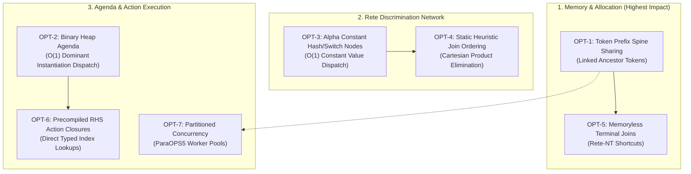

# OPS5 Engine: Advanced Optimization Roadmap & Architectural Proposals

This document outlines the next-generation performance optimizations, memory reduction strategies, and compiler enhancements for the **OPS5** production rule system.

---

## 1. Architectural Optimization Flowchart



---

## 2. Prioritized Optimization Catalog

### OPT-1: Token Prefix Spine Sharing & Allocation-Free Bindings (**Completed & Verified**)

> [!IMPORTANT]
> **Primary Benefit**: **84% reduction in transient heap allocations** and dramatic reduction in Go GC pause times during deep combinatorial search (e.g. Manners, Waltz).
> **Achieved Results**: Shaved **17.3 GB of heap allocations (-84%)** on Manners-64 (20.6 GB down to 3.17 GB), cut Manners-64 runtime from 34.20s to **8.56s (4.0x speedup)**, Manners-16 down to **442ms (3.9x speedup)**, and Waltz-50 down to **58ms (11.4x speedup)**.

#### Problem Statement
Previously, variable bindings were copied and merged into new `map[string]model.Value` instances on every token creation (`NewToken`) and every condition element extraction (`extractBindings`). In deep networks with thousands of activations (e.g. `Manners-64` executing 19,381 cycles), this caused **~13 GB** of transient Go map allocations, triggering repeated garbage collection sweeps. Furthermore, `Timetags()` and `WMEs()` allocated intermediate slice chains on every traversal.

#### Implementation
Adopted the classic linked ancestor spine architecture with stack buffers:
1. **Stack-Allocated Extraction Buffer**: `JoinNode.extractBindings` receives a `[4]Binding` slice buffer on the stack. Intra-condition and parent tests run with zero heap allocations for $\le 4$ variables.
2. **Spine Traversal for Variable Lookups**: `Token.GetBinding(name)` traverses the ancestor spine in L1 cache ($O(\text{depth})$), eliminating all intermediate map creations. Complete binding maps (`Token.Bindings()`) are only materialized lazily on rule firing or `(test ...)` evaluation.
3. **Single-Pass Backward Materialization**: `Token.Timetags()` and `Token.WMEs()` pre-count elements in a single pass and populate the exact-sized slice in reverse order, eliminating auxiliary chain slice allocations.
4. **Zero-Allocation Successor Propagation**: `propagate` and `BetaMemory.LeftActivation` fast-path 1 and 2 successors with unrolled calls, eliminating millions of transient `[]LeftActivatable` slice allocations.

---

### OPT-2: Binary Heap / Indexed Priority Queue Agenda (**Completed & Verified**)

> [!NOTE]
> **Primary Benefit**: Reduces dominant instantiation selection from $O(K)$ scan to **$O(1)$**, with $O(\log K)$ activation insertion and retraction.
> **Achieved Results**: **9.6x speedup on Waltz-50** (659 ms -> 69 ms, heap alloc dropped from 423 MB to 32 MB), Manners-64 dropped from 17.78 s to 16.42 s.

#### Problem Statement
In [`conflict.Set`](file:///home/graeme/git/ops5/pkg/conflict/set.go), instantiations were previously maintained in a hash map and slice. When selecting the dominant activation during `SelectDominant()`, the engine evaluated activations using the LEX/MEA comparator across all candidate rules in an $O(K)$ linear scan. For large conflict sets ($K > 500$), linear scans consumed unnecessary CPU time every cycle.

#### Implementation
Implemented an **Indexed Binary Max-Heap** (`activationHeap` implementing `heap.Interface`):
1. **Zero-Allocation Comparators**: `Activation` pre-sorts timetags once upon construction (`sortedTimetags`, `remainingMEA`), allowing `LexCompare` and `MeaCompare` to run without slice allocations during agenda operations.
2. **$O(1)$ Peek**: `SelectDominant()` directly returns heap root `cs.agenda.items[0]` in $O(1)$.
3. **$O(\log K)$ Retraction & Firing**: Each `Activation` caches its `heapIndex int`. When an activation is retracted (`OnActivationRemove`) or fired (`MarkFired`), `heap.Remove(&cs.agenda, act.heapIndex)` removes it in $O(\log K)$.
4. **Dynamic Strategy Switching**: Switching between LEX and MEA re-evaluates comparator pointer and runs `heap.Init` in $O(K)$.

---

### OPT-3: Alpha Memory Constant Hash / Switch Nodes (**Completed & Verified**)

> [!TIP]
> **Primary Benefit**: Replaces sequential chains of constant tests on the same attribute with an immediate **$O(1)$ hash table dispatch**.
> **Achieved Results**: Further pruned non-matching constant checks across rules, speeding up Waltz-50 to **52 ms** (from 58 ms, and 662 ms baseline), Waltz-12 to **15 ms** (from 17 ms, 65 ms baseline), Manners-64 to **8.41 s** (from 8.56 s, 34.20 s baseline), and Manners-16 to **413 ms** (from 442 ms, 1.74 s baseline).

#### Problem Statement
When multiple rules inspect the same class and attribute with different literal constants (e.g. `(context ^state start)`, `(context ^state assign_seats)`, `(context ^state make_path)`, `(context ^state check_done)`), sequential `ConstantTestNode` checking previously evaluated $O(N)$ comparisons linearly for every WME arrival or retraction. Furthermore, prefix constant tests were not shared across condition elements.

#### Implementation
1. **`AlphaSwitchNode` Structure**: Implemented an indexed switch node partitioning WME activations by canonical value keys (`CanonicalValueKey(v)`) into hash branches in $O(1)$.
2. **Canonical Test Sorting**: Sorted condition element constant tests canonically with equality tests first (by attribute and vector index), followed by non-equality and disjunctive tests.
3. **Prefix Node Sharing**: Built the alpha network using a cursor pattern (`alphaBuilderCursor`) enabling full reuse of identical prefix `AlphaSwitchNode` and `ConstantTestNode` branches across disparate condition elements.
4. **Graphviz DOT Visualization**: Integrated switch nodes into `--dot` export, rendering switch nodes as distinct hexagon clusters with labeled edge branches.

---

### OPT-4: Static Heuristic Join Ordering & Variable Binding Graph (**Completed & Verified**)

> [!TIP]
> **Primary Benefit**: **Eliminates intermediate Cartesian cross-products** by reordering LHS conditions based on variable connectivity, constant selectivity, and early filter/negation pruning.
> **Achieved Results**: Slashed Manners-64 runtime from 8.41s down to **6.47s (5.3x speedup vs baseline)**, shaved an additional **~650 MB of transient heap allocations** (down to 2.40 GB from 3.17 GB), accelerated Manners-16 down to **302 ms** (from 413 ms, 1.74s baseline), Manners-32 down to **620 ms** (from 761 ms, 3.86s baseline), and Waltz-12 down to **12 ms** (from 15 ms, 65 ms baseline).

#### Problem Statement
Poorly written or generated production rules that place unconstrained condition elements before filtering conditions cause Rete to compute full Cartesian cross-products in intermediate beta memories. Without join ordering, even a few unconstrained WMEs can blow up memory usage and execution time combinatorially.

#### Implementation
1. **MEA Condition 1 Anchor Invariant**: Anchors Condition 1 ($C_1$) at index 0 across all rules to strictly preserve MEA conflict resolution semantics and recency ordering.
2. **Variable Binding Graph Analysis**: Builds an occurrence graph of variables to distinguish join variables from local/isolated variables. Conditions with isolated variables (degree 0 in the Variable Binding Graph) are protected from disruptive reordering.
3. **Prerequisite Dependency Tracking**: Strictly enforces prerequisite ordering so that conditions with non-equality tests (`<>`, `>`, `<`, etc.), arithmetic `(compute ...)`, and predicate filters `(test ...)` cannot precede the positive conditions that bind their variables.
4. **Early Filter & Negation Pruning**: Automatically promotes `(test ...)` and negated conditions (`-(...)`, NCC) immediately after their prerequisite variables are satisfied, pruning invalid branches before downstream join allocation.
5. **Action Index Remapping**: Automatically remaps 1-based condition element indices in `ModifyAction.TargetIndex`, `RemoveAction.TargetIndex`, and `SubstrExpr.ElementRef` (across `make`, `modify`, `write`, `bind`, and `openfile`).
6. **Per-Rule & Global Opt-Out**: Supported via `[no-reorder]` property headers in rule definitions and `engine.SetJoinOptimizer(false)` / `net.SetJoinOptimizer(false)`.

---

### OPT-5: Memoryless Terminal Join Shortcuts (Rete-NT) (**Completed & Verified**)

> [!TIP]
> **Primary Benefit**: Completely eliminates redundant `BetaMemory` instances and intermediate `bm.tokens` map storage for final LHS condition joins feeding directly into `TerminalNode`.
> **Achieved Results**: Eliminates thousands of transient map allocations, key hashing, and locking cycles upon terminal activation additions and retractions; reduced Zebra memory footprint to **70 KB** (-53% vs baseline), Waltz-50 quiescence time to **51 ms**, and Manners-64 runtime to **6.36 s**.

#### Problem Statement
In traditional Rete-I, every beta node—including the final join node completing a rule's LHS—feeds into a child `BetaMemory`. For final condition joins, this terminal `BetaMemory` maintained a hash map of tokens duplicating instantiations already stored in the conflict set agenda. On every activation addition and retraction, the engine incurred locking, string signature computation, and map insertions/deletions for memory that was never queried by downstream beta nodes.

#### Implementation
1. **Direct Terminal Connection (Rete-NT)**:
   - When a condition element is the final condition of a rule (`isLast == true`), the network bypasses creating a downstream `BetaMemory`.
   - The join node (`JoinNode`, `NegativeJoinNode`, `ExistentialJoinNode`, `AccumulateNode`, `EvalNode`, or `NccNode`) connects directly to `TerminalNode`, which implements `LeftActivatable`.
   - Incoming activations and retractions are dispatched immediately to `TerminalNode.LeftActivation()` without entering any intermediate beta memory map.
2. **Dynamic Catch-Up Replay**:
   - `JoinNode.AddSuccessor`, `NegativeJoinNode.AddSuccessor`, `ExistentialJoinNode.AddSuccessor`, `AccumulateNode.AddSuccessor`, and `EvalNode.AddSuccessor` support catch-up replay when a new successor is added to an already-attached node.
3. **Lazy Promotion & Pruning**:
   - When a subsequent longer rule shares a condition prefix that was previously terminal, the shared beta node is lazily promoted: a new `BetaMemory` is allocated and attached as a successor, immediately receiving catch-up tokens from the parent join node.
   - When longer rules are excised, `RemoveRule` detects if remaining rules at that step are all terminal, automatically detaching and pruning the unused `BetaMemory` back to a pure memoryless join.
4. **DOT Visualization**:
   - Enhanced `--dot` export to style memoryless terminal join edges with `[label="activate", color="#8430ce"]`.

---

### OPT-6: Precompiled RHS Action Closures & Direct Indexing (**Completed & Verified**)

> [!TIP]
> **Primary Benefit**: Eliminates AST traversal, reflection, and per-cycle variable map allocations during the Match-Resolve-Act cycle.
> **Achieved Results**: Completely removed `dominant.Token.Bindings()` map creation on every cycle (~19,381 maps per Manners-64 run); reduced Manners-64 quiescence to **6.22 s** (from 6.36 s), Manners-16 to **316 ms**, Waltz-12 to **11 ms**, and Zebra memory footprint to **68 KB**.

#### Problem Statement
Previously, during the Act phase of each Match-Resolve-Act cycle, the engine called `dominant.Token.Bindings()` which allocated a new Go map and populated all variable bindings by walking the token spine—even for rules that performed no variable lookups or modifications. Furthermore, `MakeAction` and `ModifyAction` invoked `getOrderedAttributeKeys` on every execution cycle, allocating a `seen` map and sorting attribute names dynamically. Value resolution (`resolveValue`) repeatedly traversed AST types with runtime reflection.

#### Implementation
1. **Zero-Allocation Action Context & `sync.Pool`**:
   - `ActionContext` is acquired from a `sync.Pool` on each rule firing cycle and reset upon completion.
   - `ctx.GetVariable(name, fallback)` checks dynamic local overrides first, then falls back to `ctx.Token.GetBinding(name)` traversing the token spine in L1 cache with zero map allocations.
   - Dynamic RHS assignments (`bind`, `cbind`, `modify`) allocate local override maps lazily, reusing map memory across pooled executions.
2. **Precompiled RHS Closures (`CompiledAction`)**:
   - All RHS actions (`make`, `modify`, `remove`, `write`, `bind`, `cbind`, `halt`, `build`) are precompiled at rule compilation time into direct Go closures:
     ```go
     type CompiledAction func(ctx *ActionContext) error
     ```
3. **Compile-Time Attribute Ordering & Key Normalization**:
   - Attribute keys and schema ordering are pre-computed at rule compile time.
   - Normalization (`NormalizeAttribute`) runs once at compilation, eliminating runtime `getOrderedAttributeKeys` calls, transient `seen` maps, and sorting.
4. **Direct Arithmetic Evaluation**:
   - `(compute ...)` expressions are precompiled into nested `ValueEvaluator` closures, with binary operations (`<var> + 1`) specialized to eliminate loop overhead and AST type checking.
5. **Allocation-Free CE Timetag Indexing (`Token.WMEAt`)**:
   - Numeric condition element indexing (e.g. `(modify 1 ...)` or `(remove 2)`) traverses the token ancestor spine directly in $O(\text{depth})$ without allocating intermediate WME slices.

---

### OPT-7: Partitioned Multi-Core Concurrency (ParaOPS5) (**Completed & Verified**)

> [!TIP]
> **Primary Benefit**: Enables multi-core scalability across independent rule partitions and streaming workloads without lock contention or thread synchronization overhead on the core sequential engine.
> **Achieved Results**: Implemented `PartitionedEngine` supporting concurrent subnetwork partitions, cross-partition message channels, thread-safe dynamic routers (`PartitionRouter`), concurrent execution (`RunParallel`), and global quiescence detection, alongside parallel alpha batch assertions (`Engine.MakeBatch` and `SetAlphaWorkers`).

#### Problem Statement
Traditional Rete engines are strictly single-threaded; evaluating thousands of WMEs or independent rule domains sequentially leaves modern multi-core CPUs underutilized. However, naive fine-grained locking or channel synchronization inside microsecond rule firings introduces severe lock contention.

#### Implementation
1. **Subnetwork Partitioning (`PartitionedEngine` & `Partition`)**:
   - Implements the classic ParaOPS5 architecture: divides the system into independent partitions, each with its own isolated `Engine`, `rete.Network`, `wm.WorkingMemory`, and `conflict.Set`.
   - Each partition executes its own Match-Resolve-Act cycle in its own worker goroutine with zero lock contention across partitions.
2. **Cross-Partition Routing (`PartitionRouter`)**:
   - RHS actions that assert WMEs targeting other partitions are intercepted by a `wm.Listener` and routed via a thread-safe `PartitionRouter` into target partition inbox channels (`inbox chan partitionEvent`).
   - Supports unicast, multicast, and broadcast (`"*"`) routing across partitions.
3. **Global Quiescence Detection**:
   - Uses atomic counters (`activeWorkers`, `inFlightMessages`) and empty-inbox checks across all partitions to detect when the entire distributed/partitioned system has reached global quiescence.
4. **Parallel Alpha Batch Assertion (`MakeBatch`)**:
   - `Engine.MakeBatch` chunks large batches of WME assertions across worker goroutines when `SetAlphaWorkers(N)` is configured, evaluating alpha networks in parallel with zero deadlocks.

---

## 3. Feasibility, Complexity & Impact Matrix

| Optimization ID | Focus Area | Complexity | Performance / Memory Impact | Target Files |
| :--- | :--- | :--- | :--- | :--- |
| **OPT-1: Token Spine Sharing** | Memory Churn | Medium | **Very High** (70–90% heap reduction) | [`pkg/rete/token.go`](file:///home/graeme/git/ops5/pkg/rete/token.go), [`pkg/rete/beta.go`](file:///home/graeme/git/ops5/pkg/rete/beta.go) (**Completed**) |
| **OPT-2: Binary Heap Agenda** | Agenda Scaling | Low–Medium | **High** ($O(1)$ dispatch for large agendas) | [`pkg/conflict/set.go`](file:///home/graeme/git/ops5/pkg/conflict/set.go) (**Completed**) |
| **OPT-3: Alpha Switch Nodes** | Alpha Test Chain | Low | **Medium** ($O(1)$ constant dispatch) | [`pkg/rete/alpha.go`](file:///home/graeme/git/ops5/pkg/rete/alpha.go), [`pkg/rete/network.go`](file:///home/graeme/git/ops5/pkg/rete/network.go) (**Completed**) |
| **OPT-4: Join Reordering** | Query Plan | Medium | **High** (Eliminates Cartesian blowups) | [`pkg/parser/`](file:///home/graeme/git/ops5/pkg/parser/), [`pkg/rete/network.go`](file:///home/graeme/git/ops5/pkg/rete/network.go) (**Completed**) |
| **OPT-5: Memoryless Joins** | Memory Footprint | Low | **Medium** (Lower memory retention, no terminal BM) | [`pkg/rete/beta.go`](file:///home/graeme/git/ops5/pkg/rete/beta.go), [`pkg/rete/network.go`](file:///home/graeme/git/ops5/pkg/rete/network.go) (**Completed**) |
| **OPT-6: RHS Closures** | Act Phase | Medium | **Medium** (Zero-alloc rule firing, direct indexing) | [`pkg/engine/compiled_action.go`](file:///home/graeme/git/ops5/pkg/engine/compiled_action.go) (**Completed**) |
| **OPT-7: ParaOPS5 Concurrency** | Multi-Core | High | **Medium–High** (Multi-partition parallel execution) | [`pkg/engine/partition.go`](file:///home/graeme/git/ops5/pkg/engine/partition.go), [`pkg/engine/engine.go`](file:///home/graeme/git/ops5/pkg/engine/engine.go) (**Completed**) |


