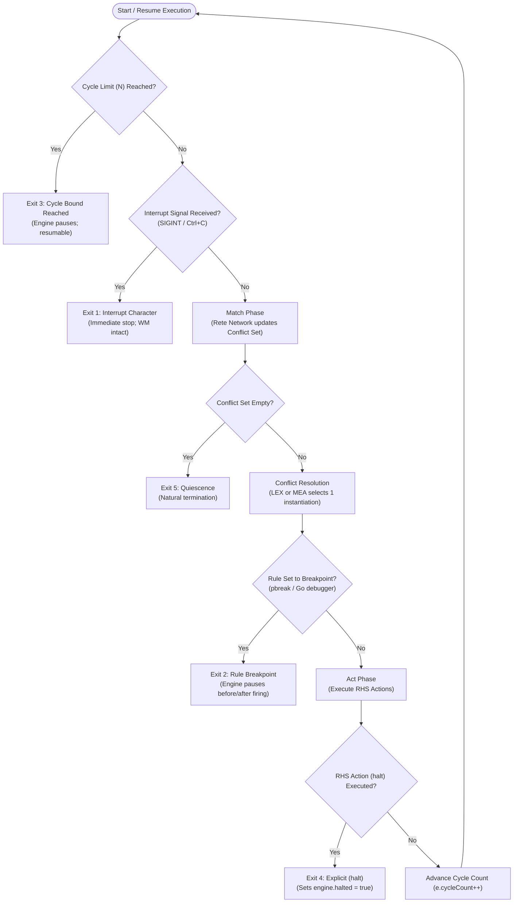

# OPS5 Program Termination & Halting Mechanisms

In production rule systems such as OPS5, program flow is not governed by traditional procedural loops or sequential instruction pointers. Instead, the engine executes an autonomous **Recognize-Act cycle** (Match $\rightarrow$ Conflict Resolution $\rightarrow$ Act).

As established in classic rule-based literature (*Programming Expert Systems in OPS5*, Brownston, Farrell, Kant, & Martin, Addison-Wesley, 1985, Section 2.5), there are **five distinct ways** an OPS5 program stops or terminates execution:

1. **Implementation-Specific Interrupt Character** (e.g., `Ctrl+C` / `SIGINT`)
2. **Rule Breakpoint** (e.g., `pbreak` or Go runtime / Delve breakpoints)
3. **Cycle Bound on the `run` Command** (e.g., `run [N]` / `(run [N])`)
4. **RHS Action `(halt)` Command**
5. **Empty Conflict Set (Quiescence)**

This document elucidates the semantics, runtime behavior, and practical debugging implications of each termination mechanism in the Go OPS5 implementation.

---

## Termination Architecture & The Recognize-Act Cycle

The diagram below illustrates where each of the five termination checks occurs within the OPS5 execution pipeline:



---

## 1. Implementation-Specific Interrupt Character

### Concept & Semantics
During interactive development, a rule set may encounter an unintended infinite loop, an unresponsive `(accept)` prompt, or prolonged computations. An **implementation-specific interrupt character** forces the runtime to pause or terminate rule execution asynchronously from the keyboard without terminating the operating system process or losing working memory state.

### Go Runtime & CLI Implementation
- **POSIX Signal Handling**: In Unix/Linux/macOS terminals, pressing `Ctrl+C` emits a `SIGINT` (Signal 2).
- **Graceful Trap**: In Go, signals can be trapped via the standard library package `os/signal`:
  ```go
  sigChan := make(chan os.Signal, 1)
  signal.Notify(sigChan, os.Interrupt, syscall.SIGTERM)
  ```
- **Engine State Integrity**: Because WME assertions and retractions in Go OPS5 are protected by read/write mutexes (`sync.RWMutex`), interrupting a run does not leave working memory in a corrupted or half-modified state.
- **Diagnostic Inspection**: When interrupted, the CLI drops the developer back to the interactive REPL prompt (`OPS5>`). The developer can immediately query the state that caused the hang:
  - `wm` — displays all active WMEs.
  - `cs` — inspects the conflict set activations competing to fire.
  - `trace on` — enables cycle tracing before resuming with `step`.

---

## 2. Rule Breakpoints & Go Runtime Debugging

### Concept & Semantics
A **rule breakpoint** pauses engine execution precisely when a designated production rule is selected from the conflict set, immediately before or after its Right-Hand Side (RHS) actions execute.

### A. Classic OPS5: `pbreak`
In classic OPS5 environments, the `pbreak` directive sets or clears breakpoints on specific production names:
```ops5
(pbreak FindAncestors::Stop)     ; Pause whenever FindAncestors::Stop is selected
(pbreak)                         ; List all active rule breakpoints
(unbreak FindAncestors::Stop)   ; Remove breakpoint
```
When a broken rule is selected by conflict resolution:
1. The engine suspends the execution loop before firing the rule.
2. Control returns to the user prompt.
3. The user can inspect the current instantiations, examine bindings, and either step (`step`) or continue running (`run`).

### B. Go Runtime Debugging (Delve / IDEs)
Because this OPS5 engine is implemented in Go, developers can leverage native Go debugging tools (such as [Delve (`dlv`)](https://github.com/go-delve/delve), VS Code, or GoLand) to set programmatic breakpoints:

1. **Rule Selection Breakpoint**:
   Place a breakpoint in [`pkg/engine/engine.go`](file:///home/graeme/git/ops5/pkg/engine/engine.go) inside `Step()`:
   ```go
   // Break when a specific rule is selected
   if selected.Rule.Name == "FindAncestors::Stop" {
       runtime.Breakpoint() // or debugger breakpoint
   }
   ```
2. **Action Execution Breakpoint**:
   Place a breakpoint in `executeAction()` or within concrete action evaluators (e.g. `MakeAction`, `ModifyAction`, `HaltAction`).
3. **WME Assertion/Retraction Listener**:
   Implement the `wm.Listener` interface to break on specific WME changes:
   ```go
   type DebugListener struct{}
   func (d *DebugListener) OnAssert(wme *model.WME) {
       if wme.Class == "Request" {
           // Inspect assertion
       }
   }
   func (d *DebugListener) OnRetract(wme *model.WME) {}
   ```

### C. Single-Stepping in the REPL
The interactive REPL provides the `step` command to execute a single cycle at a time:
```ops5
OPS5> step
Fired: FindAncestors::Initialize with WMEs [1] (Cycle 1)
OPS5> step
Fired: FindAncestors with WMEs [2 3] (Cycle 2)
```

---

## 3. Bounded Cycle Count in `run` (`(run [N])`)

### Concept & Semantics
The `run` command accepts an optional integer argument $N$ ($N \ge 1$) that specifies an upper limit on the number of Match-Resolve-Act cycles the engine is permitted to execute before returning control to the caller.

### Syntax & Usage

| Interface | Command / Call | Description |
| :--- | :--- | :--- |
| **Interactive REPL** | `run 5` or `(run 5)` | Runs up to 5 cycles; pauses if still active. |
| **Interactive REPL** | `run` or `(run)` | Runs indefinitely until quiescence or `(halt)`. |
| **Go Engine API** | `engine.Run(5)` | Programmatic execution up to 5 cycles. |
| **Go Engine API** | `engine.Run(0)` or `engine.Run(-1)` | Runs indefinitely until quiescence or `(halt)`. |
| **CLI Flag** | `ops5 -max-cycles 100 file.ops` | Sets default safety bound for batch runs (default: 1000). |

### Engine Implementation
In [`pkg/engine/engine.go`](file:///home/graeme/git/ops5/pkg/engine/engine.go#L1065-L1082):

```go
func (e *Engine) Run(maxCycles int) (int, error) {
    startCycle := e.cycleCount
    for {
        if maxCycles > 0 && (e.cycleCount-startCycle) >= maxCycles {
            break // Bound reached: pause and return
        }

        fired, err := e.Step()
        if err != nil {
            return e.cycleCount - startCycle, err
        }
        if !fired {
            break // Quiescence reached
        }
    }
    return e.cycleCount - startCycle, nil
}
```

### Key Properties
- **Resumable**: Bounding the cycle count does **not** reset the engine, retract working memory, or clear the conflict set. Calling `run` or `step` again resumes execution exactly where it paused.
- **Loop Protection**: Prevents runaway recursive rules during automated test runs and headless CI environments.
- **Two-Phase Initialization**: Used in Section 2.5.1 and 2.5.2 integration tests to execute exactly 1 initialization cycle (`repl.Engine().Run(1)` or `Run(10)`), verify working memory assertions, and then begin the query phase.

---

## 4. Right-Hand Side `(halt)` Action

### Concept & Semantics
The `(halt)` action is an explicit Right-Hand Side (RHS) primitive that orders the inference engine to immediately stop execution at the conclusion of the current rule's firing.

### Syntax
Inside any production rule's RHS (after `-->`):
```ops5
(p FindAncestors::Stop
        (Request ^type ancestor ^target {<name1> <> nil})
        - (Request ^type ancestor ^target {<> <name1> <> nil})
    -->
        (write (crlf) No More Ancestors (crlf))
        (halt)
)
```

### Engine Semantics
1. When `(halt)` is parsed, it creates an instance of `model.HaltAction`.
2. During the Act phase, the engine marks its internal status:
   ```go
   case model.HaltAction:
       e.halted = true
       return nil
   ```
3. At the end of the cycle, `engine.IsHalted()` evaluates to `true`.
4. The main `Run()` loop checks whether the engine is halted; if `true`, it ceases further stepping and reports:
   ```text
   Execution halted by rule action after N cycles.
   ```

### Practical Applications
- **Goal Completion**: Signaling that a problem has been completely solved (e.g. `FindAncestors::Stop` halting after reporting all ancestors).
- **Error Trapping / Guardrails**: Halting when an invalid state, inconsistent data, or fatal violation is detected in working memory.
- **Selective Termination vs Quiescence**: Allows rules to stop execution even while other lower-priority rules remain in the conflict set.

---

## 5. Empty Conflict Set (Quiescence)

### Concept & Semantics
**Quiescence** (also known as rule exhaustion or system saturation) occurs when the conflict set contains **zero eligible instantiations**.

In OPS5, forward-chaining rules continue to fire as long as at least one instantiation satisfies the left-hand side patterns and has not been refracted. When no such instantiations exist, the system stops naturally.

```text
Conflict Set: 0 activations => Step() returns (false, nil) => Quiescence
```

### Why the Conflict Set Becomes Empty

1. **Refraction**:
   OPS5 enforces the principle of *refraction*: a rule instantiation consisting of the rule name and the exact tuple of matching WME timetags `[RuleName, timetag1, timetag2, ...]` can fire at most **once**. Once fired, that instantiation is permanently refracted and will never fire again unless one of the matching WMEs is modified or re-asserted.
2. **WME Retraction (`remove`)**:
   Rules frequently consume their triggering tokens. For example:
   ```ops5
   {(Start) <initialize>} --> (remove <initialize>)
   ```
   Retracting `(Start)` removes all dependent instantiations from the Rete network's alpha/beta memories, emptying the conflict set.
3. **Goal Fulfillment**:
   Sub-goal WMEs are processed and removed once solved. When all sub-goals are exhausted, no rules match.

### Diagnostic Significance
- **Expected Completion**: In systems without an explicit `(halt)` rule (such as Section 2.4.3 Part A and Part B), quiescence is the designed completion state.
- **Unexpected Premature Quiescence**: If a program stops unexpectedly early, it indicates that a necessary rule failed to match, often due to:
  - Misspelled attribute names (e.g. `^tatget` instead of `^target`).
  - Strict condition element conjunctions failing (e.g. `{<> nil}`).
  - Unbound or mismatched variable bindings across conditions.

---

## Comprehensive Comparison Matrix

| Mechanism | Trigger / Source | Engine State (`IsHalted()`) | Conflict Set State | Resumable? | Typical Use Case |
| :--- | :--- | :--- | :--- | :--- | :--- |
| **1. Interrupt Character** | Keyboard / OS signal (`Ctrl+C`, `SIGINT`) | `false` | Non-empty (pending instantiations intact) | Yes (`run` or `step`) | Escaping infinite loops or interactive hangs. |
| **2. Rule Breakpoint** | `pbreak` or Go debugger (`dlv`) | `false` | Non-empty (rule at top of agenda) | Yes (`step` or `run`) | Deep inspection of variable bindings and memory state before a rule executes. |
| **3. Cycle Bound** | `run N`, `(run N)`, or `Run(N)` | `false` | Non-empty (if more work remains) | Yes (`run` or `step`) | Step-wise batch testing, preventing runaways, multi-phase test drivers. |
| **4. RHS Action `(halt)`** | `(halt)` executed on RHS | `true` | May be non-empty (remaining rules ignored) | Requires reset / un-halt | Intentional programmatic completion or fatal error detection. |
| **5. Quiescence** | Natural exhaustion of all eligible matches | `false` | **Empty** (0 activations) | Only if new WMEs are asserted (`make`) | Natural termination of forward-chaining deduction. |

---

## REPL Post-Termination Inspection Commands

When execution stops via any of the above mechanisms, the developer can inspect and diagnose the engine state using these REPL commands:

```ops5
OPS5> cs               ; Inspect remaining activations in conflict set (salience order)
OPS5> wm               ; List all active Working Memory Elements with timetags
OPS5> wm Request       ; Filter WMEs by class name
OPS5> trace on         ; Enable full cycle tracing before resuming
OPS5> step             ; Execute exactly 1 cycle
OPS5> run 5            ; Execute at most 5 more cycles
OPS5> reset            ; Clear all WMEs, reset timetags, and empty conflict set
```
