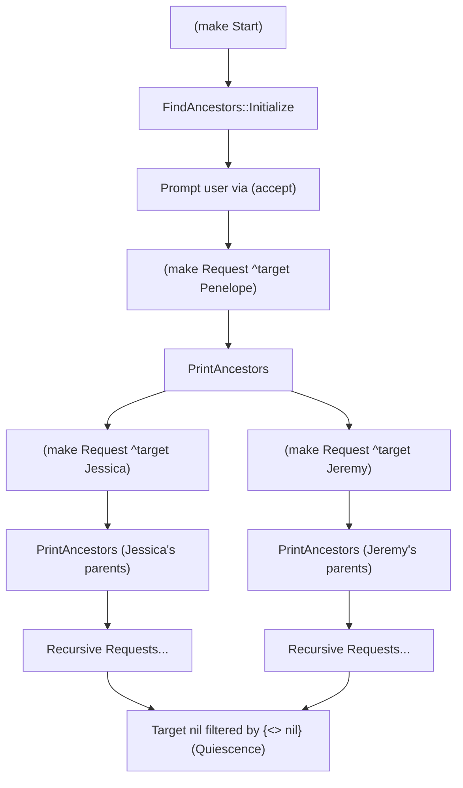

# OPS5 Interactive Tutorial: Ancestors Search (Section 2.4.3)

This tutorial provides a complete walkthrough for loading and running the integration test in [`tests/integration/2_4_3_a.ops5`](../tests/integration/2_4_3_a.ops5) using the interactive OPS5 REPL.

The program is adapted from Section 2.4.3 of *Programming Expert Systems in OPS5: An Introduction to Rule-Based Programming* (Brownston, Farrell, Kant, & Martin, Addison-Wesley, 1985).

---

## 1. Overview of the Program

The program implements a recursive ancestor finder over a family tree:

1. **Family Database**: 6 `Person` elements are asserted at load time.
2. **Initialization Rule (`FindAncestors::Initialize`)**:
   - Matches a `(Start)` trigger element.
   - Retracts `(Start)`.
   - Prompts the user on the terminal for a person's name via `(accept)`.
   - Asserts a `(Request ^type ancestor ^target <name>)` goal.
3. **Recursive Rule (`PrintAncestors`)**:
   - Matches a pending `Request` whose `^target` is not `nil`:
     ```ops5
     {(Request ^type ancestor ^target {<myparents> <> nil}) <request1>}
     ```
   - Matches the corresponding `Person` fact:
     ```ops5
     (Person ^name <myparents> ^mother <mother-name> ^father <father-name>)
     ```
   - Retracts the current `Request`.
   - Prints the parents of `<myparents>`.
   - Asserts recursive `Request` elements for both the mother and the father:
     ```ops5
     (make Request ^type ancestor ^target <mother-name>)
     (make Request ^type ancestor ^target <father-name>)
     ```
4. **Base Case & Recursion Termination**:
   - When a person has no recorded mother or father (such as `Steven` or `Loree`), the missing attribute defaults to `nil`.
   - The recursive call generates `(Request ^type ancestor ^target nil)`.
   - The attribute conjunction `{<myparents> <> nil}` filters out `nil` targets, terminating recursion naturally without requiring explicit base-case rules.



---

## 2. Launching the REPL

You can launch the REPL with the integration test preloaded using the `-i` flag:

```bash
go run ./cmd/ops5 -i tests/integration/2_4_3_a.ops5
```

Alternatively, launch the REPL empty and load the file manually with the `load` command:

```bash
go run ./cmd/ops5
```
```ops5
ops5> load tests/integration/2_4_3_a.ops5
Loaded tests/integration/2_4_3_a.ops5: added 2 rules, asserted 6 WMEs.
```

---

## 3. Inspecting Working Memory Before Execution

Before running, inspect the preloaded family database:

```ops5
ops5> wm
Working Memory (6 elements):
  (1: Person ^father Jeremy ^mother Jessica ^name Penelope)
  (2: Person ^father Homer ^mother Mary-Elizabeth ^name Jessica)
  (3: Person ^father Steven ^mother Jenny ^name Jeremy)
  (4: Person ^mother Loree ^name Steven)
  (5: Person ^father Jason ^name Loree)
  (6: Person ^mother Stephanie ^name Homer)
```

Check the conflict set:

```ops5
ops5> cs
Conflict set is empty.
```

> [!NOTE]
> The conflict set is empty because neither `FindAncestors::Initialize` nor `PrintAncestors` has all of its condition elements satisfied yet. `FindAncestors::Initialize` requires a `(Start)` element.

---

## 4. Running the Full Interactive Workflow

### Step 1: Assert `(Start)`
Trigger the program by asserting the start token:

```ops5
ops5> (make Start)
Asserted: (7: Start)
```

Now verify the conflict set:

```ops5
ops5> cs
Conflict Set (1 activations, strategy: LEX):
* 1. FindAncestors::Initialize  WMEs: [7]  (specificity: 1)
```

### Step 2: Execute with `run`
Start the match-select-act cycle:

```ops5
ops5> run
Running (max cycles: 0)...

Please type the first name of a person
whose ancestors you would like to find:
```

### Step 3: Provide Terminal Input
The inference engine is now waiting at `(accept)`. Type `Penelope` and press **Enter**:

```ops5
Penelope

Jessica and Jeremy are ancestors via Penelope
Jenny and Steven are ancestors via Jeremy
Loree and nil are ancestors via Steven
nil and Jason are ancestors via Loree
Mary-Elizabeth and Homer are ancestors via Jessica
Stephanie and nil are ancestors via Homer
Reached quiescence after 7 cycles.
```

The engine prints all ancestors up both branches of the family tree and terminates upon quiescence after 7 rule firings.

---

## 5. Step-by-Step Cycle Debugging

To observe each rule firing individually, use the `step` command:

```ops5
ops5> reset
Working memory, conflict set, and genatom counter reset.

ops5> load tests/integration/2_4_3_a.ops5
Loaded tests/integration/2_4_3_a.ops5: added 2 rules, asserted 6 WMEs.

ops5> (make Start)
Asserted: (7: Start)

ops5> step
Please type the first name of a person
whose ancestors you would like to find:
Penelope
Fired: FindAncestors::Initialize with WMEs [7] (Cycle 1)

ops5> wm Request
Working Memory (1 elements):
  (8: Request ^target Penelope ^type ancestor)

ops5> cs
Conflict Set (1 activations, strategy: LEX):
* 1. PrintAncestors  WMEs: [8 1]  (specificity: 6)

ops5> step
Jessica and Jeremy are ancestors via Penelope
Fired: PrintAncestors with WMEs [8 1] (Cycle 2)

ops5> wm Request
Working Memory (2 elements):
  (9: Request ^target Jessica ^type ancestor)
  (10: Request ^target Jeremy ^type ancestor)

ops5> cs
Conflict Set (2 activations, strategy: LEX):
* 1. PrintAncestors  WMEs: [10 3]  (specificity: 6)
  2. PrintAncestors  WMEs: [9 2]  (specificity: 6)
```

You can continue stepping with `step` or let the remaining cycles run to completion with `run`.

---

## 6. Tracing Execution

To see timetag and rule activation details during execution, turn on tracing:

```ops5
ops5> trace on
Tracing enabled

ops5> (make Start)
Asserted: (7: Start)

ops5> run
Running (max cycles: 0)...
[TRACE] Cycle 1: Fired rule 'FindAncestors::Initialize' with WMEs [7]

Please type the first name of a person
whose ancestors you would like to find:
Penelope
[TRACE] Cycle 2: Fired rule 'PrintAncestors' with WMEs [8 1]

Jessica and Jeremy are ancestors via Penelope
[TRACE] Cycle 3: Fired rule 'PrintAncestors' with WMEs [10 3]
...
```

---

## 7. Automated Non-Interactive Execution

To run the integration test in scripts or CI pipelines without an interactive terminal:

```bash
printf "(make Start)\nrun\nPenelope\nrun\nexit\n" | go run ./cmd/ops5 -i tests/integration/2_4_3_a.ops5
```
