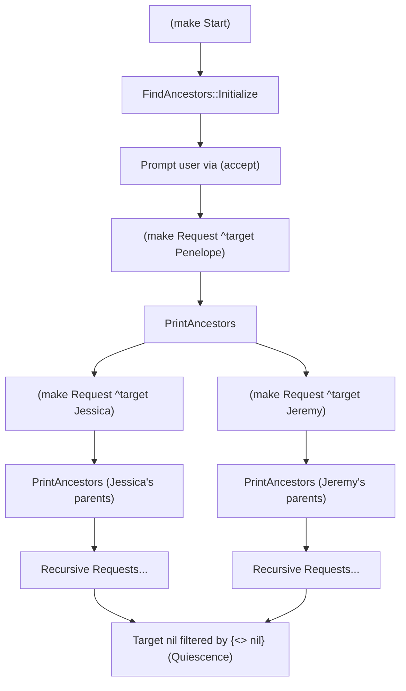
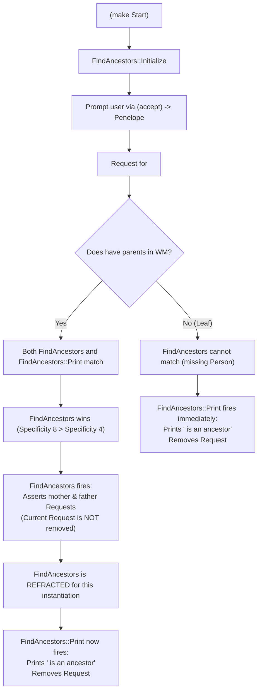

# OPS5 Interactive Tutorial: Ancestors Search (Section 2.4.3)

This tutorial provides a complete walkthrough for loading, running, and debugging the Section 2.4.3 integration tests from *Programming Expert Systems in OPS5: An Introduction to Rule-Based Programming* (Brownston, Farrell, Kant, & Martin, Addison-Wesley, 1985):

- [`tests/integration/2_4_3_a.ops5`](../tests/integration/2_4_3_a.ops5): Interactive input prompt with a single recursive rule (`PrintAncestors`).
- [`tests/integration/2_4_3_b.ops5`](../tests/integration/2_4_3_b.ops5): Interactive input prompt with a two-rule decomposition (`FindAncestors` and `FindAncestors::Print`) governed by specificity conflict resolution and refraction.

---

## 1. Overview and Architectural Comparison

Section 2.4.3 demonstrates two distinct rule-based programming paradigms in OPS5 to solve the same problem—finding all ancestors of a person within a hierarchical family tree.

| Aspect | Part A (`2_4_3_a.ops5`) | Part B (`2_4_3_b.ops5`) |
| :--- | :--- | :--- |
| **Rule Strategy** | Single recursive rule (`PrintAncestors`) + init rule | Two rules: Generator (`FindAncestors`) vs Reporter (`FindAncestors::Print`) + init rule |
| **Conflict Resolution** | Sequential activation (1 match per cycle) | Specificity competition: Specificity 8 dominates Specificity 4 |
| **Sequencing Control** | Immediate retraction of current request | Refraction prevents loops; reporter fires after generator refracts |
| **User Input** | Interactive terminal prompt via `(accept)` on `(Start)` | Interactive terminal prompt via `(accept)` on `(Start)` (or direct `Request` assertion) |
| **Cycles to Quiescence**| 7 cycles (1 init + 6 recursive firings) | 17 cycles (1 init + 16 ancestor firings) |
| **Output Format** | Parent pairs: `<mother> and <father> are ancestors via <child>` | Individual ancestors: `<name> is an ancestor` |

---

## 2. Part A: Interactive Prompt & Single Recursive Rule (`2_4_3_a.ops5`)

### Program Structure

Part A uses two rules:
1. **`FindAncestors::Initialize`**: Matches `(Start)`, prompts the user via `(accept)`, and creates the initial `Request`.
2. **`PrintAncestors`**: Matches `(Request)` and `(Person)`, prints both parents, retracts the current request, and asserts two sub-requests for mother and father.



### Running Part A in the REPL

Launch the REPL with Part A:

```bash
go run ./cmd/ops5 -i tests/integration/2_4_3_a.ops5
```

Assert `(Start)` and run:

```ops5
ops5> (make Start)
Asserted: (7: Start)

ops5> run
Running (max cycles: 0)...

Please type the first name of a person
whose ancestors you would like to find:
Penelope

Jessica and Jeremy are ancestors via Penelope
Jenny and Steven are ancestors via Jeremy
Loree and nil are ancestors via Steven
nil and Jason are ancestors via Loree
Mary-Elizabeth and Homer are ancestors via Jessica
Stephanie and nil are ancestors via Homer
Reached quiescence after 7 cycles.
```

---

## 3. Part B: Two-Rule Specificity Decomposition (`2_4_3_b.ops5`)

### Program Structure

Part B shares the same initialization rule as Part A, but decomposes the ancestor finding and printing into two competing rules:

```ops5
(p FindAncestors::Initialize
        {(Start) <initialize>}
    -->
        (remove <initialize>)
        (write (crlf) |Please type the first name of a person|
            (crlf) |whose ancestors you would like to find:|
            (crlf))
        (make Request ^type ancestor ^target (accept))
)

(p FindAncestors
        (Request ^type ancestor ^target {<name> <> nil})
        (Person ^name <name> ^mother <mother-name> 
            ^father <father-name>)
    -->
        (make Request ^type ancestor ^target <mother-name>)
        (make Request ^type ancestor ^target <father-name>)    
)

(p FindAncestors::Print
        {(Request ^type ancestor ^target {<name> <> nil}) <request1>}
    -->
        (write (crlf) <name> is an ancestor)
        (remove <request1>)
)
```

### The Conflict Resolution & Refraction Mechanism

Part B demonstrates OPS5's declarative conflict resolution without needing explicit stage or control flags:



1. **Initialization**:
   - `FindAncestors::Initialize` matches the `(Start)` token, prompts the user via `(accept)`, asserts `(Request ^type ancestor ^target <name>)`, and retracts `(Start)`.

2. **Specificity Dominance**:
   - `FindAncestors` tests **2 condition elements** (`Request` and `Person`), giving it a **specificity score of 8**.
   - `FindAncestors::Print` tests only **1 condition element** (`Request`), giving it a **specificity score of 4**.
   - When a new `Request` is asserted for a person with parents in working memory, both rules match. Under the LEX strategy (step 4, specificity), `FindAncestors` **always wins** over `FindAncestors::Print`.

3. **Refraction Prevents Infinite Loops**:
   - `FindAncestors` generates sub-requests for mother and father, but **does not retract** the current `Request`.
   - Once fired, OPS5's **refraction** rule guarantees that the exact same instantiation `[FindAncestors with Request, Person]` will not fire again.

4. **Delayed Goal Retraction**:
   - Because `FindAncestors` is now refracted, the lower-specificity rule `FindAncestors::Print` is free to fire for that same `Request`.
   - `FindAncestors::Print` prints `<name> is an ancestor` and **removes** the `Request`.

5. **Base-Case / Leaf Nodes**:
   - When recursion reaches an ancestor with no parent records (e.g. `Jason`, `Jenny`, or `Stephanie`), `FindAncestors` fails to match the `Person` pattern.
   - `FindAncestors::Print` is the sole match in the conflict set; it immediately prints the ancestor and retracts the request.

6. **Recency-Driven Traversal**:
   - Because new `Request` elements receive higher timetags, recency directs the engine to expand and report leaf ancestors before returning to parent requests, yielding bottom-up reporting.

---

### Running Part B in the REPL

Launch the REPL with Part B:

```bash
go run ./cmd/ops5 -i tests/integration/2_4_3_b.ops5
```

```ops5
Loaded tests/integration/2_4_3_b.ops5: added 3 rules, asserted 6 WMEs.
OPS5 Interactive Runtime (type 'help' for commands, 'exit' to quit)
```

#### Step 1: Assert `(Start)`
Trigger the initialization rule:

```ops5
ops5> (make Start)
Asserted: (7: Start)
```

#### Step 2: Run to Prompt and Provide Input
Execute `run` and type `Penelope`:

```ops5
ops5> run
Running (max cycles: 0)...

Please type the first name of a person
whose ancestors you would like to find:
Penelope

Jason is an ancestor
Loree is an ancestor
Steven is an ancestor
Jenny is an ancestor
Jeremy is an ancestor
Stephanie is an ancestor
Homer is an ancestor
Mary-Elizabeth is an ancestor
Jessica is an ancestor
Penelope is an ancestor
Reached quiescence after 17 cycles.
```

The system executes 1 initialization cycle followed by 16 ancestor processing cycles, identifying all 10 members of Penelope's ancestral lineage before quiescence.

---

### Step-by-Step Cycle Walkthrough for Part B

To see the interaction between specificity, recency, and refraction cycle-by-cycle:

```ops5
ops5> reset
Working memory, conflict set, and genatom counter reset.

ops5> load tests/integration/2_4_3_b.ops5
Loaded tests/integration/2_4_3_b.ops5: added 3 rules, asserted 6 WMEs.

ops5> (make Start)
Asserted: (7: Start)

ops5> step
Please type the first name of a person
whose ancestors you would like to find:
Penelope
Fired: FindAncestors::Initialize with WMEs [7] (Cycle 1)

ops5> cs
Conflict Set (2 activations, strategy: LEX):
* 1. FindAncestors        WMEs: [8 1]  (specificity: 8)
  2. FindAncestors::Print  WMEs: [8]    (specificity: 4)

ops5> step
Fired: FindAncestors with WMEs [8 1] (Cycle 2)

ops5> cs
Conflict Set (5 activations, strategy: LEX):
* 1. FindAncestors        WMEs: [10 3]  (specificity: 8)
  2. FindAncestors::Print  WMEs: [10]    (specificity: 4)
  3. FindAncestors        WMEs: [9 2]   (specificity: 8)
  4. FindAncestors::Print  WMEs: [9]     (specificity: 4)
  5. FindAncestors::Print  WMEs: [8]     (specificity: 4)
```

Key observations from the conflict set after Cycle 2:
- WME 9 is `Request ^target Jessica` and WME 10 is `Request ^target Jeremy`.
- `FindAncestors` with WMEs `[8 1]` is gone due to **refraction**.
- Activation `[10 3]` (Jeremy's parents) is chosen next because WME 10 is more recent than WME 9 or WME 8.
- `FindAncestors::Print` for Penelope (`WME [8]`) remains in the conflict set, patiently waiting until higher-recency subgoals are processed.

---

## 4. Execution Tracing

To inspect the full timetag firing trace, enable tracing before running:

```ops5
ops5> trace on
Tracing enabled

ops5> (make Start)
Asserted: (7: Start)

ops5> run
Running (max cycles: 0)...
[TRACE] Cycle 1: Fired rule 'FindAncestors::Initialize' with WMEs [7]

Please type the first name of a person
whose ancestors you would like to find:
Penelope
[TRACE] Cycle 2: Fired rule 'FindAncestors' with WMEs [8 1]
[TRACE] Cycle 3: Fired rule 'FindAncestors' with WMEs [10 3]
[TRACE] Cycle 4: Fired rule 'FindAncestors' with WMEs [12 4]
[TRACE] Cycle 5: Fired rule 'FindAncestors' with WMEs [14 5]
[TRACE] Cycle 6: Fired rule 'FindAncestors::Print' with WMEs [15]
Jason is an ancestor
[TRACE] Cycle 7: Fired rule 'FindAncestors::Print' with WMEs [14]
Loree is an ancestor
...
Reached quiescence after 17 cycles.
```

---

## 5. Automated Script & Pipeline Execution

You can run both integration tests in non-interactive batch or pipeline environments:

### Part A Non-Interactive Run
```bash
printf "(make Start)\nrun\nPenelope\nrun\nexit\n" | go run ./cmd/ops5 -i tests/integration/2_4_3_a.ops5
```

### Part B Non-Interactive Run
```bash
printf "(make Start)\nrun\nPenelope\nrun\nexit\n" | go run ./cmd/ops5 -i tests/integration/2_4_3_b.ops5
```

Alternatively, you can bypass interactive input by directly asserting the `Request` goal:
```bash
printf "(make Request ^type ancestor ^target Penelope)\nrun\nexit\n" | go run ./cmd/ops5 -i tests/integration/2_4_3_b.ops5
```

---

## 6. Automated Go Test Suite

Both implementations are verified in the automated Go test suite:

- [`tests/suite_test.go`](../tests/suite_test.go):
  - `TestIntegration2_4_3_a`: Verifies Part A produces 7 cycles and correct ancestor pair strings.
  - `TestIntegration2_4_3_b`: Verifies Part B executes 17 cycles and outputs all 10 individual ancestors.
- [`pkg/parser/parser_test.go`](../pkg/parser/parser_test.go):
  - `TestParseIntegration2_4_3_aFile`: Validates AST generation for Part A rules (2) and initial facts (6).
  - `TestParseIntegration2_4_3_bFile`: Validates AST generation for Part B rules (3) and initial facts (6).

Run the test suite with:

```bash
go test -v -race -count=1 ./...
```
