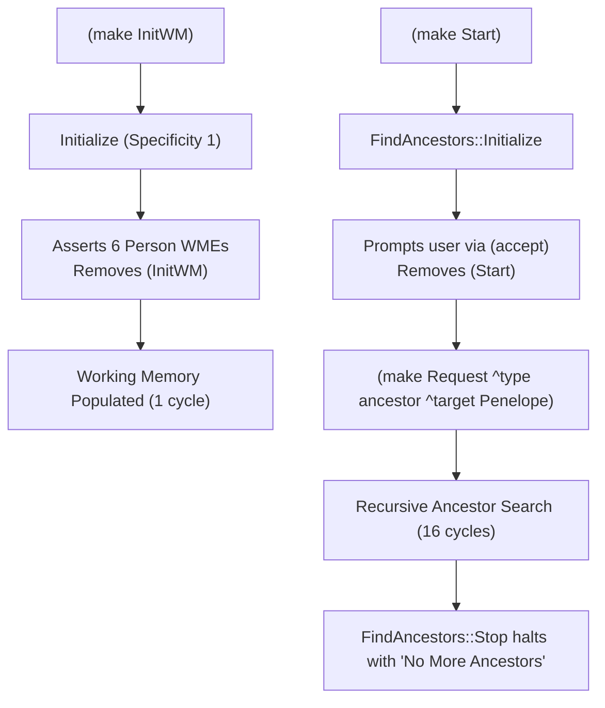

# OPS5 Interactive Tutorial: Testing & Debugging (Section 2.5)

This tutorial provides a complete walkthrough for the testing and working memory initialization techniques described in Chapter 2, Section 2.5 of *Programming Expert Systems in OPS5: An Introduction to Rule-Based Programming* (Brownston, Farrell, Kant, & Martin, Addison-Wesley, 1985):

- [`tests/integration/2_5_1_a.ops5`](../tests/integration/2_5_1_a.ops5): Dynamic working memory initialization using a production rule (`Initialize`) rather than static declarations at file load time.
- [`tests/integration/2_5_2.ops5`](../tests/integration/2_5_2.ops5): Parameterized test harness using `(literalize TestCase type name)` and dedicated test-setup productions (`Test::Ancestor:null`, `Test::Ancestor:Single`, and `Test::Ancestor:General`).

---

## 1. Section 2.5.1: Working Memory Initialization via Production (`2_5_1_a.ops5`)

### Motivation
In development and automated testing, hardcoding static working memory declarations at file load time creates tight coupling between the rule base and a specific dataset. Section 2.5.1 demonstrates using a dedicated production rule (`Initialize`) to populate working memory upon request.

### Decoupled Bootstrap Strategy
To eliminate conflict resolution ambiguity when multiple initialization rules exist:
- **`InitWM` token**: Matches `Initialize`, asserting the 6 genealogy `Person` records and removing `(InitWM)`.
- **`Start` token**: Matches `FindAncestors::Initialize`, prompting the user via `(accept)` and asserting `(Request ^type ancestor ^target <name>)`.



---

## 2. Section 2.5.2: Parameterized Test Harness (`2_5_2.ops5`)

### Parameterized Test Tokens
Section 2.5.2 introduces structured test case definitions using an OPS5 element class:

```ops5
(literalize TestCase
    type    ; Category of test (e.g., nulldb, singledb, generaldb)
    name    ; Unique test case identifier (e.g., ancestornull, ancestorsingle, ancestorgeneral)
)
```

Instead of modifying the core production rules or manually inserting facts, the test engineer asserts a single `TestCase` WME to bootstrap any desired test scenario:

```ops5
(make TestCase ^type <category> ^name <id>)
```

### Test Case Matrix

| Test Case | Trigger WME | Database Configuration | Expected Behavior | Total Cycles |
| :--- | :--- | :--- | :--- | :--- |
| **`ancestornull`** | `(make TestCase ^type nulldb ^name ancestornull)` | Empty database (0 `Person` WMEs) | Asserts `(Start)`, prompts for target, `FindAncestors::Stop` immediately fires since no parents exist; reports 0 ancestors and halts with `"No More Ancestors"`. | 3 |
| **`ancestorsingle`** | `(make TestCase ^type singledb ^name ancestorsingle)` | Single isolated record (`Orphan`) | Asserts `(Person ^name Orphan)` and query `(Request ^target Orphan)`. `FindAncestors` generates nil subgoals; `FindAncestors::Stop` halts with `"No More Ancestors"`. `Orphan` is omitted. | 3 |
| **`ancestorgeneral`** | `(make TestCase ^type generaldb ^name ancestorgeneral)` | 3-generation family tree (7 persons) | Asserts 6 `Person` facts and query for `Penelope`. Recursively prints all 6 true ancestors, then halts with `"No More Ancestors"`. | 11 |

---

## 3. Running Test Cases in the REPL

Launch the REPL with the parameterized test suite:

```bash
go run ./cmd/ops5 -i tests/integration/2_5_2.ops5
```

### Running Test Case 1: Empty Database (`ancestornull`)

```ops5
OPS5> (make TestCase ^type nulldb ^name ancestornull)
=> WME 1: (TestCase ^type nulldb ^name ancestornull)

OPS5> (run)
Please type the first name of a person
whose ancestors you would like to find:
Penelope

No More Ancestors
End of run: 3 cycles.
```

### Running Test Case 2: Single Node / Orphan (`ancestorsingle`)

```ops5
OPS5> (make TestCase ^type singledb ^name ancestorsingle)
=> WME 1: (TestCase ^type singledb ^name ancestorsingle)

OPS5> (run)
No More Ancestors
End of run: 3 cycles.
```

### Running Test Case 3: General Subtree (`ancestorgeneral`)

```ops5
OPS5> (make TestCase ^type generaldb ^name ancestorgeneral)
=> WME 1: (TestCase ^type generaldb ^name ancestorgeneral)

OPS5> (run)
Steven is an ancestor
Jenny is an ancestor
Jeremy is an ancestor
Homer is an ancestor
Mary-Elizabeth is an ancestor
Jessica is an ancestor

No More Ancestors
End of run: 11 cycles.
```

---

## 4. Automated Verification in Go

The entire test harness is tested via [`tests/suite_test.go`](../tests/suite_test.go):

```bash
go test -v -race -run TestIntegration2_5_2 ./tests/...
```
