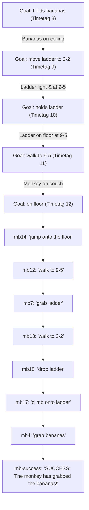

# OPS5 Interactive Tutorial: Monkey & Bananas (Section 3)

This tutorial provides a complete architectural guide, rule walkthrough, and execution trace for the **Monkey and Bananas Problem** described in Section 3 of *Programming Expert Systems in OPS5: An Introduction to Rule-Based Programming* (Brownston, Farrell, Kant, & Martin, Addison-Wesley, 1985):

- [`tests/integration/3_monkey_bananas.ops5`](../tests/integration/3_monkey_bananas.ops5): Production rule implementation using the Means-Ends Analysis (MEA) conflict resolution strategy.
- [`tests/integration/3_monkey_bananas_problem_statement.md`](../tests/integration/3_monkey_bananas_problem_statement.md): Original problem specification.
- [`tests/fixtures/monkey_bananas_workflow.json`](../tests/fixtures/monkey_bananas_workflow.json): Automated harness test fixture.

---

## 1. Problem Overview & Requirements

In a **10' x 10' x 10' room**, the environment consists of:
1. **Heavy couch**: Located on the floor (`^weight heavy ^on floor`).
2. **Light ladder**: Located on the floor (`^weight light ^on floor`).
3. **Hungry monkey**: Incapable of moving heavy objects (`weight heavy`).
4. **Monkey's blanket**: Either held by the monkey or placed on furniture/floor.
5. **Bunch of bananas**: May be in one of four positions:
   - Suspended from the **ceiling** (requires moving ladder, climbing, and grabbing).
   - On the **couch** (requires walking to couch, climbing onto couch, and grabbing).
   - On the **ladder** (requires walking to ladder, climbing ladder, and grabbing).
   - On the **floor** (requires walking to bananas and grabbing).

The program reads descriptions of objects and their locations, and outputs a sequence of commands for the monkey:
- `walk to <p>`
- `grab <w>`
- `climb onto <o>`
- `jump onto the floor`
- `drop <x>`

---

## 2. Means-Ends Analysis (MEA) Architecture

The classic solution relies on the **`MEA`** conflict resolution strategy (`(strategy mea)`).



### Why MEA Enables Hierarchical Planning
Under MEA:
1. **Recency of Condition Element 1**: Condition Element 1 of every goal rule matches an active `goal` WME `(goal ^status active ...)`. When a production creates a new subgoal, that new goal has a higher timetag than any previous goal. MEA gives highest priority to the most recently created goal, establishing an automatic **LIFO Goal Stack**.
2. **Refinement & Specificity**: Once the engine focuses on the most recent goal, rules matching additional preconditions (e.g., monkey already at `<p>`, hands already free) have higher specificity and fire before rules that would create further subgoals.
3. **Automatic Subgoal Return**: When an action satisfies a subgoal (`^status satisfied`), that goal no longer matches `^status active`. Conflict resolution naturally falls back to the parent goal, where newly satisfied physical conditions now trigger the next phase.

---

## 3. Working Memory Schemas

```ops5
(strategy mea)

(literalize Room
    x                   ; room width in feet (default 10)
    y                   ; room length in feet (default 10)
    z                   ; room height in feet (default 10)
)

(literalize monkey
    at                  ; current (x-y) location coordinate (e.g., 5-7)
    on                  ; current surface: floor, couch, ladder
    holds               ; held item: nil, blanket, ladder, bananas
)

(literalize object
    name                ; couch, ladder, bananas, blanket
    at                  ; current (x-y) location coordinate (e.g., 5-7)
    weight              ; heavy or light
    on                  ; support surface: floor, couch, ladder, ceiling
)

(literalize goal
    status              ; active, satisfied, failed, not-processed
    type                ; holds, move, walk-to, on
    object              ; target object or destination surface
    to                  ; destination location for move actions
)
```

---

## 4. Production Rule Set Summary

| Rule Name | Goal Type | Primary Condition | Action Taken / Output |
| :--- | :--- | :--- | :--- |
| **`mb1`** | `holds <w>` | `<w> ^on ceiling` | Subgoal: `move ladder ^to <p>` |
| **`mb2`** | `holds <w>` | `<w> ^on ceiling`, ladder at `<p>` | Subgoal: `on ladder` |
| **`mb3`** | `holds <w>` | `<w> ^on ceiling`, ladder at `<p>`, monkey on ladder | Subgoal: `holds nil` (free hands) |
| **`mb4`** | `holds <w>` | `<w> ^on ceiling`, ladder at `<p>`, monkey on ladder, `holds nil` | `grab <w>`, monkey holds `<w>` |
| **`mb5`** | `holds <w>` | `<w> ^on floor` | Subgoal: `walk-to <p>` |
| **`mb5a`** | `holds <w>` | `<w> ^on floor`, monkey at `<p>`, monkey on raised surface | Subgoal: `on floor` |
| **`mb6`** | `holds <w>` | `<w> ^on floor`, monkey at `<p>`, on floor | Subgoal: `holds nil` |
| **`mb7`** | `holds <w>` | `<w> ^on floor`, monkey at `<p>`, on floor, `holds nil` | `grab <w>`, monkey holds `<w>` |
| **`mb-surf-walk`** | `holds <w>` | `<w> ^on {couch \| ladder}` | Subgoal: `walk-to <p>` |
| **`mb-surf-climb`** | `holds <w>` | `<w> ^on {couch \| ladder}`, monkey at `<p>` | Subgoal: `on <surf>` |
| **`mb-surf-free`** | `holds <w>` | `<w> ^on {couch \| ladder}`, monkey at `<p>`, on `<surf>` | Subgoal: `holds nil` |
| **`mb-surf-grab`** | `holds <w>` | `<w> ^on {couch \| ladder}`, monkey at `<p>`, on `<surf>`, `holds nil`| `grab <w>`, monkey holds `<w>` |
| **`mb-move-heavy`**| `move <o>` | `<o> ^weight heavy` | Halts: monkey cannot move heavy object! |
| **`mb8`** | `move <o>` | `<o> ^weight light ^at <> <p>` | Subgoal: `holds <o>` |
| **`mb9`** | `move <o>` | `<o> ^weight light`, monkey holds `<o>` | Subgoal: `walk-to <p>` |
| **`mb10`** | `move <o>` | `<o> ^weight light ^at <p>` | Satisfies move goal |
| **`mb11`** | `walk-to <p>` | monkey not on floor | Subgoal: `on floor` |
| **`mb12`** | `walk-to <p>` | monkey on floor, `holds nil` | `walk to <p>`, monkey at `<p>` |
| **`mb13`** | `walk-to <p>` | monkey on floor, `holds <w>` | `walk to <p>`, monkey & `<w>` at `<p>` |
| **`mb14`** | `on floor` | monkey on raised surface | `jump onto the floor` |
| **`mb15`** | `on <o>` | object at `<p>` | Subgoal: `walk-to <p>` |
| **`mb16`** | `on <o>` | monkey at `<p>` | Subgoal: `holds nil` (free hands) |
| **`mb17`** | `on <o>` | monkey at `<p>`, `holds nil` | `climb onto <o>` |
| **`mb18`** | `holds nil` | monkey holds `<x> <> nil` | `drop <x>`, monkey holds `nil` |
| **`mb-success`** | `holds bananas`| monkey holds bananas, goal satisfied | Emits success banner and halts |

---

## 5. Execution Trace: Bananas on Ceiling (`ceiling`)

Initial conditions:
- Couch at `5-7` on floor (heavy)
- Ladder at `9-5` on floor (light)
- Bananas at `2-2` on ceiling
- Monkey at `5-7` on couch, empty hands (`holds nil`)

```text
[Cycle 1] Fired rule 'Test::Ceiling' with WMEs [1]
[Cycle 2] Fired rule 'mb1' with WMEs [8 6]
[Cycle 3] Fired rule 'mb8' with WMEs [9 5]
[Cycle 4] Fired rule 'mb5' with WMEs [10 5]
[Cycle 5] Fired rule 'mb11' with WMEs [11]
[Cycle 6] Fired rule 'mb14' with WMEs [12 3]

jump onto the floor
[Cycle 7] Fired rule 'mb12' with WMEs [11 13]

walk to 9-5
[Cycle 8] Fired rule 'mb7' with WMEs [10 5 15]

grab ladder
[Cycle 9] Fired rule 'mb9' with WMEs [9 5 17]
[Cycle 10] Fired rule 'mb13' with WMEs [19 17 5]

walk to 2-2
[Cycle 11] Fired rule 'mb10' with WMEs [9 21]
[Cycle 12] Fired rule 'mb2' with WMEs [8 6 21]
[Cycle 13] Fired rule 'mb16' with WMEs [24 21 20]
[Cycle 14] Fired rule 'mb18' with WMEs [25 20]

drop ladder
[Cycle 15] Fired rule 'mb17' with WMEs [24 21 26]

climb onto ladder
[Cycle 16] Fired rule 'mb4' with WMEs [8 6 21 28]

grab bananas
[Cycle 17] Fired rule 'mb-success' with WMEs [31 30]

SUCCESS: The monkey has grabbed the bananas!
```

---

## 6. Supported Scenario Matrix

| Scenario Name | Test WME | Banana Location | Monkey Starting State | Generated Commands | Total Cycles |
| :--- | :--- | :--- | :--- | :--- | :--- |
| **`ceiling`** | `(make TestCase ^name ceiling)` | `2-2` on ceiling | `5-7` on couch, holds nil | `jump onto the floor`<br>`walk to 9-5`<br>`grab ladder`<br>`walk to 2-2`<br>`drop ladder`<br>`climb onto ladder`<br>`grab bananas` | 17 |
| **`floor`** | `(make TestCase ^name floor)` | `2-2` on floor | `5-7` on couch, holds nil | `jump onto the floor`<br>`walk to 2-2`<br>`grab bananas` | 7 |
| **`couch`** | `(make TestCase ^name couch)` | `5-7` on couch | `1-1` on floor, holds nil | `walk to 5-7`<br>`climb onto couch`<br>`grab bananas` | 7 |
| **`ladder`** | `(make TestCase ^name ladder)` | `9-5` on ladder | `5-7` on couch, holds nil | `jump onto the floor`<br>`walk to 9-5`<br>`climb onto ladder`<br>`grab bananas` | 9 |
| **`blanket`** | `(make TestCase ^name blanket)` | `2-2` on ceiling | `5-7` on couch, holds blanket | `jump onto the floor`<br>`walk to 9-5`<br>`drop blanket`<br>`grab ladder`<br>`walk to 2-2`<br>`drop ladder`<br>`climb onto ladder`<br>`grab bananas` | 19 |
| **`couch-blanket`** | `(make TestCase ^name couch-blanket)` | `5-7` on couch | `5-7` on couch, holds blanket | `drop blanket`<br>`grab bananas` | 5 |
| **`heavy-couch`** | `(make TestCase ^name heavy-couch)` | N/A | `5-7` on floor | Halts with error: cannot move heavy object couch | 2 |

---

## 7. Interactive Setup via `(accept)`

You can run the program interactively in the REPL:

```bash
go run ./cmd/ops5 -i tests/integration/3_monkey_bananas.ops5
```

### Option A: Select Preset Scenario
```ops5
OPS5> (make Start)
OPS5> (run)

=== Monkey & Bananas Problem (10'x10'x10' Room) ===
Choose initial setup:
  ceiling     - Bananas on ceiling at 2-2, ladder at 9-5, couch at 5-7
  floor       - Bananas on floor at 2-2
  couch       - Bananas on couch at 5-7
  ladder      - Bananas on ladder at 9-5
  blanket     - Bananas on ceiling, monkey holding blanket
  interactive - Enter custom object locations step-by-step
Enter choice: ceiling

jump onto the floor
walk to 9-5
grab ladder
walk to 2-2
drop ladder
climb onto ladder
grab bananas

SUCCESS: The monkey has grabbed the bananas!
End of run: 18 cycles.
```

### Option B: Custom Object Descriptions via `interactive`
```ops5
OPS5> (make Start)
OPS5> (run)
Enter choice: interactive

Enter monkey location (e.g. 5-7): 5-7
Enter monkey surface (floor or couch): couch
Enter monkey held item (nil or blanket): nil
Enter couch location (e.g. 5-7): 5-7
Enter ladder location (e.g. 9-5): 9-5
Enter bananas location (e.g. 2-2): 2-2
Enter bananas surface (ceiling, couch, ladder, or floor): ceiling

Planning action sequence for monkey...

jump onto the floor
walk to 9-5
grab ladder
walk to 2-2
drop ladder
climb onto ladder
grab bananas

SUCCESS: The monkey has grabbed the bananas!
End of run: 25 cycles.
```
