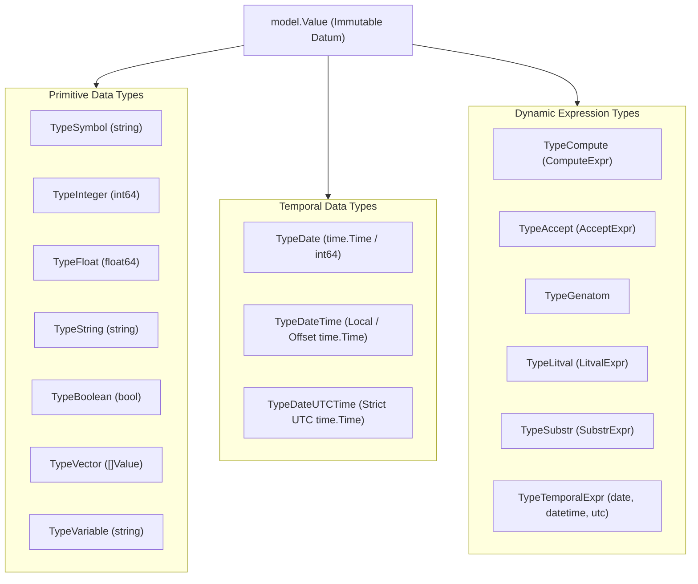

# OPS5 Type System & Temporal Types Specification

> **Package**: `pkg/model`  
> **Engine Runtime**: `pkg/engine`, `pkg/rete`, `pkg/parser`  
> **Specification Version**: `v0.3.2`

---

## 1. Overview & Type Hierarchy

The OPS5 runtime provides a typed, immutable value model representing working memory element (WME) attributes, pattern tests, variable bindings, and RHS expressions.



### Complete Value Type Matrix

| Type Name | `ValueType` Constant | Internal Storage (`val any`) | Syntax Pattern / Literal | String Representation |
| :--- | :--- | :--- | :--- | :--- |
| **Symbol** | `TypeSymbol` | `string` | Unquoted alphanumeric (e.g. `active`) | Bare symbol (e.g. `active`) |
| **Integer** | `TypeInteger` | `int64` | Digits with optional sign (e.g. `42`) | Base-10 integer string (`42`) |
| **Float** | `TypeFloat` | `float64` | Decimal or exponent (e.g. `3.14`) | Floating-point string (`3.14`) |
| **String** | `TypeString` | `string` | Double-quoted text (e.g. `"hello"`) | Double-quoted text (`"hello"`) |
| **Boolean** | `TypeBoolean` | `bool` | `true` or `false` | `true` or `false` |
| **Vector** | `TypeVector` | `[]Value` | Space-separated values | Elements separated by space |
| **Variable** | `TypeVariable` | `string` | Angle-bracketed identifier (`<x>`) | `<x>` |
| **Date** | `TypeDate` | `time.Time` (midnight UTC) | `YYYY-MM-DD` or integer `YYYYMMDD` | `YYYYMMDD` (e.g. `20260929`) |
| **DateTime** | `TypeDateTime` | `time.Time` (Local / offset) | ISO 8601 extended `YYYY-MM-DDTHH:MM:SS` | `YYYY-MM-DDTHH:MM:SS` |
| **DateUTCTime** | `TypeDateUTCTime` | `time.Time` (Strict UTC) | ISO 8601 extended `YYYY-MM-DDTHH:MM:SSZ` | `YYYY-MM-DDTHH:MM:SSZ` |
| **ComputeExpr** | `TypeCompute` | `*ComputeExpr` | `(compute <expr> ...)` | `(compute ...)` |
| **TemporalExpr**| `TypeTemporalExpr` | `*TemporalExpr` | `(utc ...)`, `(datetime ...)`, `(date ...)` | `(utc ...)` |

---

## 2. Temporal Data Types

Temporal types provide first-class chronological modeling, time zone conversions, and instant-based matching across distributed environments (e.g. local systems communicating with international suppliers).

### 2.1 `TypeDate`

* **Semantics**: Represents a calendar date (year, month, day), normalized to midnight UTC (`00:00:00.000 UTC`).
* **Input Formats**:
  * **ISO 8601 Date String**: `2026-09-29` (10 characters with hyphens).
  * **Compact Integer**: `20260929` (8-digit integer `YYYYMMDD`).
* **Go Constructors**:
  * `model.NewDate(yyyymmdd int64) Value`
  * `model.NewDateFromTime(t time.Time) Value`
  * `model.ParseDate(yyyymmdd int64) (Value, error)`: Validates calendar boundaries and leap-year rollovers.
  * `model.ParseDateString(s string) (Value, error)`: Parses `YYYY-MM-DD`.
* **Accessors**:
  * `v.IsDate() bool`
  * `v.DateInt() int64`: Returns integer `YYYYMMDD` (e.g. `20260929`).
  * `v.Time() time.Time`: Returns the midnight UTC `time.Time` object.

### 2.2 `TypeDateTime`

* **Semantics**: Represents a point in time in the local timezone or with an explicit timezone offset.
* **Input Formats**:
  * **ISO 8601 Extended / RFC 3339**: `2026-09-29T19:53:58` (Local) or with offset `2026-09-29T19:53:58-07:00`.
  * **Backward-Compatible Compact**: `20260929T195358` or `20260929:195358`.
* **Go Constructors**:
  * `model.NewDateTime(s string) Value`: Parsed in `time.Local`.
  * `model.NewDateTimeInLocation(s string, loc *time.Location) Value`: Parsed in a custom location.
  * `model.NewDateTimeFromTime(t time.Time) Value`
  * `model.ParseDateTime(s string) (Value, error)`
* **Accessors**:
  * `v.IsDateTime() bool`
  * `v.Time() time.Time`

### 2.3 `TypeDateUTCTime`

* **Semantics**: Represents a point in time strictly in UTC (`+00:00`).
* **Input Formats**:
  * **ISO 8601 Extended with UTC Indicator**: `2026-09-30T02:53:58Z`.
  * **Local-to-UTC Automatic Conversion**: When constructed via `NewDateUTCTime("2026-09-29T19:53:58")`, the parser interprets the timestamp in local time and converts it to UTC (`.UTC()`).
* **Go Constructors**:
  * `model.NewDateUTCTime(s string) Value`: Parses in local time and converts to UTC.
  * `model.NewDateUTCTimeInLocation(s string, loc *time.Location) Value`: Parses in a supplier's timezone and converts to UTC.
  * `model.NewDateUTCDirect(s string) Value`: Parses string directly in UTC (e.g. when suffixed with `Z`).
  * `model.NewDateUTCTimeFromTime(t time.Time) Value`
  * `model.ParseDateUTCTime(s string) (Value, error)`
* **Accessors**:
  * `v.IsDateUTCTime() bool`
  * `v.Time() time.Time`: Always guaranteed to have location `time.UTC`.

---

## 3. Disambiguation Rules: Dates vs Integers

In OPS5, numbers and dates can both appear as 8 digits. The parser applies deterministic lexical and syntax rules to disambiguate them:

| Written Form | Resulting OPS5 Type | Why the Parser Chooses This Type |
| :--- | :--- | :--- |
| `^order_date 2026-09-29` | **`TypeDate`** | The hyphens distinguish `YYYY-MM-DD` from pure integers. |
| `^order_date (date 20260929)` | **`TypeDate`** | Explicit `(date ...)` value function explicitly casts integer to `TypeDate`. |
| `^order_date 20260929` | **`TypeInteger`** | Pure digits default to integer, but cross-compares and cross-equals `TypeDate`. |
| `^order_number 20260930` | **`TypeInteger`** | Pure digits default to standard 64-bit integer. |
| `^current_time 2026-09-29T19:53:58` | **`TypeDateTime`** | `T` delimiter and colons identify ISO 8601 local date-time. |
| `^supplier_current_time 2026-09-30T02:53:58Z` | **`TypeDateUTCTime`** | Ending with `Z` explicitly identifies ISO 8601 UTC date-time. |

---

## 4. OPS5 RHS Value Functions: `(utc ...)`, `(datetime ...)`, `(date ...)`

The engine provides first-class RHS action functions for dynamic temporal evaluation:

### 4.1 `(utc <expr>)`
Converts any date, local date-time, integer, or string expression into `TypeDateUTCTime`:

```lisp
; Dynamic conversion of a bound local time variable into UTC:
(p sync-supplier-time
    (order_context ^order_id <id> ^current_time <ct>)
    -->
    (make supplier_order 
        ^order_id <id> 
        ^supplier_current_time (utc <ct>))
    (write |Order | <id> | synchronized to supplier UTC time: | (utc <ct>) (crlf)))
```

### 4.2 `(datetime <expr>)`
Constructs or casts an expression into local `TypeDateTime`:
```lisp
(make order_context ^current_time (datetime "2026-09-29T19:53:58"))
```

### 4.3 `(date <expr>)`
Constructs or casts an integer or string into `TypeDate`:
```lisp
(make order_context ^due_date (date 20260929))
```

> **Optimization Note**: If the argument to `(utc ...)`, `(datetime ...)`, or `(date ...)` is a constant literal, the parser evaluates it **immediately at compile time** into a direct `Value`, completely avoiding runtime overhead during rule execution.

---

## 5. Cross-Type Equality & Relational Comparisons

### 5.1 Date & Integer Interoperability
Because dates are frequently written as numbers in legacy rules, `TypeDate` and `TypeInteger` support bidirectional cross-equality and ordering:

* **Equality (`=`, `<>`)**:
  ```go
  model.NewDate(20260929).Equal(model.NewInt(20260929)) // true
  model.NewInt(20260929).Equal(model.NewDate(20260929)) // true
  ```
* **Comparison (`<`, `<=`, `>`, `>=`)**:
  ```go
  model.NewDate(20260929).Compare(model.NewInt(20260930)) // -1 (<)
  ```
* **LHS Rule Matching**:
  ```lisp
  ; Matches whether ^due_date was asserted as TypeDate or TypeInteger!
  (order ^due_date 20260929 ^status pending)
  (order ^due_date < 20261001)
  ```

### 5.2 Universal Instant-Based Temporal Comparisons
When comparing `TypeDateTime` and `TypeDateUTCTime`, the engine compares the **absolute universal instant** (`time.Time.Equal`, `Before`, and `After`) rather than string values:

```go
// Local time 19:53:58 PDT (UTC-7) equals 02:53:58Z UTC the next day:
local := model.NewDateTime("2026-09-29T19:53:58")
utc := model.NewDateUTCTime("2026-09-29T19:53:58") // converted to UTC

local.Equal(utc) // true!
```

In rule LHS patterns, chronological comparisons work accurately across timezones:
```lisp
(p check-delivery-cutoff
    (time_context ^current_time <ct> ^supplier_current_time { <sct> > <ct> })
    -->
    (write |Supplier time is ahead of local time| (crlf)))
```

---

## 6. Rete Network Hashed Indexing ($O(1)$ Joins)

To ensure zero-allocation hot paths and sub-millisecond execution times:

1. **Date Indexing**:
   * `CanonicalValueKey` hashes `TypeDate` as `"i:" + strconv.FormatInt(v.DateInt(), 10)`.
   * Shares the exact same bucket as `TypeInteger`, enabling $O(1)$ hash joins in beta memories between date objects and integer rule constants.
2. **DateTime & UTC Indexing**:
   * `CanonicalValueKey` normalizes both `TypeDateTime` and `TypeDateUTCTime` to UTC unix nanoseconds:
     `"t:" + strconv.FormatInt(v.Time().UTC().UnixNano(), 10)`
   * A local `TypeDateTime` and a UTC `TypeDateUTCTime` representing the **same moment** hash to the identical bucket, enabling immediate $O(1)$ equality joins across nodes.

---

## 7. Programmatic Go API Examples

### Asserting WMEs with Temporal Attributes

```go
package main

import (
	"fmt"
	"time"

	"github.com/graemenewlands/ops5/pkg/engine"
	"github.com/graemenewlands/ops5/pkg/model"
)

func main() {
	eng := engine.New()

	// 1. Supplier operates in Tokyo (JST = UTC+9)
	jst := time.FixedZone("JST", 9*3600)

	// 2. Assert WME with local, supplier, and date attributes
	wme := eng.WorkingMemory().Make("order_context", map[string]model.Value{
		"order_id":              model.NewInt(5001),
		"current_time":          model.NewDateTime("2026-09-29T19:53:58"),                  // Local PDT
		"supplier_current_time": model.NewDateUTCTimeInLocation("2026-09-30T04:53:58", jst), // JST converted to UTC
		"order_date":            model.NewDate(20260929),                                   // Date
	})

	fmt.Println("Asserted WME:", wme.String())

	// 3. Inspect attribute types
	ct, _ := wme.Get("current_time")
	sct, _ := wme.Get("supplier_current_time")

	// Both represent the exact same universal instant:
	fmt.Printf("Instant Equal: %v\n", ct.Equal(sct)) // true
}
```
