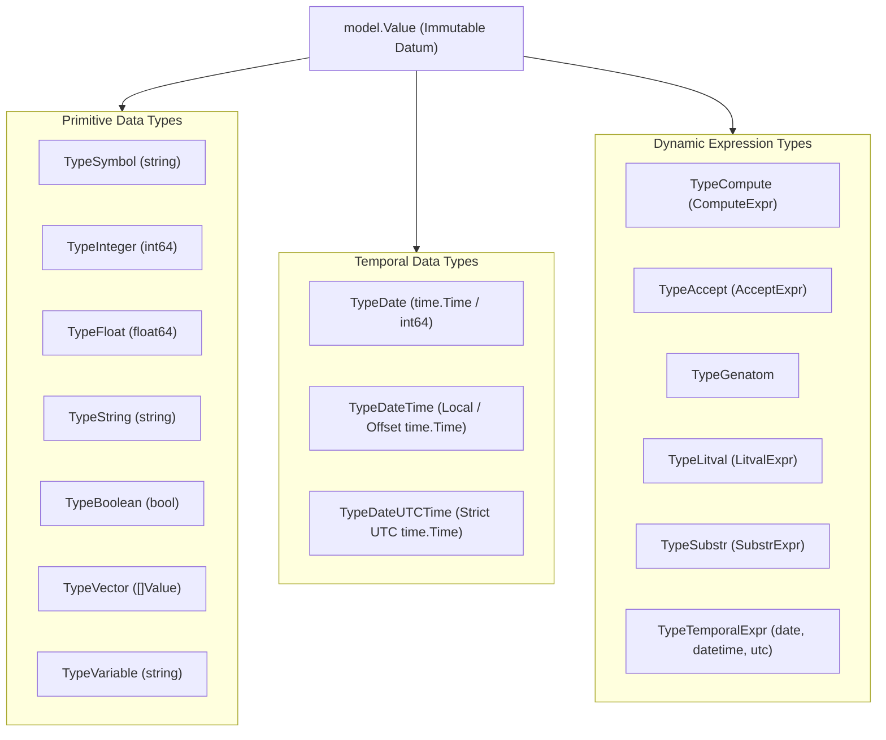
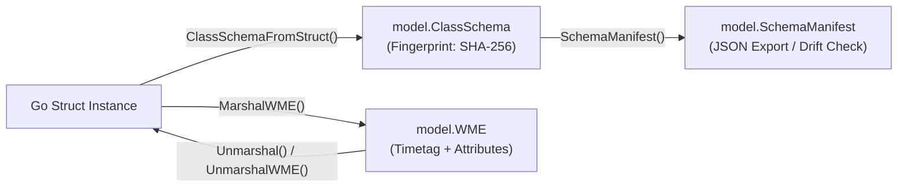

# OPS5 Type System & Temporal Types Specification

> **Package**: `pkg/model`  
> **Engine Runtime**: `pkg/engine`, `pkg/rete`, `pkg/parser`  
> **Specification Version**: `v0.3.2`

---

## 1. Overview & Type Hierarchy

The OPS5 runtime provides a typed, immutable value model representing working memory element (WME) attributes, pattern tests, variable bindings, and RHS expressions.



### Complete Value Type Matrix

| Type Name | `ValueType` Constant | Internal Storage (`val any`) | Syntax Pattern / Literal | String Representation |
| :--- | :--- | :--- | :--- | :--- |
| **Symbol** | `TypeSymbol` | `string` | Unquoted alphanumeric (e.g. `active`) | Bare symbol (e.g. `active`) |
| **Integer** | `TypeInteger` | `int64` | Digits with optional sign (e.g. `42`) | Base-10 integer string (`42`) |
| **Float** | `TypeFloat` | `float64` | Decimal or exponent (e.g. `3.14`) | Floating-point string (`3.14`) |
| **String** | `TypeString` | `string` | Double-quoted text (e.g. `"hello"`) | Double-quoted text (`"hello"`) |
| **Boolean** | `TypeBoolean` | `bool` | `true` or `false` | `true` or `false` |
| **Vector** | `TypeVector` | `[]Value` | Space-separated values | Elements separated by space |
| **Variable** | `TypeVariable` | `string` | Angle-bracketed identifier (`<x>`) | `<x>` |
| **Date** | `TypeDate` | `time.Time` (midnight UTC) | `YYYY-MM-DD` or integer `YYYYMMDD` | `YYYYMMDD` (e.g. `20260929`) |
| **DateTime** | `TypeDateTime` | `time.Time` (Local / offset) | ISO 8601 extended `YYYY-MM-DDTHH:MM:SS` | `YYYY-MM-DDTHH:MM:SS` |
| **DateUTCTime** | `TypeDateUTCTime` | `time.Time` (Strict UTC) | ISO 8601 extended `YYYY-MM-DDTHH:MM:SSZ` | `YYYY-MM-DDTHH:MM:SSZ` |
| **ComputeExpr** | `TypeCompute` | `*ComputeExpr` | `(compute <expr> ...)` | `(compute ...)` |
| **TemporalExpr**| `TypeTemporalExpr` | `*TemporalExpr` | `(utc ...)`, `(datetime ...)`, `(date ...)` | `(utc ...)` |

---

## 2. Temporal Data Types

Temporal types provide first-class chronological modeling, time zone conversions, and instant-based matching across distributed environments (e.g. local systems communicating with international suppliers).

### 2.1 `TypeDate`

* **Semantics**: Represents a calendar date (year, month, day), normalized to midnight UTC (`00:00:00.000 UTC`).
* **Input Formats**:
  * **ISO 8601 Date String**: `2026-09-29` (10 characters with hyphens).
  * **Compact Integer**: `20260929` (8-digit integer `YYYYMMDD`).
* **Go Constructors**:
  * `model.NewDate(yyyymmdd int64) Value`
  * `model.NewDateFromTime(t time.Time) Value`
  * `model.ParseDate(yyyymmdd int64) (Value, error)`: Validates calendar boundaries and leap-year rollovers.
  * `model.ParseDateString(s string) (Value, error)`: Parses `YYYY-MM-DD`.
* **Accessors**:
  * `v.IsDate() bool`
  * `v.DateInt() int64`: Returns integer `YYYYMMDD` (e.g. `20260929`).
  * `v.Time() time.Time`: Returns the midnight UTC `time.Time` object.

### 2.2 `TypeDateTime`

* **Semantics**: Represents a point in time in the local timezone or with an explicit timezone offset.
* **Input Formats**:
  * **ISO 8601 Extended / RFC 3339**: `2026-09-29T19:53:58` (Local) or with offset `2026-09-29T19:53:58-07:00`.
  * **Backward-Compatible Compact**: `20260929T195358` or `20260929:195358`.
* **Go Constructors**:
  * `model.NewDateTime(s string) Value`: Parsed in `time.Local`.
  * `model.NewDateTimeInLocation(s string, loc *time.Location) Value`: Parsed in a custom location.
  * `model.NewDateTimeFromTime(t time.Time) Value`
  * `model.ParseDateTime(s string) (Value, error)`
* **Accessors**:
  * `v.IsDateTime() bool`
  * `v.Time() time.Time`

### 2.3 `TypeDateUTCTime`

* **Semantics**: Represents a point in time strictly in UTC (`+00:00`).
* **Input Formats**:
  * **ISO 8601 Extended with UTC Indicator**: `2026-09-30T02:53:58Z`.
  * **Local-to-UTC Automatic Conversion**: When constructed via `NewDateUTCTime("2026-09-29T19:53:58")`, the parser interprets the timestamp in local time and converts it to UTC (`.UTC()`).
* **Go Constructors**:
  * `model.NewDateUTCTime(s string) Value`: Parses in local time and converts to UTC.
  * `model.NewDateUTCTimeInLocation(s string, loc *time.Location) Value`: Parses in a supplier's timezone and converts to UTC.
  * `model.NewDateUTCDirect(s string) Value`: Parses string directly in UTC (e.g. when suffixed with `Z`).
  * `model.NewDateUTCTimeFromTime(t time.Time) Value`
  * `model.ParseDateUTCTime(s string) (Value, error)`
* **Accessors**:
  * `v.IsDateUTCTime() bool`
  * `v.Time() time.Time`: Always guaranteed to have location `time.UTC`.

---

## 3. Disambiguation Rules: Dates vs Integers

In OPS5, numbers and dates can both appear as 8 digits. The parser applies deterministic lexical and syntax rules to disambiguate them:

| Written Form | Resulting OPS5 Type | Why the Parser Chooses This Type |
| :--- | :--- | :--- |
| `^order_date 2026-09-29` | **`TypeDate`** | The hyphens distinguish `YYYY-MM-DD` from pure integers. |
| `^order_date (date 20260929)` | **`TypeDate`** | Explicit `(date ...)` value function explicitly casts integer to `TypeDate`. |
| `^order_date 20260929` | **`TypeInteger`** | Pure digits default to integer, but cross-compares and cross-equals `TypeDate`. |
| `^order_number 20260930` | **`TypeInteger`** | Pure digits default to standard 64-bit integer. |
| `^current_time 2026-09-29T19:53:58` | **`TypeDateTime`** | `T` delimiter and colons identify ISO 8601 local date-time. |
| `^supplier_current_time 2026-09-30T02:53:58Z` | **`TypeDateUTCTime`** | Ending with `Z` explicitly identifies ISO 8601 UTC date-time. |

---

## 4. OPS5 RHS Value Functions: `(utc ...)`, `(datetime ...)`, `(date ...)`

The engine provides first-class RHS action functions for dynamic temporal evaluation:

### 4.1 `(utc <expr>)`
Converts any date, local date-time, integer, or string expression into `TypeDateUTCTime`:

```lisp
; Dynamic conversion of a bound local time variable into UTC:
(p sync-supplier-time
    (order_context ^order_id <id> ^current_time <ct>)
    -->
    (make supplier_order 
        ^order_id <id> 
        ^supplier_current_time (utc <ct>))
    (write |Order | <id> | synchronized to supplier UTC time: | (utc <ct>) (crlf)))
```

### 4.2 `(datetime <expr>)`
Constructs or casts an expression into local `TypeDateTime`:
```lisp
(make order_context ^current_time (datetime "2026-09-29T19:53:58"))
```

### 4.3 `(date <expr>)`
Constructs or casts an integer or string into `TypeDate`:
```lisp
(make order_context ^due_date (date 20260929))
```

> **Optimization Note**: If the argument to `(utc ...)`, `(datetime ...)`, or `(date ...)` is a constant literal, the parser evaluates it **immediately at compile time** into a direct `Value`, completely avoiding runtime overhead during rule execution.

---

## 5. Cross-Type Equality & Relational Comparisons

### 5.1 Date & Integer Interoperability
Because dates are frequently written as numbers in legacy rules, `TypeDate` and `TypeInteger` support bidirectional cross-equality and ordering:

* **Equality (`=`, `<>`)**:
  ```go
  model.NewDate(20260929).Equal(model.NewInt(20260929)) // true
  model.NewInt(20260929).Equal(model.NewDate(20260929)) // true
  ```
* **Comparison (`<`, `<=`, `>`, `>=`)**:
  ```go
  model.NewDate(20260929).Compare(model.NewInt(20260930)) // -1 (<)
  ```
* **LHS Rule Matching**:
  ```lisp
  ; Matches whether ^due_date was asserted as TypeDate or TypeInteger!
  (order ^due_date 20260929 ^status pending)
  (order ^due_date < 20261001)
  ```

### 5.2 Universal Instant-Based Temporal Comparisons
When comparing `TypeDateTime` and `TypeDateUTCTime`, the engine compares the **absolute universal instant** (`time.Time.Equal`, `Before`, and `After`) rather than string values:

```go
// Local time 19:53:58 PDT (UTC-7) equals 02:53:58Z UTC the next day:
local := model.NewDateTime("2026-09-29T19:53:58")
utc := model.NewDateUTCTime("2026-09-29T19:53:58") // converted to UTC

local.Equal(utc) // true!
```

In rule LHS patterns, chronological comparisons work accurately across timezones:
```lisp
(p check-delivery-cutoff
    (time_context ^current_time <ct> ^supplier_current_time { <sct> > <ct> })
    -->
    (write |Supplier time is ahead of local time| (crlf)))
```

---

## 6. Rete Network Hashed Indexing ($O(1)$ Joins)

To ensure zero-allocation hot paths and sub-millisecond execution times:

1. **Date Indexing**:
   * `CanonicalValueKey` hashes `TypeDate` as `"i:" + strconv.FormatInt(v.DateInt(), 10)`.
   * Shares the exact same bucket as `TypeInteger`, enabling $O(1)$ hash joins in beta memories between date objects and integer rule constants.
2. **DateTime & UTC Indexing**:
   * `CanonicalValueKey` normalizes both `TypeDateTime` and `TypeDateUTCTime` to UTC unix nanoseconds:
     `"t:" + strconv.FormatInt(v.Time().UTC().UnixNano(), 10)`
   * A local `TypeDateTime` and a UTC `TypeDateUTCTime` representing the **same moment** hash to the identical bucket, enabling immediate $O(1)$ equality joins across nodes.

---

## 7. Programmatic Go API Examples

### Asserting WMEs with Temporal Attributes

```go
package main

import (
	"fmt"
	"time"

	"github.com/graemenewlands/ops5/pkg/engine"
	"github.com/graemenewlands/ops5/pkg/model"
)

func main() {
	eng := engine.New()

	// 1. Supplier operates in Tokyo (JST = UTC+9)
	jst := time.FixedZone("JST", 9*3600)

	// 2. Assert WME with local, supplier, and date attributes
	wme := eng.WorkingMemory().Make("order_context", map[string]model.Value{
		"order_id":              model.NewInt(5001),
		"current_time":          model.NewDateTime("2026-09-29T19:53:58"),                  // Local PDT
		"supplier_current_time": model.NewDateUTCTimeInLocation("2026-09-30T04:53:58", jst), // JST converted to UTC
		"order_date":            model.NewDate(20260929),                                   // Date
	})

	fmt.Println("Asserted WME:", wme.String())

	// 3. Inspect attribute types
	ct, _ := wme.Get("current_time")
	sct, _ := wme.Get("supplier_current_time")

	// Both represent the exact same universal instant:
	fmt.Printf("Instant Equal: %v\n", ct.Equal(sct)) // true
}
```

---

## 8. Temporal Arithmetic & Date Math Utility Functions

OPS5 rules and Go applications can perform full date arithmetic, calculate time differences, and convert between units using built-in utility functions.

### Utility Function Reference

| Function / Verb | Arguments | Output Type | Description |
| :--- | :--- | :--- | :--- |
| `dayadd` / `day-add` | `<date/datetime> <intN>` | `Date` / `DateTime` | Adds `intN` days (positive or negative). Preserves type. |
| `monthadd` / `month-add` | `<date/datetime> <intN>` | `Date` / `DateTime` | Adds `intN` months (positive or negative) with **end-of-month clamping**. |
| `yearadd` / `year-add` | `<date/datetime> <intN>` | `Date` / `DateTime` | Adds `intN` years (positive or negative) with **leap-year clamping**. |
| `houradd` / `hour-add` | `<date/datetime> <intN>` | `DateTime` | Adds `intN` hours (positive or negative). Promotes `Date` to `DateTime`. |
| `minuteadd` / `minute-add` | `<date/datetime> <intN>` | `DateTime` | Adds `intN` minutes (positive or negative). Promotes `Date` to `DateTime`. |
| `secondsadd` / `secondadd` | `<date/datetime> <intN>` | `DateTime` | Adds `intN` seconds (positive or negative). Promotes `Date` to `DateTime`. |
| `datediff` / `date-diff` | `<d1> <d2>` | `Integer` | Computes chronological difference `d1 - d2` in seconds. |
| `minutes` | `<seconds>` | `Integer` / `Float` | Converts seconds to minutes (`seconds / 60`). |
| `hours` | `<seconds>` | `Integer` / `Float` | Converts seconds to hours (`seconds / 3600`). |
| `days` | `<seconds>` | `Integer` / `Float` | Converts seconds to days (`seconds / 86400`). |

> [!NOTE]
> **End-of-Month & Leap-Year Clamping**:
> In accordance with standard enterprise SQL, Java (`java.time`), and Python (`dateutil.relativedelta`) conventions, `monthadd` and `yearadd` apply end-of-month clamping so dates never overflow into the subsequent month:
> * `2026-01-31` + 1 month $\rightarrow$ `2026-02-28` *(or `2024-02-29` in a leap year)*
> * `2026-08-31` + 1 month $\rightarrow$ `2026-09-30`
> * `2026-03-31` - 1 month $\rightarrow$ `2026-02-28`
> * `2024-02-29` (Leap Day) + 1 year $\rightarrow$ `2025-02-28`
>
> **Flexible Argument Order & Constant Folding**:
> For all addition functions (`dayadd`, `monthadd`, `yearadd`, `houradd`, `minuteadd`, `secondsadd`), arguments can be provided in **either order**: `(dayadd <date> 7)` or `(dayadd 7 <date>)`.
> If all arguments are constants (e.g. `(dayadd 20260929 5)` or `(days 172800)`), the parser folds them immediately at compile-time with zero runtime overhead.

### Usage in OPS5 Rules

#### 1. RHS Actions (`bind`, `make`, `modify`)

```lisp
(p process-ticket
    (ticket ^created <ct> ^resolved <rt>)
    (test ((datediff <rt> <ct>) > 7200))
    -->
    (bind <diff_sec> (datediff <rt> <ct>))
    (bind <diff_hrs> (hours <diff_sec>))
    (bind <diff_mins> (minutes <diff_sec>))
    (bind <due_date> (dayadd <ct> 3))
    (make ticket-report
          ^diff_sec <diff_sec>
          ^hours <diff_hrs>
          ^mins <diff_mins>
          ^due <due_date>))
```

#### 2. Inside `(compute ...)` Expressions

Temporal functions can be seamlessly nested inside `(compute ...)` arithmetic chains:

```lisp
(bind <overtime_hours> (compute (hours (datediff <end> <start>)) - 8))
(bind <next_cycle> (compute (days <diff>) + 1))
```

#### 3. Inside LHS `(test ...)` Condition Elements

```lisp
(p flag-delayed-shipment
    (shipment ^order_date <od> ^ship_date <sd>)
    (test ((days (datediff <sd> <od>)) >= 3))
    -->
    (make reminder ^status delayed ^order <od>))
```

### Programmatic Go API

All temporal operations are also available as strongly-typed methods on `model.Value`:

```go
d := model.NewDate(20260929)
dNextWeek, _ := d.DayAdd(7)     // 20261006 (TypeDate)
dLastMonth, _ := d.MonthAdd(-1)  // 20260829 (TypeDate)

t1 := model.NewDateTime("2026-09-29T10:00:00")
t2 := model.NewDateTime("2026-10-01T14:30:00")

diffSec, _ := t2.DateDiff(t1)   // 189000 seconds
diffDays, _ := diffSec.Days()   // 2 days
diffHours, _ := diffSec.Hours() // 52 hours
diffMins, _ := diffSec.Minutes()// 3150 minutes
```

---

## 4. Go Struct Mapping, Structural Fingerprinting & Schema Manifest

The OPS5 Go runtime provides seamless, bidirectional struct mapping (similar to `json.Marshal` / `yaml.Unmarshal`) for binding idiomatic Go structs directly to OPS5 `(literalize ...)` element classes and Working Memory Elements (WMEs).



### 4.1 Struct Tag Syntax (`ops5:"name,opts"`)

Struct fields can be annotated with `ops5:"..."` tags controlling attribute naming, serialization options, and type hints:

| Tag Option | Description | Example |
| :--- | :--- | :--- |
| `name` | Canonical attribute name (strips `^`, defaults to lowercase field name). | `ops5:"order_id"` |
| `-` | Excludes the field from schema generation, marshaling, and unmarshaling. | `ops5:"-"` |
| `omitempty` | Omits the attribute from WME if the Go field holds its zero value. | `ops5:"notes,omitempty"` |
| `vector` | Designates the attribute as a vector attribute. Slices (`[]T`) are automatically recognized as vectors. | `ops5:"tags,vector"` |
| `date` | Serializes field (`time.Time`, `int64`, or `string`) as `TypeDate` (midnight UTC). | `ops5:"due_date,date"` |
| `datetime` | Serializes `time.Time` or `string` as `TypeDateTime` (in local timezone). | `ops5:"updated_at,datetime"` |
| `utc` | Serializes `time.Time` or `string` as `TypeDateUTCTime` (strict UTC ISO 8601). | `ops5:"created_at,utc"` |
| `symbol` | Maps a Go `string` to an OPS5 bare `TypeSymbol` instead of a quoted `TypeString`. | `ops5:"status,symbol"` |
| `timetag` | Designates the WME timetag field. Omitted during `MarshalWME` and populated during `Unmarshal`. Also auto-detected if field is named `Timetag`. | `ops5:",timetag"` |
| `class=name` | Overrides the element class name for this struct. | `ops5:"id,class=order"` |

### 4.2 Class Naming & Interface

By default, element class names are derived from the lowercase struct type name (`Order` -> `"order"`). A custom class name can be specified via:
1. The `ops5:",class=custom_name"` tag option.
2. Implementing the `model.ClassNamer` interface:
   ```go
   type ClassNamer interface {
       OPS5ClassName() string
   }
   ```

### 4.3 Deterministic Structural Fingerprinting & Schema Drift

To represent the complete structural state of element schemas across services and executions without requiring manual version numbers, `model.ClassSchema` automatically generates a deterministic **SHA-256 structural fingerprint**.

* **Canonical Representation**: Computes a canonical hash across the class name, alphabetically sorted attribute names, attribute field types, and vector flags.
* **Invariant to Field Order**: Reordering fields within the Go struct does not alter the fingerprint.
* **Drift Detection**: Any change to attribute names, types, or vector designations alters the fingerprint. Calling `eng.RegisterStruct(v)` returns a `schema drift detected` error if an incompatible struct definition is re-registered.

### 4.4 Schema Manifest Export & Validation

The complete state of all element schemas registered in an engine can be exported to JSON or validated against pre-existing manifests:

```go
// 1. Generate snapshot manifest of registered schemas
manifest := eng.SchemaManifest()

// 2. Export manifest as formatted JSON
jsonBytes, err := eng.ExportSchemaManifestJSON()

// 3. Validate against an external or stored manifest
err = eng.ValidateManifest(manifest)
if err != nil {
    log.Fatalf("Schema drift detected: %v", err)
}
```

### 4.5 Dual-Level Programmatic API

#### Core Package (`pkg/model`)
- `model.ClassSchemaFromStruct(v any) (*ClassSchema, error)`
- `model.MarshalWME(v any) (className string, attrs map[string]Value, err error)`
- `model.UnmarshalWME(wme *WME, target any) error`
- `wme.Unmarshal(target any) error`
- `model.NewSchemaManifest() *SchemaManifest`
- `model.ParseSchemaManifestJSON(data []byte) (*SchemaManifest, error)`

#### Engine & Working Memory (`pkg/engine`, `pkg/wm`)
- `eng.RegisterStruct(v any) (*model.ClassSchema, error)`
- `eng.MakeFromStruct(v any) (*model.WME, error)`
- `eng.SchemaManifest() *model.SchemaManifest`
- `eng.ExportSchemaManifestJSON() ([]byte, error)`
- `eng.ValidateManifest(manifest *model.SchemaManifest) error`
- `pe.RegisterStruct(v any) (*model.ClassSchema, error)` (PartitionedEngine)
- `wm.MakeFromStruct(v any) (*model.WME, error)`

### 4.6 End-to-End Example

```go
type Order struct {
    Timetag   int64     `ops5:",timetag"`
    ID        int64     `ops5:"order_id"`
    Customer  string    `ops5:"customer"`
    Status    string    `ops5:"status,symbol"`
    Total     float64   `ops5:"total"`
    Tags      []string  `ops5:"tags,vector"`
    CreatedAt time.Time `ops5:"created_at,utc"`
}

func (Order) OPS5ClassName() string {
    return "order"
}

func main() {
    eng := engine.New()

    // 1. Register schema derived from struct
    schema, _ := eng.RegisterStruct(Order{})
    fmt.Printf("Registered %s (fingerprint: %s)\n", schema.Class, schema.Fingerprint[:8])

    // 2. Add rule
    rules, _ := parser.ParseRules(`
        (p ship-order
           <o> (order ^order_id <id> ^status pending)
           -->
           (modify <o> ^status shipped)
        )
    `)
    eng.AddRule(rules[0])

    // 3. Assert fact directly from Go struct
    wme, _ := eng.MakeFromStruct(Order{
        ID:        101,
        Customer:  "Acme Corp",
        Status:    "pending",
        Total:     199.99,
        Tags:      []string{"express"},
        CreatedAt: time.Now().UTC(),
    })

    // 4. Run rules
    eng.Run(10)

    // 5. Unmarshal updated WME back into Go struct
    var updated Order
    updatedWME := eng.WorkingMemory().All()[0]
    _ = updatedWME.Unmarshal(&updated)

    fmt.Printf("Order %d status is now: %s (timetag %d)\n", 
        updated.ID, updated.Status, updated.Timetag)
}
```

